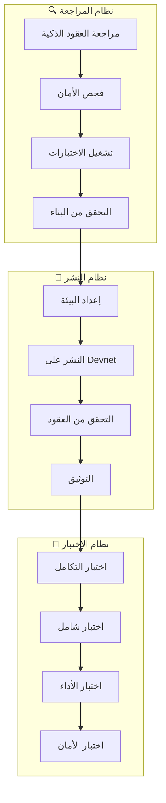

# تصميم مراجعة ونشر SynapsePay

## نظرة عامة

يهدف هذا التصميم إلى إنشاء نظام شامل لمراجعة وتدقيق ونشر مشروع SynapsePay على شبكة Solana. النظام يتضمن مراجعة العقود الذكية، إعداد البيئة، النشر على devnet، التوثيق، والاختبار الشامل.

## الهيكل المعماري

### المكونات الأساسية



### طبقات النظام

| الطبقة | المسؤولية | التقنيات |
|--------|-----------|----------|
| **طبقة المراجعة** | فحص الكود والأمان | Rust Analyzer, Clippy, Audit Tools |
| **طبقة النشر** | نشر العقود والخدمات | Anchor CLI, Solana CLI, Docker |
| **طبقة الاختبار** | اختبار شامل للنظام | Jest, Mocha, Custom Test Scripts |
| **طبقة التوثيق** | توثيق العناوين والروابط | Markdown, Solana Explorer |

## المكونات والواجهات

### 1. مراجع العقود الذكية

```typescript
interface ContractAuditResult {
  contractName: string;
  programId: string;
  auditStatus: 'passed' | 'failed' | 'warning';
  securityIssues: SecurityIssue[];
  testResults: TestResult[];
  buildArtifacts: BuildArtifact[];
}

interface SecurityIssue {
  severity: 'critical' | 'high' | 'medium' | 'low';
  description: string;
  location: string;
  recommendation: string;
}
```

### 2. نظام النشر

```typescript
interface DeploymentConfig {
  network: 'devnet' | 'mainnet-beta';
  programs: ProgramConfig[];
  environment: EnvironmentConfig;
  verification: VerificationConfig;
}

interface ProgramConfig {
  name: string;
  path: string;
  keypair: string;
  upgradeAuthority: string;
}
```

### 3. نظام الاختبار

```typescript
interface TestSuite {
  name: string;
  type: 'unit' | 'integration' | 'e2e' | 'performance';
  tests: TestCase[];
  environment: TestEnvironment;
}

interface TestCase {
  name: string;
  description: string;
  expectedResult: any;
  actualResult?: any;
  status: 'pending' | 'running' | 'passed' | 'failed';
}
```

## نماذج البيانات

### 1. نموذج نتائج المراجعة

```rust
#[derive(Serialize, Deserialize)]
pub struct AuditReport {
    pub timestamp: i64,
    pub version: String,
    pub contracts: Vec<ContractAudit>,
    pub overall_status: AuditStatus,
    pub recommendations: Vec<String>,
}

#[derive(Serialize, Deserialize)]
pub struct ContractAudit {
    pub name: String,
    pub program_id: Option<Pubkey>,
    pub security_score: u8,
    pub test_coverage: f32,
    pub issues: Vec<AuditIssue>,
}
```

### 2. نموذج النشر

```rust
#[derive(Serialize, Deserialize)]
pub struct DeploymentRecord {
    pub program_name: String,
    pub program_id: Pubkey,
    pub network: String,
    pub deployed_at: i64,
    pub transaction_signature: String,
    pub verification_url: String,
}
```

### 3. نموذج الاختبار

```rust
#[derive(Serialize, Deserialize)]
pub struct TestReport {
    pub suite_name: String,
    pub total_tests: u32,
    pub passed_tests: u32,
    pub failed_tests: u32,
    pub execution_time: u64,
    pub coverage_percentage: f32,
}
```

## خصائص الصحة

*الخاصية هي سمة أو سلوك يجب أن يكون صحيحاً عبر جميع عمليات التنفيذ الصالحة للنظام - في الأساس، بيان رسمي حول ما يجب أن يفعله النظام. تعمل الخصائص كجسر بين المواصفات المقروءة بواسطة الإنسان وضمانات الصحة القابلة للتحقق آلياً.*

### Property 1: نجاح جميع اختبارات العقود
*لأي* مجموعة من العقود الذكية، عند تشغيل جميع الاختبارات، يجب أن تنجح جميع الاختبارات بدون أخطاء
**Validates: Requirements 1.1**

### Property 2: خلو العقود من الأخطاء الأمنية
*لأي* عقد ذكي، عند تشغيل أدوات فحص الأمان، يجب ألا تظهر أي مشاكل أمنية من مستوى critical أو high
**Validates: Requirements 1.2**

### Property 3: إنتاج ملفات .so صالحة
*لأي* عقد ذكي، عند عملية البناء، يجب أن ينتج ملف .so صالح وقابل للنشر
**Validates: Requirements 1.3**

### Property 4: عمل العقود مع البيانات الحقيقية
*لأي* عقد منشور على devnet، عند إرسال معاملات حقيقية، يجب أن يستجيب بشكل صحيح ويعالج البيانات
**Validates: Requirements 1.4**

### Property 5: وجود جميع متغيرات البيئة المطلوبة
*لأي* ملف .env، يجب أن يحتوي على جميع المتغيرات المطلوبة للتشغيل الصحيح للنظام
**Validates: Requirements 2.1**

### Property 6: نجاح الاتصال بشبكة Solana
*لأي* خدمة تتطلب الاتصال بـ Solana، يجب أن تتمكن من الاتصال بنجاح والحصول على استجابة صحيحة
**Validates: Requirements 2.2**

### Property 7: التواصل مع الخدمات الخارجية
*لأي* خدمة خارجية مطلوبة، يجب أن يتمكن النظام من التواصل معها بنجاح
**Validates: Requirements 2.3**

### Property 8: صحة وأمان المفاتيح
*لأي* مفتاح مستخدم في النظام، يجب أن يكون صالحاً وآمناً ويلبي معايير الأمان المطلوبة
**Validates: Requirements 2.4**

### Property 9: نجاح تشغيل حاويات Docker
*لأي* حاوية Docker مطلوبة، يجب أن تبدأ بنجاح وتكون جاهزة لاستقبال الطلبات
**Validates: Requirements 2.5**

### Property 10: الحصول على عناوين صالحة عند النشر
*لأي* عقد يتم نشره على devnet، يجب أن يحصل على عنوان program ID صالح وفريد
**Validates: Requirements 3.1**

### Property 11: استجابة العقود للمعاملات
*لأي* عقد منشور، عند إرسال معاملة صحيحة، يجب أن يستجيب بالطريقة المتوقعة
**Validates: Requirements 3.2**

### Property 12: عمل التكامل مع الخدمات الأخرى
*لأي* عقد ذكي، يجب أن يعمل بشكل صحيح مع الخدمات الأخرى في النظام
**Validates: Requirements 3.4**

### Property 13: تحقيق أوقات استجابة مقبولة
*لأي* عملية في النظام، يجب أن تكمل خلال الوقت المحدد المقبول
**Validates: Requirements 3.5**

### Property 14: تسجيل العناوين في README
*لأي* عقد منشور، يجب أن يتم تسجيل عنوانه في ملف README بالتنسيق الصحيح
**Validates: Requirements 4.1**

### Property 15: حفظ روابط Solana Explorer
*لأي* عقد منشور، يجب أن يتم حفظ رابط Solana Explorer الخاص به
**Validates: Requirements 4.2**

### Property 16: صحة جميع الروابط
*لأي* رابط في الوثائق، يجب أن يكون صالحاً ويعيد استجابة ناجحة
**Validates: Requirements 4.3**

### Property 17: وجود تعليمات الاستخدام
*لأي* وثيقة، يجب أن تحتوي على تعليمات واضحة للاستخدام
**Validates: Requirements 4.4**

### Property 18: التعامل مع المدفوعات الحقيقية
*لأي* معاملة دفع، يجب أن يتعامل معها النظام بشكل صحيح ويعالجها بنجاح
**Validates: Requirements 5.1**

### Property 19: تنفيذ مهام الوكلاء الذكيين
*لأي* وكيل ذكي، عند تلقي مهمة صحيحة، يجب أن ينفذها بنجاح ويعيد النتيجة المتوقعة
**Validates: Requirements 5.2**

### Property 20: إدارة المهام المجدولة
*لأي* اشتراك أو مهمة مجدولة، يجب أن يديرها النظام بشكل صحيح وينفذها في الوقت المحدد
**Validates: Requirements 5.3**

### Property 21: عرض البيانات في واجهة المستخدم
*لأي* بيانات في النظام، يجب أن تظهر بشكل صحيح في واجهة المستخدم
**Validates: Requirements 5.4**

### Property 22: تحقيق معايير الأداء
*لأي* عملية في النظام، يجب أن تحقق معايير الأداء المحددة مسبقاً
**Validates: Requirements 5.5**

## معالجة الأخطاء

### استراتيجية معالجة الأخطاء

```typescript
interface ErrorHandler {
  handleContractError(error: ContractError): ErrorResponse;
  handleDeploymentError(error: DeploymentError): ErrorResponse;
  handleTestError(error: TestError): ErrorResponse;
  handleNetworkError(error: NetworkError): ErrorResponse;
}

interface ErrorResponse {
  code: string;
  message: string;
  severity: 'critical' | 'high' | 'medium' | 'low';
  recovery: RecoveryAction[];
}
```

### أنواع الأخطاء المتوقعة

| نوع الخطأ | الوصف | إجراء الاستعادة |
|-----------|--------|-----------------|
| **Contract Build Error** | فشل في بناء العقد | إعادة البناء بعد إصلاح الأخطاء |
| **Deployment Error** | فشل في النشر | إعادة المحاولة مع إعدادات مختلفة |
| **Test Failure** | فشل في الاختبارات | تحليل الأخطاء وإصلاحها |
| **Network Error** | مشاكل في الشبكة | إعادة المحاولة مع timeout أطول |
| **Security Issue** | مشاكل أمنية | إصلاح المشاكل قبل المتابعة |

## استراتيجية الاختبار

### نهج الاختبار المزدوج

يجب أن يحدد النظام نهجي اختبار الوحدة واختبار الخصائص في وثيقة التصميم:

- **اختبارات الوحدة واختبارات الخصائص مكملة ويجب تضمين كليهما:**
  - اختبارات الوحدة تتحقق من أمثلة محددة وحالات حدية وشروط الخطأ
  - اختبارات الخصائص تتحقق من الخصائص العامة التي يجب أن تصمد عبر جميع المدخلات
  - معاً يوفران تغطية شاملة: اختبارات الوحدة تلتقط الأخطاء الملموسة، اختبارات الخصائص تتحقق من الصحة العامة

### متطلبات اختبار الوحدة

- اختبارات الوحدة غالباً ما تغطي:
  - أمثلة محددة تظهر السلوك الصحيح
  - نقاط التكامل بين المكونات
  - اختبارات الوحدة مفيدة، لكن تجنب كتابة الكثير منها
  - إنها مهمة اختبارات الخصائص التعامل مع تغطية الكثير من المدخلات

### متطلبات اختبار الخصائص

- يجب اختيار مكتبة اختبار خصائص للغة المستهدفة وتحديدها في وثيقة التصميم. يجب عدم تنفيذ اختبار الخصائص من الصفر.
- يجب تكوين كل اختبار خصائص لتشغيل ما لا يقل عن 100 تكرار، حيث أن عملية اختبار الخصائص عشوائية.
- يجب وضع علامة على كل اختبار خصائص بتعليق يشير صراحة إلى خاصية الصحة في وثيقة التصميم التي ينفذها اختبار الخصائص.
- يجب وضع علامة على كل اختبار خصائص باستخدام هذا التنسيق الدقيق: '**Feature: synapsepay-audit, Property {number}: {property_text}**'
- يجب تنفيذ كل خاصية صحة بواسطة اختبار خصائص واحد.

### مكتبات الاختبار المحددة

| اللغة/التقنية | مكتبة اختبار الخصائص |
|---------------|----------------------|
| **TypeScript/JavaScript** | fast-check |
| **Rust** | proptest |
| **Python** | hypothesis |

### تكوين الاختبارات

```typescript
// مثال لتكوين اختبار الخصائص
import fc from 'fast-check';

describe('SynapsePay Audit Properties', () => {
  it('Property 1: Contract tests should pass', () => {
    // **Feature: synapsepay-audit, Property 1: نجاح جميع اختبارات العقود**
    fc.assert(
      fc.property(fc.array(fc.string()), (contracts) => {
        const results = runContractTests(contracts);
        return results.every(result => result.status === 'passed');
      }),
      { numRuns: 100 }
    );
  });
});
```