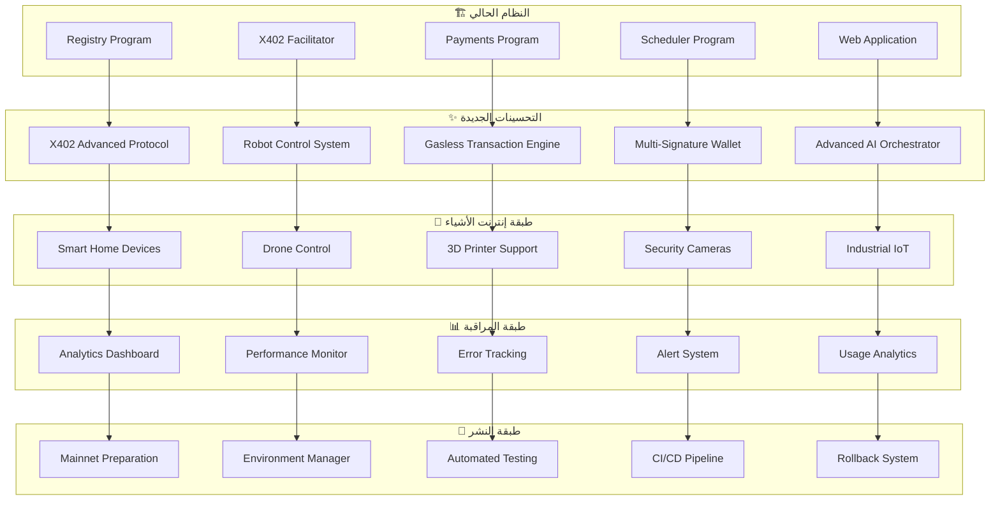

# تصميم تحسينات SynapsePay - المرحلة الثانية

## نظرة عامة

يهدف هذا التصميم إلى تطوير مشروع SynapsePay الحالي بإضافة ميزات متقدمة مستوحاة من PayBot، وتحسين الأداء والأمان، وإضافة دعم أجهزة إنترنت الأشياء المتنوعة، والاستعداد للنشر على Mainnet.

## الهيكل المعماري

### المكونات الجديدة



### طبقات النظام المحسنة

| الطبقة | المسؤولية | التقنيات الجديدة |
|--------|-----------|-------------------|
| **X402 Protocol Layer** | المدفوعات بدون غاز | EIP-2612 Permit, Gasless UX |
| **IoT Control Layer** | التحكم في الأجهزة | HTTP/MQTT/WebSocket APIs |
| **Advanced AI Layer** | ذكاء اصطناعي متقدم | Multi-modal, Chain-of-Thought |
| **Security Layer** | أمان متقدم | Multi-sig, Rate Limiting, Emergency Pause |
| **Monitoring Layer** | مراقبة وتحليلات | Real-time Analytics, Error Tracking |
| **Deployment Layer** | نشر متقدم | CI/CD, Environment Management |

## المكونات والواجهات

### 1. X402 Advanced Protocol

```typescript
interface X402AdvancedConfig {
  gaslessEnabled: boolean;
  permitSupport: boolean;
  robotControlEndpoints: string[];
  emergencyPauseEnabled: boolean;
}

interface GaslessTransaction {
  userSignature: string;
  permitSignature: string;
  facilitatorAddress: string;
  gasEstimate: number;
  executionResult: TransactionResult;
}

interface RobotControlCommand {
  deviceId: string;
  command: string;
  parameters: Record<string, any>;
  paymentRequired: boolean;
  estimatedCost: number;
}
```

### 2. Advanced AI Orchestrator

```typescript
interface MultiModalAI {
  textProcessing: TextProcessor;
  imageProcessing: ImageProcessor;
  audioProcessing: AudioProcessor;
  chainOfThought: ChainOfThoughtEngine;
  memorySystem: ConversationMemory;
}

interface ChainOfThoughtStep {
  stepId: string;
  description: string;
  input: any;
  output: any;
  reasoning: string;
  nextStep?: string;
}

interface ConversationMemory {
  sessionId: string;
  context: ConversationContext[];
  longTermMemory: MemoryEntry[];
  retrieveContext(query: string): ConversationContext[];
}
```

### 3. IoT Device Management

```typescript
interface IoTDevice {
  deviceId: string;
  deviceType: 'smart_home' | 'drone' | '3d_printer' | 'security_camera' | 'industrial';
  capabilities: DeviceCapability[];
  connectionProtocol: 'http' | 'mqtt' | 'websocket';
  paymentRate: number;
  isOnline: boolean;
}

interface DeviceCapability {
  name: string;
  description: string;
  parameters: ParameterDefinition[];
  costPerExecution: number;
}

interface DeviceControlSession {
  sessionId: string;
  deviceId: string;
  userId: string;
  startTime: number;
  duration: number;
  totalCost: number;
  commands: DeviceCommand[];
}
```

### 4. Security & Multi-Signature

```typescript
interface MultiSigWallet {
  walletAddress: string;
  requiredSignatures: number;
  signers: string[];
  pendingTransactions: PendingTransaction[];
  executeTransaction(txId: string): Promise<TransactionResult>;
}

interface SecurityConfig {
  rateLimiting: RateLimitConfig;
  emergencyPause: EmergencyPauseConfig;
  accessControl: AccessControlConfig;
  auditLogging: AuditLogConfig;
}

interface RateLimitConfig {
  requestsPerMinute: number;
  requestsPerHour: number;
  burstLimit: number;
  cooldownPeriod: number;
}
```

## نماذج البيانات

### 1. Enhanced Payment Model

```rust
#[derive(Serialize, Deserialize)]
pub struct EnhancedPayment {
    pub payment_id: String,
    pub payer: Pubkey,
    pub recipient: Pubkey,
    pub amount: u64,
    pub payment_type: PaymentType,
    pub gasless_enabled: bool,
    pub permit_signature: Option<String>,
    pub device_session: Option<DeviceSession>,
    pub ai_task: Option<AITask>,
}

#[derive(Serialize, Deserialize)]
pub enum PaymentType {
    Standard,
    Gasless,
    IoTControl,
    AIExecution,
    Subscription,
}
```

### 2. IoT Device Model

```rust
#[derive(Serialize, Deserialize)]
pub struct IoTDeviceRegistry {
    pub device_id: String,
    pub owner: Pubkey,
    pub device_type: IoTDeviceType,
    pub capabilities: Vec<DeviceCapability>,
    pub pricing: DevicePricing,
    pub status: DeviceStatus,
    pub last_heartbeat: i64,
}

#[derive(Serialize, Deserialize)]
pub enum IoTDeviceType {
    SmartHome,
    Drone,
    Printer3D,
    SecurityCamera,
    Industrial,
}
```

### 3. Advanced AI Task Model

```rust
#[derive(Serialize, Deserialize)]
pub struct AITaskExecution {
    pub task_id: String,
    pub user_id: Pubkey,
    pub task_type: AITaskType,
    pub input_data: TaskInput,
    pub chain_of_thought: Vec<ThoughtStep>,
    pub memory_context: Option<String>,
    pub execution_result: TaskResult,
    pub cost_breakdown: CostBreakdown,
}

#[derive(Serialize, Deserialize)]
pub enum AITaskType {
    MultiModal,
    ChainOfThought,
    CustomAgent,
    ExternalAPI,
}
```

## خصائص الصحة

*الخاصية هي سمة أو سلوك يجب أن يكون صحيحاً عبر جميع عمليات التنفيذ الصالحة للنظام - في الأساس، بيان رسمي حول ما يجب أن يفعله النظام. تعمل الخصائص كجسر بين المواصفات المقروءة بواسطة الإنسان وضمانات الصحة القابلة للتحقق آلياً.*

### Property 1: دعم المدفوعات بدون غاز
*لأي* معاملة دفع، عند استخدام X402 Protocol، يجب ألا يدفع المستخدم رسوم غاز مباشرة
**Validates: Requirements 1.1**

### Property 2: الموافقات عبر التوقيع فقط
*لأي* عملية موافقة، عند استخدام EIP-2612 Permit، يجب أن تتم عبر التوقيع بدون إنشاء معاملة
**Validates: Requirements 1.2**

### Property 3: التحكم في الأجهزة الفيزيائية
*لأي* جهاز IoT متصل، عند إرسال أمر تحكم صحيح، يجب أن يستجيب الجهاز وينفذ الأمر
**Validates: Requirements 1.3**

### Property 4: العمل مع الروبوتات الحقيقية
*لأي* روبوت متصل، عند إرسال أوامر تحكم، يجب أن يتم تنفيذها بنجاح والحصول على تأكيد
**Validates: Requirements 1.5**

### Property 5: تقليل استهلاك الغاز
*لأي* عقد محسن، يجب أن يستهلك غاز أقل بنسبة 20% مقارنة بالإصدار السابق
**Validates: Requirements 2.1**

### Property 6: دعم التوقيعات المتعددة
*لأي* معاملة تتطلب توقيعات متعددة، يجب أن تنفذ فقط عند الحصول على العدد المطلوب من التوقيعات
**Validates: Requirements 2.2**

### Property 7: منع الهجمات والإساءة
*لأي* مستخدم، عند تجاوز حدود الاستخدام المسموحة، يجب أن يتم رفض الطلبات الإضافية
**Validates: Requirements 2.3**

### Property 8: إيقاف العمليات في الطوارئ
*لأي* حالة طوارئ، عند تفعيل Emergency Pause، يجب أن تتوقف جميع العمليات الحساسة
**Validates: Requirements 2.4**

### Property 9: دعم المدخلات المتعددة
*لأي* مدخل (نص، صورة، صوت)، يجب أن يتمكن النظام من معالجته والاستجابة بشكل مناسب
**Validates: Requirements 3.1**

### Property 10: تنفيذ المهام متعددة الخطوات
*لأي* مهمة معقدة، يجب أن ينفذها النظام بالترتيب الصحيح ويحتفظ بالسياق بين الخطوات
**Validates: Requirements 3.2**

### Property 11: تذكر السياق
*لأي* محادثة، يجب أن يتذكر النظام المعلومات السابقة ويستخدمها في الاستجابات اللاحقة
**Validates: Requirements 3.3**

### Property 12: الاتصال بخدمات خارجية
*لأي* API خارجي مدعوم، يجب أن يتمكن النظام من الاتصال به والحصول على استجابة صحيحة
**Validates: Requirements 3.4**

### Property 13: إنشاء وكلاء مخصصين
*لأي* مستخدم، يجب أن يتمكن من إنشاء وكيل مخصص وتشغيله بنجاح
**Validates: Requirements 3.5**

### Property 14: التحديثات الفورية
*لأي* تغيير في النظام، يجب أن يظهر فوراً في واجهة المستخدم بدون إعادة تحميل
**Validates: Requirements 4.2**

### Property 15: دعم الأجهزة المحمولة
*لأي* جهاز محمول، يجب أن تعمل الواجهة بكفاءة وتكون قابلة للاستخدام
**Validates: Requirements 4.4**

### Property 16: دعم محافظ متعددة
*لأي* محفظة Solana مدعومة، يجب أن يتمكن المستخدم من الاتصال بها واستخدامها
**Validates: Requirements 4.5**

### Property 17: عرض الإحصائيات
*لأي* بيانات في النظام، يجب أن تظهر في لوحة التحكم بشكل صحيح ومحدث
**Validates: Requirements 5.1**

### Property 18: مراقبة الأداء
*لأي* عملية في النظام، يجب أن يتم تسجيل بيانات الأداء ومراقبتها في الوقت الفعلي
**Validates: Requirements 5.2**

### Property 19: تتبع الأخطاء
*لأي* خطأ يحدث، يجب أن يتم تسجيله وتتبعه مع تفاصيل كافية للتشخيص
**Validates: Requirements 5.3**

### Property 20: إرسال التنبيهات
*لأي* مشكلة تحدث، يجب أن يتم إرسال تنبيه فوري للمسؤولين
**Validates: Requirements 5.4**

### Property 21: تحليل أنماط الاستخدام
*لأي* نشاط مستخدم، يجب أن يتم تحليله وتسجيله لفهم أنماط الاستخدام
**Validates: Requirements 5.5**

### Property 22: التحكم في أجهزة المنزل الذكي
*لأي* جهاز منزل ذكي متصل، يجب أن يتمكن النظام من التحكم فيه عبر البروتوكولات المناسبة
**Validates: Requirements 6.1**

### Property 23: التحكم في الطائرات بدون طيار
*لأي* طائرة بدون طيار متصلة، يجب أن يتمكن النظام من إرسال أوامر الطيران والتحكم
**Validates: Requirements 6.2**

### Property 24: التحكم في الطابعات ثلاثية الأبعاد
*لأي* طابعة ثلاثية الأبعاد متصلة، يجب أن يتمكن النظام من إرسال ملفات الطباعة وبدء العملية
**Validates: Requirements 6.3**

### Property 25: إدارة كاميرات المراقبة
*لأي* كاميرا مراقبة متصلة، يجب أن يتمكن النظام من التحكم فيها والحصول على البث المباشر
**Validates: Requirements 6.4**

### Property 26: دعم الأجهزة الصناعية
*لأي* جهاز صناعي متصل، يجب أن يتمكن النظام من التواصل معه عبر البروتوكولات الصناعية
**Validates: Requirements 6.5**

### Property 27: إدارة البيئات المتعددة
*لأي* بيئة (dev/staging/prod)، يجب أن يتمكن النظام من التبديل بينها مع الإعدادات الصحيحة
**Validates: Requirements 7.2**

### Property 28: تشغيل الاختبارات الآلية
*لأي* محاولة نشر، يجب أن يتم تشغيل جميع الاختبارات أولاً والتأكد من نجاحها
**Validates: Requirements 7.3**

### Property 29: النشر التلقائي
*لأي* تغيير في الكود، عند اجتياز الاختبارات، يجب أن يتم النشر تلقائياً
**Validates: Requirements 7.4**

### Property 30: التراجع عن النشر
*لأي* مشكلة بعد النشر، يجب أن يتمكن النظام من التراجع تلقائياً للإصدار السابق
**Validates: Requirements 7.5**

## معالجة الأخطاء

### استراتيجية معالجة الأخطاء المحسنة

```typescript
interface EnhancedErrorHandler {
  handleX402Error(error: X402Error): ErrorResponse;
  handleIoTError(error: IoTError): ErrorResponse;
  handleAIError(error: AIError): ErrorResponse;
  handleSecurityError(error: SecurityError): ErrorResponse;
  handleDeploymentError(error: DeploymentError): ErrorResponse;
}

interface ErrorRecovery {
  automaticRetry: boolean;
  retryCount: number;
  fallbackStrategy: FallbackStrategy;
  rollbackCapable: boolean;
}
```

### أنواع الأخطاء الجديدة

| نوع الخطأ | الوصف | إجراء الاستعادة |
|-----------|--------|-----------------|
| **X402 Protocol Error** | فشل في المدفوعات بدون غاز | إعادة المحاولة مع الطريقة التقليدية |
| **IoT Device Error** | فشل في الاتصال بالأجهزة | إعادة المحاولة مع timeout أطول |
| **AI Processing Error** | فشل في معالجة AI | استخدام نموذج بديل |
| **Security Breach** | محاولة اختراق أمني | تفعيل Emergency Pause |
| **Deployment Error** | فشل في النشر | Rollback تلقائي |

## استراتيجية الاختبار

### نهج الاختبار المزدوج المحسن

يجب أن يحدد النظام نهجي اختبار الوحدة واختبار الخصائص:

- **اختبارات الوحدة واختبارات الخصائص مكملة ويجب تضمين كليهما:**
  - اختبارات الوحدة تتحقق من أمثلة محددة وحالات حدية وشروط الخطأ
  - اختبارات الخصائص تتحقق من الخصائص العامة التي يجب أن تصمد عبر جميع المدخلات
  - معاً يوفران تغطية شاملة: اختبارات الوحدة تلتقط الأخطاء الملموسة، اختبارات الخصائص تتحقق من الصحة العامة

### متطلبات اختبار الخصائص المحسنة

- يجب اختيار مكتبة اختبار خصائص للغة المستهدفة وتحديدها في وثيقة التصميم. يجب عدم تنفيذ اختبار الخصائص من الصفر.
- يجب تكوين كل اختبار خصائص لتشغيل ما لا يقل عن 100 تكرار، حيث أن عملية اختبار الخصائص عشوائية.
- يجب وضع علامة على كل اختبار خصائص بتعليق يشير صراحة إلى خاصية الصحة في وثيقة التصميم التي ينفذها اختبار الخصائص.
- يجب وضع علامة على كل اختبار خصائص باستخدام هذا التنسيق الدقيق: '**Feature: synapsepay-enhancements, Property {number}: {property_text}**'
- يجب تنفيذ كل خاصية صحة بواسطة اختبار خصائص واحد.

### مكتبات الاختبار المحددة

| اللغة/التقنية | مكتبة اختبار الخصائص |
|---------------|----------------------|
| **TypeScript/JavaScript** | fast-check |
| **Rust** | proptest |
| **Python** | hypothesis |
| **Solana/Anchor** | anchor-client + proptest |

### تكوين الاختبارات المحسن

```typescript
// مثال لتكوين اختبار الخصائص للميزات الجديدة
import fc from 'fast-check';

describe('SynapsePay Enhancements Properties', () => {
  it('Property 1: Gasless payments should not charge users gas', () => {
    // **Feature: synapsepay-enhancements, Property 1: دعم المدفوعات بدون غاز**
    fc.assert(
      fc.property(fc.record({
        amount: fc.integer(1, 1000),
        recipient: fc.string(),
        useGasless: fc.constant(true)
      }), async (payment) => {
        const result = await executeX402Payment(payment);
        return result.userGasPaid === 0 && result.facilitatorGasPaid > 0;
      }),
      { numRuns: 100 }
    );
  });

  it('Property 3: IoT devices should respond to valid commands', () => {
    // **Feature: synapsepay-enhancements, Property 3: التحكم في الأجهزة الفيزيائية**
    fc.assert(
      fc.property(fc.record({
        deviceId: fc.string(),
        command: fc.oneof(fc.constant('move_forward'), fc.constant('turn_left'), fc.constant('stop')),
        parameters: fc.object()
      }), async (controlCommand) => {
        const response = await sendIoTCommand(controlCommand);
        return response.status === 'success' && response.executed === true;
      }),
      { numRuns: 100 }
    );
  });
});
```

### اختبارات الأمان المتقدمة

```rust
// مثال لاختبارات الأمان في Rust
use proptest::prelude::*;

proptest! {
    #[test]
    fn test_rate_limiting_prevents_abuse(
        requests_per_minute in 1u32..1000,
        actual_requests in 1u32..2000
    ) {
        // **Feature: synapsepay-enhancements, Property 7: منع الهجمات والإساءة**
        let rate_limiter = RateLimiter::new(requests_per_minute);
        let mut successful_requests = 0;
        
        for _ in 0..actual_requests {
            if rate_limiter.allow_request() {
                successful_requests += 1;
            }
        }
        
        prop_assert!(successful_requests <= requests_per_minute);
    }
}
```