<p align="center">
  
  
  
</p>

<h1 align="center">🚀 SynapsePay</h1>

<h3 align="center">AI-Powered AutoPay Agents on Solana</h3>

<p align="center">
  <strong>Pay-per-Action • Automation • Solana Actions • x402 • AI Agents • Marketplace</strong>
</p>

<p align="center">
  <a href="#-why-synapsepay">Why SynapsePay</a> •
  <a href="#-core-features">Features</a> •
  <a href="#-architecture">Architecture</a> •
  <a href="#-tech-stack">Tech Stack</a> •
  <a href="#-demo-scenarios">Demo</a> •
  <a href="#-quick-start">Quick Start</a>
</p>

---

## 📋 Overview

**SynapsePay** is a next-generation automation network that enables **AI-driven tasks**, **micro-transactions**, and **real-world device triggers** — all powered by **Solana's speed, scalability, and near-zero fees**.

Unlike traditional pay-per-use systems, SynapsePay combines:

| Component | Description |
|-----------|-------------|
| 🤖 **AI Agents** | Multi-tool execution for diverse tasks |
| ⚡ **Solana Actions** | Direct transaction flows via social & web |
| 🔄 **Automated Workflows** | Scheduled tasks & subscriptions |
| 💰 **x402 Micropayments** | Gasless, instant micro-transactions |
| 🏪 **Agent Marketplace** | Discover & monetize custom agents |
| 🌐 **IoT Device Execution** | Bridge blockchain to physical world |

> **This makes SynapsePay the first system where users can pay 0.05 USDC to instantly trigger an AI task, device action, or on-chain workflow — fully automated.**

---

## ⭐ Why SynapsePay?

Most hackathon projects deliver simple "trigger and pay" apps.
**SynapsePay delivers a full automation network**, combining 3–4 ideas into one unified system:

| Feature | Status |
|---------|--------|
| ✅ AI execution | Multi-model support |
| ✅ On-chain automation | Solana-native |
| ✅ Pay-per-action billing | x402 protocol |
| ✅ Real device integration | IoT gateway |
| ✅ Social & Web2 integrations | Solana Actions |
| ✅ Marketplace for custom agents | Creator economy |

> 🎯 **Perfectly aligned** with Solana's 2025 emphasis on **consumer apps, speed, automation, x402, and Solana Actions**.

---

## 🚀 Core Features

### 1. 🤖 AI Agents (Multi-Tool Execution)

Each agent performs tasks on demand after a micro-payment:

```
┌─────────────────────────────────────────────────────────────┐
│  📄 PDF Analysis          │  🐛 Code Debugging              │
│  🎬 Video Summarization   │  📝 Smart Contract Signing      │
│  🎨 Image Editing         │  🖼️  NFT Generation             │
│  📈 Trading Bot Execution │  📁 IPFS Uploads                │
│  💼 Wallet Analytics      │  💬 Multi-Model Chat            │
└─────────────────────────────────────────────────────────────┘
```

**Price Range:** `0.05 – 0.5 USDC` per action, gasless via x402.

---

### 2. ⚡ Solana Actions Integration (SUPERPOWER)

Send a Solana transaction directly through:

- 🐦 **Twitter** — Tweet triggers action
- 📧 **Email** — Inbox to blockchain
- 💬 **WhatsApp** — Chat-based payments
- 🌐 **Websites** — Embedded action buttons
- 📱 **QR Codes** — Scan and execute

**Example Automation Flow:**
```
Upload Image → Auto-Pay → AI converts to NFT → Returns mint link in 2 seconds
```

---

### 3. 🔄 Auto-Tasks & Subscriptions

Users can schedule automated recurring actions:

| Task Type | Example |
|-----------|---------|
| 📊 Daily Reports | Price alerts & portfolio summaries |
| 💱 Weekly Rebalancing | USDC portfolio optimization |
| 💾 Automated Backups | Data to Arweave/IPFS |
| 🎨 Daily NFT Drops | AI-generated collections |
| 🔔 Wallet Monitoring | Balance & transaction alerts |
| 📈 Trading Triggers | Automated DeFi strategies |

> All tasks are billed with **auto micropayments** — set once, run forever.

---

### 4. 🏪 Agent Marketplace

Creators can publish and monetize their own agents:

```
┌────────────────────────────────────────────────────────────┐
│                    CREATOR ECONOMY                         │
├────────────────────────────────────────────────────────────┤
│  🤖 AI Bots           →  Publish your trained models       │
│  🔌 Device Triggers   →  Connect real-world hardware       │
│  📊 Data Processors   →  Analytics & transformations       │
│  🔄 Automation Flows  →  Complex multi-step workflows      │
└────────────────────────────────────────────────────────────┘

User Pays → Creator Earns → Platform Takes Fee
```

---

### 5. 🌐 Real-World Device / IoT Support

Bridge **Solana ↔ Physical World** in real time:

| Device Type | Use Case |
|-------------|----------|
| 🤖 Robots | Automated physical tasks |
| 🚪 Smart Doors | Secure access control |
| 🚁 Drones | Aerial operations |
| 🖨️ Printers | Document generation |
| 📷 Cameras | Image capture triggers |
| 💡 Smart Lights | Ambient control |

---

## 🏗️ System Architecture

```mermaid
graph TB
    subgraph UserLayer["👤 User Layer"]
        User[User]
        Wallet[Phantom / Solflare<br/>Wallet Provider]
        Social[Solana Actions<br/>Twitter / Email / QR]
    end

    subgraph Frontend["� Frontend Layer - Port 5173"]
        Web[Web App<br/>React + Vite + ShadCN]
        Components[UI Components<br/>AgentCard, PaymentModal, Dashboard]
        ActionGen[Solana Actions Generator<br/>Blinks Integration]
    end

    subgraph Backend["🔧 Backend Layer"]
        Resource[Resource Server :8404<br/>Protected AI Endpoints]
        Facilitator[X402 Facilitator :8403<br/>/verify, /settle, /invoice]
        X402Lib[X402 Library<br/>Signatures & Validation]
        AIOrchestrator[AI Agent Orchestrator<br/>Task Router & Executor]
    end

    subgraph Blockchain["⛓️ Solana Blockchain - Devnet/Mainnet"]
        Solana[Solana Network<br/>~400ms Finality]
        USDC[USDC-SPL Token<br/>Micropayments]
        Anchor[Anchor Programs<br/>Registry + Receipts]
        Scheduler[Task Scheduler<br/>Subscriptions & Cron]
    end

    subgraph AILayer["🤖 AI Agent Layer"]
        OpenAI[OpenAI<br/>GPT-4 / DALL-E]
        Anthropic[Anthropic<br/>Claude Models]
        Llama[Llama<br/>Open Source LLM]
        DeepSeek[DeepSeek<br/>Code & Analysis]
    end

    subgraph Storage["💾 Decentralized Storage"]
        IPFS[IPFS<br/>Result Storage]
        Arweave[Arweave<br/>Permanent Archive]
    end

    subgraph IoT["🌐 IoT / Device Layer"]
        Robot[UGV Rover<br/>Physical Robot]
        SmartDevices[Smart Devices<br/>Lights / Doors / Drones]
    end

    User -->|1. Select Agent| Web
    User -->|1b. Solana Action| Social
    Social -->|Blink Request| ActionGen
    Web -->|2. Request Signature| Wallet
    Wallet -->|3. Signed TX| Web
    Web -->|4. X-PAYMENT Header| Resource
    Resource -->|5. Verify Payment| Facilitator
    Facilitator -->|Uses| X402Lib
    Resource -->|6. Settle Payment| Facilitator
    Facilitator -->|7. Submit TX| Solana
    Solana --> USDC
    Solana --> Anchor
    Anchor --> Scheduler
    Resource -->|8. Execute Task| AIOrchestrator
    AIOrchestrator --> OpenAI
    AIOrchestrator --> Anthropic
    AIOrchestrator --> Llama
    AIOrchestrator --> DeepSeek
    AIOrchestrator -->|9. Store Result| IPFS
    AIOrchestrator --> Arweave
    AIOrchestrator -->|10. Device Command| Robot
    AIOrchestrator --> SmartDevices
    Resource -->|11. Return Result| Web
    Robot -->|Video Stream| Web

    style User fill:#8b5cf6,color:#fff
    style Wallet fill:#a855f7,color:#fff
    style Social fill:#c084fc,color:#fff
    style Web fill:#3b82f6,color:#fff
    style Components fill:#60a5fa,color:#fff
    style ActionGen fill:#93c5fd,color:#000
    style Resource fill:#10b981,color:#fff
    style Facilitator fill:#059669,color:#fff
    style X402Lib fill:#34d399,color:#000
    style AIOrchestrator fill:#14b8a6,color:#fff
    style Solana fill:#9945FF,color:#fff
    style USDC fill:#2775CA,color:#fff
    style Anchor fill:#14F195,color:#000
    style Scheduler fill:#00D18C,color:#000
    style OpenAI fill:#412991,color:#fff
    style Anthropic fill:#D4A574,color:#000
    style Llama fill:#0467DF,color:#fff
    style DeepSeek fill:#4F46E5,color:#fff
    style IPFS fill:#65C2CB,color:#000
    style Arweave fill:#222326,color:#fff
    style Robot fill:#6366f1,color:#fff
    style SmartDevices fill:#818cf8,color:#fff
```

### Architecture Components

| Layer | Component | Description |
|-------|-----------|-------------|
| 👤 **User** | Phantom Wallet | Primary wallet for signing & payments |
| 👤 **User** | Solana Actions | Blinks via Twitter, Email, QR |
| 🌐 **Frontend** | React + Vite | Modern SPA with real-time updates |
| 🌐 **Frontend** | ShadCN UI | Premium component library |
| 🔧 **Backend** | Resource Server | Protected AI agent endpoints |
| 🔧 **Backend** | X402 Facilitator | Payment verification & settlement |
| 🔧 **Backend** | AI Orchestrator | Routes tasks to appropriate AI model |
| ⛓️ **Blockchain** | Solana Network | Fast finality (~400ms) |
| ⛓️ **Blockchain** | USDC-SPL | Micropayments (0.05+ USDC) |
| ⛓️ **Blockchain** | Anchor Programs | Agent Registry + Receipt Storage |
| 🤖 **AI** | Multi-Model | OpenAI, Claude, Llama, DeepSeek |
| 💾 **Storage** | IPFS + Arweave | Decentralized result storage |
| 🌐 **IoT** | Device Bridge | Robot & smart device control |

### Data Flow Summary

```
┌─────────────────────────────────────────────────────────────────────────┐
│  1. User selects AI Agent or triggers via Solana Action (Blink)         │
│  2. Phantom wallet signs payment transaction (gasless)                  │
│  3. X-PAYMENT header sent to Resource Server                            │
│  4. Facilitator verifies signature & settles on Solana                  │
│  5. AI Orchestrator executes task (OpenAI/Claude/Llama/DeepSeek)        │
│  6. Result stored on IPFS, CID recorded on-chain via Anchor             │
│  7. Receipt minted, result returned to user                             │
│  8. Optional: IoT device triggered (Robot/Smart Devices)                │
└─────────────────────────────────────────────────────────────────────────┘
```

---

## 🎯 X402 Payment Flow with Solana

### Complete Payment Lifecycle for AI Agent Execution

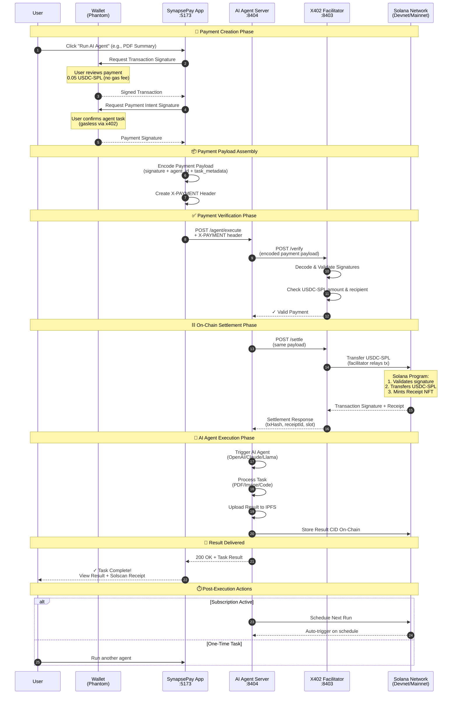

### Payment Flow Breakdown

| Phase | Description | Duration |
|-------|-------------|----------|
| 🔐 **Creation** | User signs payment intent via Phantom | ~2 sec |
| 📦 **Assembly** | Payload encoded with x402 headers | ~100 ms |
| ✅ **Verification** | Facilitator validates signatures | ~200 ms |
| ⛓️ **Settlement** | USDC-SPL transferred on Solana | ~400 ms |
| 🤖 **Execution** | AI Agent processes task | 1-10 sec |
| 🎉 **Delivery** | Result returned + receipt minted | ~500 ms |

> **Total Time:** Under 15 seconds for complete pay-to-result flow!

### Key Advantages of x402 on Solana

| Feature | Benefit |
|---------|---------|
| **Gasless UX** | Facilitator pays fees, user only signs |
| **Instant Settlement** | ~400ms finality on Solana |
| **Micropayment Ready** | 0.05 USDC viable (low fees) |
| **On-Chain Receipts** | Immutable proof via Anchor |
| **Multi-Agent Support** | Same flow for any agent type |

---

## � Payment Protocol Details

### X402 Payment Payload Structure (Solana)

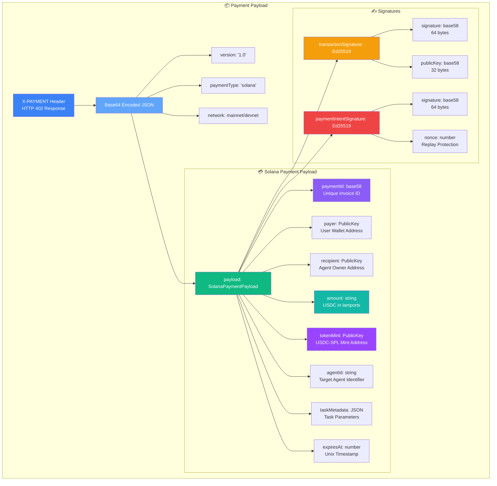

### Payload Field Definitions

| Field | Type | Description |
|-------|------|-------------|
| `version` | string | Protocol version (`"1.0"`) |
| `paymentType` | string | Blockchain type (`"solana"`) |
| `network` | string | `"mainnet-beta"` or `"devnet"` |
| `paymentId` | base58 | Unique invoice identifier (32 bytes) |
| `payer` | PublicKey | User's wallet address |
| `recipient` | PublicKey | Agent owner's wallet address |
| `amount` | string | Payment amount in USDC (6 decimals) |
| `tokenMint` | PublicKey | USDC-SPL token mint address |
| `agentId` | string | Target AI agent identifier |
| `taskMetadata` | JSON | Task-specific parameters |
| `expiresAt` | number | Invoice expiration timestamp |
| `transactionSignature` | Ed25519 | Signed Solana transaction |
| `paymentIntentSignature` | Ed25519 | Signed payment intent |
| `nonce` | number | Replay attack protection |

### Example Payment Payload

```json
{
  "version": "1.0",
  "paymentType": "solana",
  "network": "devnet",
  "payload": {
    "paymentId": "7xKXtg2CW87d9VqQzJkHT5J5E1mRQWz4vNrYhS9QT2Ni",
    "payer": "9WzDXwBbmkg8ZTbNMqUxvQRAyrZzDsGYdLVL9zYtAWWM",
    "recipient": "HN7cABqLq46Es1jh92dQQisAq662SmxELLLsHHe4YWrH",
    "amount": "50000",
    "tokenMint": "EPjFWdd5AufqSSqeM2qN1xzybapC8G4wEGGkZwyTDt1v",
    "agentId": "pdf-summarizer-v1",
    "taskMetadata": {
      "inputCID": "QmXoypiz...",
      "maxTokens": 1000,
      "language": "en"
    },
    "expiresAt": 1702166400,
    "transactionSignature": {
      "signature": "5KtP9...",
      "publicKey": "9WzDXwBbmkg8ZTbNMqUxvQRAyrZzDsGYdLVL9zYtAWWM"
    },
    "paymentIntentSignature": {
      "signature": "4RmQ7...",
      "nonce": 1702166000
    }
  }
}
```

### Signature Verification Flow

```
┌─────────────────────────────────────────────────────────────────────────┐
│  1. EXTRACT: Decode Base64 X-PAYMENT header                             │
│  2. VALIDATE: Check version, network, expiry                            │
│  3. VERIFY TX: Ed25519 verify transactionSignature with payer pubkey    │
│  4. VERIFY INTENT: Ed25519 verify paymentIntentSignature                │
│  5. CHECK NONCE: Ensure nonce not previously used (replay protection)   │
│  6. VERIFY AMOUNT: Confirm amount matches agent price                   │
│  7. VERIFY TOKEN: Confirm tokenMint is valid USDC-SPL                   │
│  8. SETTLE: Submit transaction to Solana network                        │
│  9. RECEIPT: Mint on-chain receipt via Anchor program                   │
└─────────────────────────────────────────────────────────────────────────┘
```

### Token Addresses

| Token | Network | Mint Address |
|-------|---------|--------------|
| USDC | Mainnet | `EPjFWdd5AufqSSqeM2qN1xzybapC8G4wEGGkZwyTDt1v` |
| USDC | Devnet | `4zMMC9srt5Ri5X14GAgXhaHii3GnPAEERYPJgZJDncDU` |

---

## 🔄 Payment States & Transitions

### Payment Lifecycle State Machine

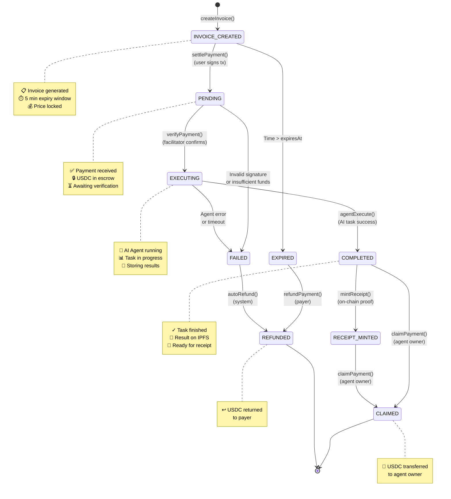

### State Definitions

| State | Description | Next Actions |
|-------|-------------|--------------|
| `INVOICE_CREATED` | Invoice generated, awaiting payment | `settlePayment()`, expires after 5 min |
| `PENDING` | Payment received, USDC in escrow | `verifyPayment()` by facilitator |
| `EXECUTING` | AI Agent processing task | Wait for completion or timeout |
| `COMPLETED` | Task finished, result stored on IPFS | `mintReceipt()`, `claimPayment()` |
| `RECEIPT_MINTED` | On-chain receipt created | `claimPayment()` |
| `CLAIMED` | Agent owner received USDC | Terminal state |
| `EXPIRED` | Invoice timed out before payment | `refundPayment()` if paid |
| `FAILED` | Verification or execution error | Auto-refund triggered |
| `REFUNDED` | USDC returned to payer | Terminal state |

### Anchor Program Instructions

```rust
// Payment State Transitions (Anchor)

#[derive(AnchorSerialize, AnchorDeserialize, Clone, PartialEq)]
pub enum PaymentState {
    InvoiceCreated,
    Pending,
    Executing,
    Completed,
    ReceiptMinted,
    Claimed,
    Expired,
    Failed,
    Refunded,
}

// Instructions
pub fn create_invoice(ctx: Context<CreateInvoice>, amount: u64, agent_id: String) -> Result<()>
pub fn settle_payment(ctx: Context<SettlePayment>, signature: [u8; 64]) -> Result<()>
pub fn verify_payment(ctx: Context<VerifyPayment>) -> Result<()>
pub fn complete_task(ctx: Context<CompleteTask>, result_cid: String) -> Result<()>
pub fn mint_receipt(ctx: Context<MintReceipt>) -> Result<()>
pub fn claim_payment(ctx: Context<ClaimPayment>) -> Result<()>
pub fn refund_payment(ctx: Context<RefundPayment>) -> Result<()>
```

### State Transition Rules

```
┌─────────────────────────────────────────────────────────────────────────┐
│  INVOICE_CREATED → PENDING                                              │
│    ✓ User must sign valid transaction                                   │
│    ✓ USDC amount must match invoice                                     │
│    ✓ Invoice must not be expired                                        │
├─────────────────────────────────────────────────────────────────────────┤
│  PENDING → EXECUTING                                                    │
│    ✓ Facilitator verifies Ed25519 signature                             │
│    ✓ USDC successfully transferred to escrow                            │
│    ✓ Nonce not previously used                                          │
├─────────────────────────────────────────────────────────────────────────┤
│  EXECUTING → COMPLETED                                                  │
│    ✓ AI Agent returns valid result                                      │
│    ✓ Result CID stored on IPFS/Arweave                                  │
│    ✓ No timeout (max 60 seconds)                                        │
├─────────────────────────────────────────────────────────────────────────┤
│  COMPLETED → CLAIMED                                                    │
│    ✓ Only agent owner can claim                                         │
│    ✓ Platform fee (5%) deducted                                         │
│    ✓ Remaining USDC transferred to owner                                │
├─────────────────────────────────────────────────────────────────────────┤
│  FAILED/EXPIRED → REFUNDED                                              │
│    ✓ Automatic refund on failure                                        │
│    ✓ Manual refund available for expired invoices                       │
│    ✓ Full amount returned to payer                                      │
└─────────────────────────────────────────────────────────────────────────┘
```

---

## 🛠️ Tech Stack

### Smart Contracts (Solana)

| Component | Technology |
|-----------|------------|
| Language | Rust (Anchor Framework) |
| Payments | x402 Integration |
| Subscriptions | On-chain Manager |
| Registry | Agent Registration |
| Scheduler | Automated Task Triggers |

### Backend

| Component | Technology |
|-----------|------------|
| Runtime | Bun + TypeScript |
| Payments | x402 Relay Service |
| Orchestration | AI Agent Orchestrator |
| IoT | Device Bridge (Optional) |

### Frontend

| Component | Technology |
|-----------|------------|
| Framework | React + ShadCN UI |
| Wallet | Solana Wallet Adapter |
| Actions | Solana Actions Generator |
| Dashboard | Real-time Task Monitoring |

### AI Services

| Provider | Capabilities |
|----------|--------------|
| OpenAI | GPT-4, DALL-E, Whisper |
| Anthropic | Claude Models |
| Llama | Open Source LLM |
| DeepSeek | Code & Analysis |

---

## 🐳 Docker Service Dependencies

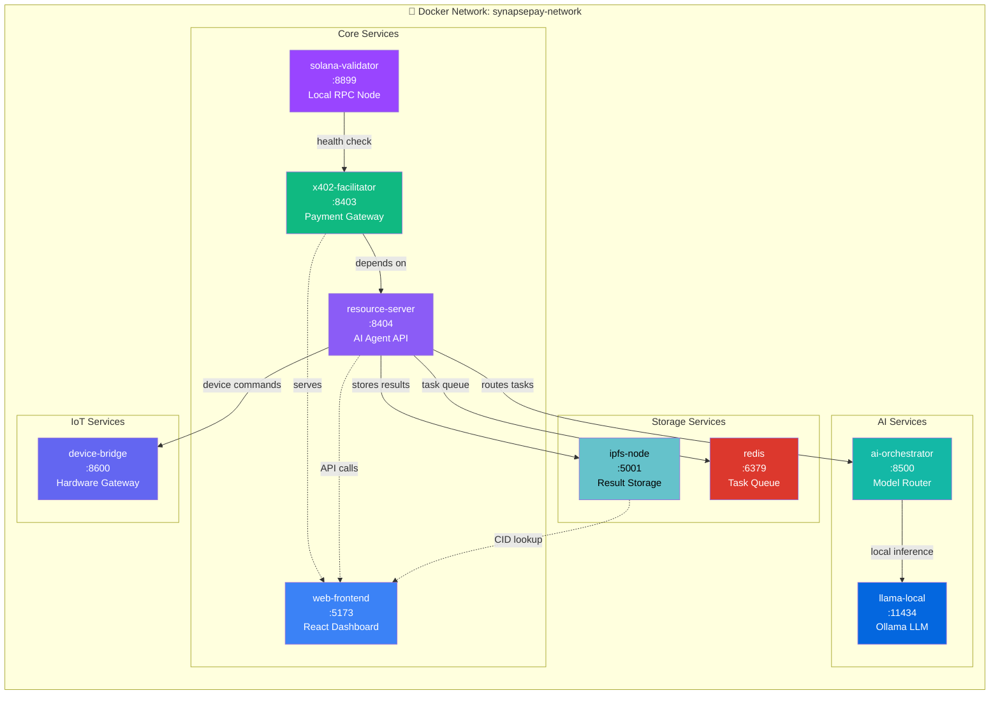

### Service Configuration

| Service | Port | Description | Dependencies |
|---------|------|-------------|--------------|
| `solana-validator` | 8899 | Local Solana RPC node | None |
| `x402-facilitator` | 8403 | Payment verification & settlement | `solana-validator` |
| `resource-server` | 8404 | AI Agent execution API | `x402-facilitator`, `redis` |
| `web-frontend` | 5173 | React dashboard | `resource-server` |
| `ai-orchestrator` | 8500 | Routes tasks to AI models | `redis` |
| `llama-local` | 11434 | Local LLM via Ollama | None |
| `ipfs-node` | 5001 | Decentralized result storage | None |
| `redis` | 6379 | Task queue & caching | None |
| `device-bridge` | 8600 | IoT hardware gateway | None |

### Docker Compose Commands

```bash
# Start all services
docker-compose up -d

# Start core services only
docker-compose up -d solana-validator x402-facilitator resource-server web-frontend

# Start with AI services
docker-compose --profile ai up -d

# Start with IoT support
docker-compose --profile iot up -d

# View logs
docker-compose logs -f resource-server

# Stop all services
docker-compose down
```

---

## 🧪 Demo Scenarios

Judges can test these live workflows:

### Scenario 1: PDF Summary
```
💵 Pay 0.05 USDC → 🤖 AI Summarizes PDF → 📄 Instant Result
```

### Scenario 2: NFT Minting
```
🖼️ Upload Image → 💵 Auto-Pay → 🎨 NFT Minted → 🔗 Mint Link Returned
```

### Scenario 3: Social Trigger
```
🐦 Connect Twitter → 📝 Tweet Action → ⚡ AI Task Triggered
```

### Scenario 4: Subscription
```
📅 Schedule Daily → 📊 Portfolio Report → 🔄 Auto-Generated
```

### Scenario 5: Marketplace
```
🏪 Browse Agents → 💵 Pay Per Use → 🤖 External Agent Runs
```

### Scenario 6: IoT Device Rental 🆕
```
🌐 Browse Devices → 💵 Pay 0.1 USDC → 🤖 Control Robot → ⏱️ Session Timer
```

---

## 🌐 IoT Device Control Hub

### Overview

The **IoT Device Control Hub** extends SynapsePay's micropayment capabilities to real-world hardware devices. Users can rent and control physical devices (robots, drones, LEDs, printers) using USDC micropayments via the X402 protocol.

### 📊 User Journey Diagram

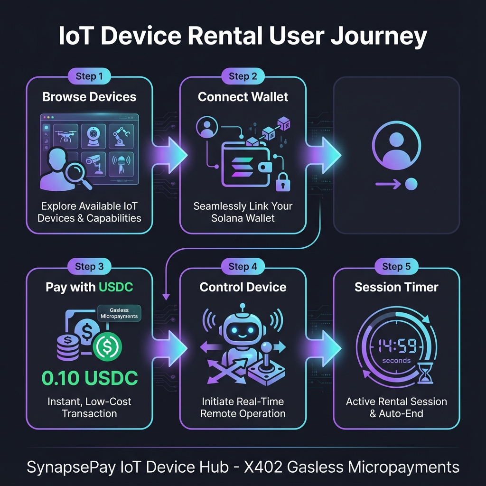

### 📐 Use Case Diagram

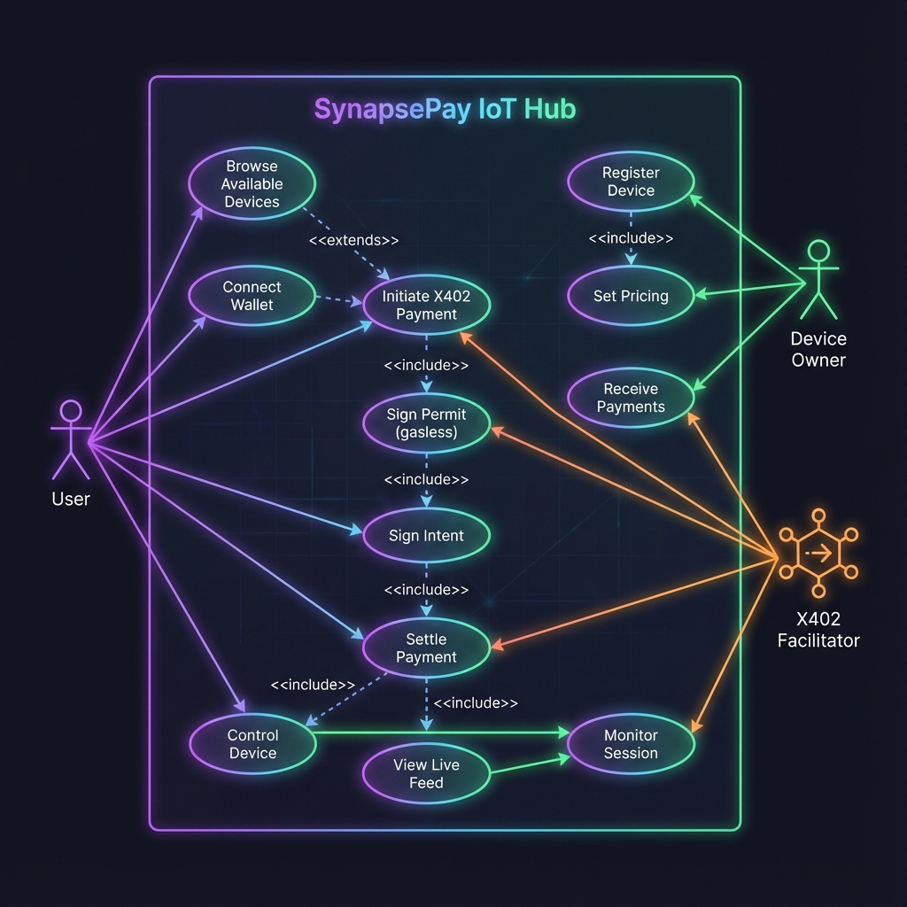

### Supported Device Types

```
┌─────────────────────────────────────────────────────────────────────────────┐
│                          IoT Device Hub Features                             │
├─────────────────────────────────────────────────────────────────────────────┤
│  🤖 UGV Rover Control     │  Real-time robot movement + live camera feed    │
│  🚁 Drone Camera          │  Aerial photography with GPS tracking           │
│  💡 Smart LED Array       │  RGB lighting control for events                │
│  🖨️ 3D Printer Access     │  Remote printing with material selection       │
│  📷 Security Cameras      │  Multi-camera surveillance access               │
│  🔭 Remote Telescope      │  Astronomical observation from anywhere         │
└─────────────────────────────────────────────────────────────────────────────┘
```

### Device Control Screens

| Route | Screen | Description |
|-------|--------|-------------|
| `/devices` | **IoT Device Hub** | Grid of all available devices with status |
| `/devices/:id` | **Device Control** | Full control interface for specific device |

### Screen 1: Connect Wallet

Initial screen for users to connect their Solana wallet.

```
┌─────────────────────────────────────────────────────────────────────┐
│  SynapsePay                           X402: ONLINE    [Connect Wallet] │
├─────────────────────────────────────────────────────────────────────┤
│                                                                      │
│                           🤖                                         │
│                      (Device Icon)                                   │
│                                                                      │
│                 Connect to SynapsePay                                │
│                                                                      │
│         Access the UGV Rover 01 controls by connecting               │
│         your wallet. This application uses the X402                  │
│         protocol for secure, gasless micropayments.                  │
│                                                                      │
│                  ┌────────────────────────┐                          │
│                  │  🔗 Connect Wallet     │                          │
│                  └────────────────────────┘                          │
│                                                                      │
└─────────────────────────────────────────────────────────────────────┘
```

### Screen 2: Secure Access Gate (Payment Flow)

Three-step X402 payment process for device access.

```
┌─────────────────────────────────────────────────────────────────────┐
│  SynapsePay                X402: ONLINE    NET: OK    [0x71C...9A23] │
├─────────────────────────────────────────────────────────────────────┤
│                                                                      │
│  ┌─────────────────────────────────────────────────────────────────┐ │
│  │  🔐 Secure Access Gate                          0.10 USDC       │ │
│  │     X402 Micropayment Required                 For 10 min ctrl  │ │
│  │                                                                 │ │
│  │  ┌─────────────┐ ┌─────────────┐ ┌─────────────┐               │ │
│  │  │ ① Sign      │ │ ② Sign      │ │ ③ Settlement │               │ │
│  │  │    Permit   │ │    Intent   │ │              │               │ │
│  │  │  (Gasless)  │ │  (Authorize)│ │ (Executing)  │               │ │
│  │  └─────────────┘ └─────────────┘ └─────────────┘               │ │
│  │                                                                 │ │
│  │  ┌─────────────────────────────────────────────────────────────┐│ │
│  │  │ [12:45:01] Initiating X402 payment sequence...              ││ │
│  │  │ [12:45:02] Requesting USDC-SPL token approval signature...  ││ │
│  │  │ [12:45:03] ✓ Permit signature received                      ││ │
│  │  │ [12:45:04] Requesting payment intent signature...           ││ │
│  │  │ [12:45:05] ✓ Payment intent signed                          ││ │
│  │  │ [12:45:06] Submitting to Solana network...                  ││ │
│  │  │ [12:45:07] ✓ Payment settled: 0.10 USDC transferred         ││ │
│  │  └─────────────────────────────────────────────────────────────┘│ │
│  │                                                                 │ │
│  │  ┌─────────────────────────────────────────────────────────────┐│ │
│  │  │         ⊕ Initialize Payment Sequence →                    ││ │
│  │  └─────────────────────────────────────────────────────────────┘│ │
│  └─────────────────────────────────────────────────────────────────┘ │
│                                                                      │
└─────────────────────────────────────────────────────────────────────┘
```

### Screen 3: Device Control Interface (Post-Payment)

Full control interface after successful payment.

```
┌─────────────────────────────────────────────────────────────────────────────┐
│  🤖 UGV Rover 01                          X402: ONLINE    [0x71C...9A23]    │
├─────────────────────────────────────────────────────────────────────────────┤
│                                                                              │
│  ┌─────────────────────────────────────┐  ┌────────────────────────────────┐│
│  │                                     │  │  🤖 UGV Rover 01      [IDLE]   ││
│  │  ● LIVE FEED          LAT: 34.0522  │  │                                ││
│  │                       LON: 118.2437 │  │  ⚡ BATTERY    📶 SIGNAL       ││
│  │      ┌─────┐                        │  │  ████████░░   ██████████       ││
│  │      │  ⊕  │  ESTABLISHING          │  │  87%          97%              ││
│  │      │     │  SECURE FEED           │  │                                ││
│  │      └─────┘  // UGV-01             │  │  🌡️ TEMP      ⏱️ SESSION       ││
│  │                                     │  │  40.4°C       09:45            ││
│  │  ─────────────────────────          │  │                                ││
│  │  ─────────────────────────          │  │  📍 LOCATION                   ││
│  │  ─────────────────────────          │  │  LAT: 34.0522 N                ││
│  │                                     │  │  LON: 118.2437 W               ││
│  └─────────────────────────────────────┘  └────────────────────────────────┘│
│                                                                              │
│  ┌─────────────────────────────────────┐  ┌────────────────────────────────┐│
│  │  ⚡ SYSTEM LOGS            TX: ACTIVE│  │         ┌─────┐               ││
│  │                                     │  │         │  ↑  │               ││
│  │  [12:45:08] Device access granted   │  │         └─────┘               ││
│  │  [12:45:09] Establishing connection │  │   ┌─────┐┌─────┐┌─────┐       ││
│  │  [12:45:10] Device control active   │  │   │  ←  ││  ●  ││  →  │       ││
│  │  [12:45:12] TX: MOVE_FORWARD        │  │   └─────┘└─────┘└─────┘       ││
│  │  [12:45:12] ACK: MOVE_FORWARD ok    │  │         ┌─────┐               ││
│  │  > █                                │  │         │  ↓  │               ││
│  └─────────────────────────────────────┘  │         └─────┘               ││
│                                           │  MANUAL OVERRIDE ENGAGED       ││
│                                           │  Use WASD keys                 ││
│                                           └────────────────────────────────┘│
└─────────────────────────────────────────────────────────────────────────────┘
```

---

## 🎯 User Journeys & Use Cases

### Use Case Diagram

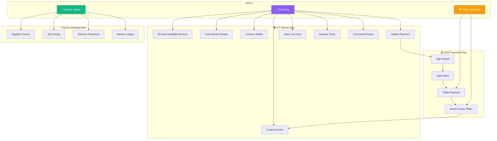

### User Journey 1: First-Time Device Rental

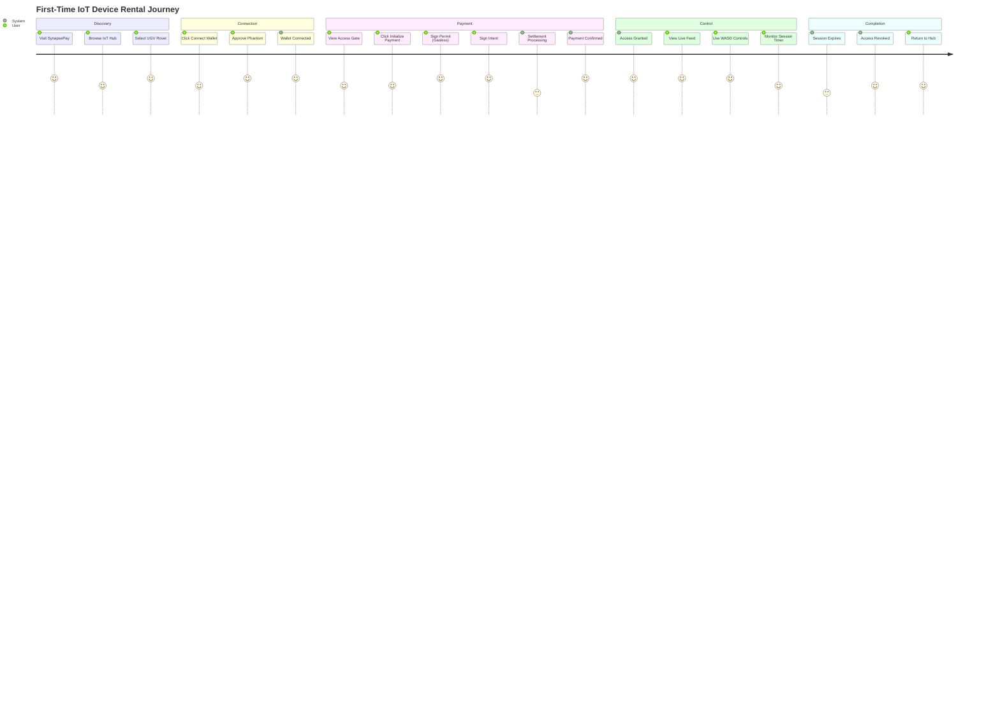

### User Journey 2: Returning User (Quick Rental)

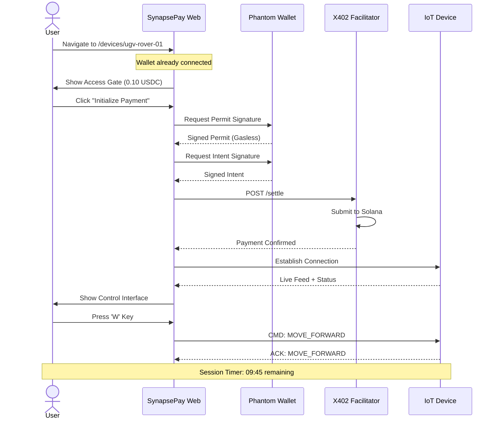

### Complete User Flow Steps

#### Step 1: Discovery & Selection

| Step | Action | Screen |
|------|--------|--------|
| 1.1 | User visits SynapsePay home page | `/` |
| 1.2 | User clicks "IoT Devices" in sidebar | Sidebar |
| 1.3 | User views IoT Device Hub | `/devices` |
| 1.4 | User browses available devices | Device Grid |
| 1.5 | User clicks "Rent Now" on UGV Rover | Device Card |

#### Step 2: Wallet Connection

| Step | Action | Screen |
|------|--------|--------|
| 2.1 | User sees "Connect to SynapsePay" prompt | `/devices/ugv-rover-01` |
| 2.2 | User clicks "Connect Wallet" | Connect Screen |
| 2.3 | Phantom wallet popup appears | Wallet Extension |
| 2.4 | User approves connection | Wallet Extension |
| 2.5 | Wallet address displayed in navbar | Access Gate |

#### Step 3: X402 Payment Flow

| Step | Action | Screen |
|------|--------|--------|
| 3.1 | User sees Secure Access Gate | Access Gate |
| 3.2 | User clicks "Initialize Payment Sequence" | Access Gate |
| 3.3 | **Step 1: Sign Permit** - User signs USDC approval | Wallet Popup |
| 3.4 | Log shows "✓ Permit signature received" | Terminal |
| 3.5 | **Step 2: Sign Intent** - User signs payment intent | Wallet Popup |
| 3.6 | Log shows "✓ Payment intent signed" | Terminal |
| 3.7 | **Step 3: Settlement** - Facilitator submits to Solana | Processing |
| 3.8 | Log shows "✓ Payment settled: 0.10 USDC transferred" | Terminal |
| 3.9 | Access token issued | System |

#### Step 4: Device Control

| Step | Action | Screen |
|------|--------|--------|
| 4.1 | Control interface loads | Control Panel |
| 4.2 | Live feed establishes connection | Live Feed |
| 4.3 | Device status displayed (Battery, Signal, Temp) | Status Panel |
| 4.4 | Session timer starts (10:00) | Timer |
| 4.5 | User uses WASD keys or arrow buttons | Controls |
| 4.6 | Commands sent to device in real-time | System Logs |
| 4.7 | Device responds with acknowledgments | System Logs |

#### Step 5: Session Completion

| Step | Action | Screen |
|------|--------|--------|
| 5.1 | Timer reaches 00:00 | Timer |
| 5.2 | System logs "Session expired" | System Logs |
| 5.3 | Controls disabled | Controls |
| 5.4 | User prompted to rent again or return | Modal |
| 5.5 | User returns to IoT Device Hub | `/devices` |

---

## 🔄 IoT Payment Flow Architecture

```mermaid
graph TB
    subgraph UserLayer["👤 User Layer"]
        User[User with Phantom]
        Browser[Web Browser]
    end

    subgraph Frontend["🌐 Frontend - Port 5174"]
        DeviceHub[IoT Device Hub<br/>/devices]
        DeviceControl[Device Control<br/>/devices/:id]
        AccessGate[DeviceAccessGate<br/>Payment Flow]
        ControlPanel[Control Interface<br/>Live Feed + Controls]
    end

    subgraph X402Layer["💳 X402 Payment Layer"]
        Facilitator[X402 Facilitator<br/>:8403]
        VerifyRoute[/verify<br/>Signature Check]
        SettleRoute[/settle<br/>Submit to Solana]
    end

    subgraph Blockchain["⛓️ Solana Blockchain"]
        Solana[Solana Network]
        USDC[USDC-SPL Token]
        PaymentProgram[synapsepay-payments<br/>Anchor Program]
    end

    subgraph IoTLayer["🌐 IoT Device Layer"]
        DeviceBridge[Device Bridge<br/>:8600]
        UGVRover[UGV Rover 01]
        DroneCam[Drone Camera]
        LEDArray[Smart LED Array]
    end

    User --> Browser
    Browser --> DeviceHub
    DeviceHub --> DeviceControl
    DeviceControl --> AccessGate
    
    AccessGate -->|1. Request Payment| Facilitator
    Facilitator --> VerifyRoute
    Facilitator --> SettleRoute
    SettleRoute -->|2. Submit TX| Solana
    Solana --> USDC
    Solana --> PaymentProgram
    PaymentProgram -->|3. Confirm| Facilitator
    
    Facilitator -->|4. Access Token| AccessGate
    AccessGate -->|5. Unlock| ControlPanel
    
    ControlPanel -->|6. Commands| DeviceBridge
    DeviceBridge --> UGVRover
    DeviceBridge --> DroneCam
    DeviceBridge --> LEDArray
    
    UGVRover -->|7. Feedback| ControlPanel
    DroneCam -->|7. Live Feed| ControlPanel

    style User fill:#8b5cf6,color:#fff
    style Facilitator fill:#f59e0b,color:#fff
    style Solana fill:#9945FF,color:#fff
    style DeviceBridge fill:#10b981,color:#fff
```

---

## 📁 IoT Components Structure

```
apps/web/src/
├── pages/
│   ├── Devices.tsx                 # IoT Device Hub page
│   └── DeviceControl.tsx           # Device control page
│
└── components/device/
    ├── index.ts                    # Barrel exports
    ├── DeviceAccessGate.tsx        # Payment flow UI
    │   ├── Payment steps (3 stages)
    │   ├── Terminal log display
    │   └── Initialize payment button
    │
    ├── DeviceStatusPanel.tsx       # Device metrics
    │   ├── Battery percentage
    │   ├── Signal strength
    │   ├── Temperature
    │   ├── Session timer
    │   └── GPS location
    │
    ├── DirectionalControls.tsx     # Movement controls
    │   ├── Arrow buttons (4 directions)
    │   ├── Stop button (center)
    │   ├── WASD keyboard support
    │   └── Disabled state handling
    │
    ├── LiveFeed.tsx                # Camera/video stream
    │   ├── Live status indicator
    │   ├── Location overlay
    │   ├── Grid overlay effect
    │   └── Loading state
    │
    └── SystemLogs.tsx              # Command terminal
        ├── Auto-scroll to bottom
        ├── Timestamp formatting
        ├── Color-coded log types
        └── TX active indicator
```

### Component Props Reference

| Component | Key Props |
|-----------|-----------|
| `DeviceAccessGate` | `priceUsdc`, `durationMinutes`, `onAccessGranted`, `walletConnected` |
| `DeviceStatusPanel` | `battery`, `signal`, `temperature`, `sessionTimeRemaining`, `location` |
| `DirectionalControls` | `onCommand`, `disabled`, `enableKeyboard` |
| `LiveFeed` | `isConnected`, `deviceName`, `streamUrl`, `location` |
| `SystemLogs` | `logs`, `txActive`, `maxHeight` |

---

## 📊 Device Types & Pricing

| Device | Type | Price | Duration | Controls |
|--------|------|-------|----------|----------|
| UGV Rover 01 | Robot | 0.10 USDC | 10 min | WASD + Camera |
| Smart LED Array | LED | 0.05 USDC | 5 min | On/Off + Colors |
| Drone Camera 01 | Drone | 0.25 USDC | 15 min | WASD + Camera |
| 3D Printer MK3 | Printer | 0.50 USDC | 30 min | Start/Stop |
| Security Cam Hub | Camera | 0.15 USDC | 20 min | PTZ Controls |
| Remote Telescope | Telescope | 0.30 USDC | 15 min | Aim + Capture |

---

## 🎯 Solana Buildathon Alignment

| Criteria | How SynapsePay Delivers |
|----------|------------------------|
| **Uses Solana Meaningfully** | Micropayments, Actions, gasless execution — all require Solana's speed |
| **Consumer-Facing** | Simple UX, instant tasks via AI |
| **Technical Depth** | x402 + Solana Actions + AI + on-chain execution + marketplace |
| **Originality** | Not a clone — a full automation network |
| **Real Demo Scenarios** | Judges can test 10+ workflows instantly |

---

## � Project Structure

### Monorepo Architecture

```mermaid
graph TB
    Root[synapsepay/]

    Root --> Docker[docker-compose.yml<br/>Multi-container orchestration]
    Root --> Env[.env.example<br/>Configuration template]
    Root --> Turbo[turbo.json<br/>Build pipeline]
    Root --> Anchor[Anchor.toml<br/>Solana program config]

    Root --> Apps[apps/]
    Root --> Packages[packages/]
    Root --> Programs[programs/]

    subgraph Applications["📱 Applications"]
        Apps --> Web[web/<br/>React + Vite + ShadCN]
        Apps --> FacApp[x402-facilitator/<br/>Payment Gateway]
        Apps --> ResourceApp[resource-server/<br/>AI Agent API]
        Apps --> ActionGen[actions-api/<br/>Solana Actions/Blinks]
    end

    subgraph Libraries["📦 Packages"]
        Packages --> X402[x402-solana/<br/>TypeScript Library]
        Packages --> AIAgents[ai-agents/<br/>Agent SDK]
        Packages --> TSConfig[tsconfig/<br/>Shared Configs]
        Packages --> UIKit[ui-kit/<br/>Shared Components]
    end

    subgraph SolanaPrograms["⛓️ Solana Programs"]
        Programs --> Registry[synapsepay-registry/<br/>Agent Registry]
        Programs --> Payments[synapsepay-payments/<br/>Escrow + Receipts]
        Programs --> Scheduler[synapsepay-scheduler/<br/>Subscriptions]
    end

    subgraph WebApp["🌐 Web App Details"]
        Web --> WebSrc[src/components/<br/>AgentCard, PaymentModal]
        Web --> WebPages[src/pages/<br/>Marketplace, Dashboard]
        Web --> WebHooks[src/hooks/<br/>usePayment, useAgent]
        Web --> WebConfig[src/config/<br/>Environment]
    end

    subgraph Facilitator["💳 Facilitator Details"]
        FacApp --> FacRoutes[src/routes/<br/>verify, settle, invoice]
        FacApp --> FacServices[src/services/<br/>Solana, Signature]
        FacApp --> FacMiddleware[src/middleware/<br/>x402 Parser]
    end

    subgraph AnchorPrograms["🦀 Anchor Programs"]
        Registry --> RegistryLib[src/lib.rs<br/>register_agent, update_agent]
        Payments --> PaymentsLib[src/lib.rs<br/>create_invoice, settle, claim]
        Scheduler --> SchedulerLib[src/lib.rs<br/>create_subscription, trigger]
    end

    style Root fill:#f59e0b,color:#fff
    style Apps fill:#3b82f6,color:#fff
    style Packages fill:#10b981,color:#fff
    style Programs fill:#9945FF,color:#fff
    style Web fill:#60a5fa,color:#fff
    style FacApp fill:#34d399,color:#fff
    style ResourceApp fill:#8b5cf6,color:#fff
    style Registry fill:#14F195,color:#000
    style Payments fill:#00D18C,color:#000
    style X402 fill:#059669,color:#fff
    style AIAgents fill:#14b8a6,color:#fff
```

### Directory Tree

```
synapsepay/
├── 📄 docker-compose.yml          # Multi-container orchestration
├── 📄 Anchor.toml                 # Solana Anchor configuration
├── 📄 Cargo.toml                  # Rust workspace
├── 📄 turbo.json                  # Turborepo build config
├── 📄 package.json                # Root package manager
├── 📄 .env.example                # Environment template
│
├── 📁 apps/                       # Application services
│   ├── 📁 web/                    # Frontend dashboard
│   │   ├── 📁 src/
│   │   │   ├── 📁 components/     # UI components
│   │   │   │   ├── AgentCard.tsx
│   │   │   │   ├── PaymentModal.tsx
│   │   │   │   ├── TaskDashboard.tsx
│   │   │   │   └── WalletConnect.tsx
│   │   │   ├── 📁 pages/          # Route pages
│   │   │   │   ├── Marketplace.tsx
│   │   │   │   ├── Dashboard.tsx
│   │   │   │   └── AgentDetails.tsx
│   │   │   ├── 📁 hooks/          # Custom hooks
│   │   │   │   ├── usePayment.ts
│   │   │   │   ├── useAgent.ts
│   │   │   │   └── useSolanaActions.ts
│   │   │   └── 📁 config/         # App configuration
│   │   ├── 📄 vite.config.ts
│   │   └── 📄 package.json
│   │
│   ├── 📁 x402-facilitator/       # Payment gateway service
│   │   ├── 📁 src/
│   │   │   ├── 📁 routes/
│   │   │   │   ├── verify.ts      # Signature verification
│   │   │   │   ├── settle.ts      # On-chain settlement
│   │   │   │   └── invoice.ts     # Invoice generation
│   │   │   ├── 📁 services/
│   │   │   │   ├── solana.ts      # Solana RPC client
│   │   │   │   └── signature.ts   # Ed25519 verification
│   │   │   ├── 📁 middleware/
│   │   │   │   └── x402-parser.ts # X-PAYMENT header parser
│   │   │   └── server.ts          # HTTP server entry
│   │   └── 📄 package.json
│   │
│   ├── 📁 resource-server/        # AI Agent execution API
│   │   ├── 📁 src/
│   │   │   ├── 📁 agents/         # AI agent implementations
│   │   │   │   ├── pdf-summarizer.ts
│   │   │   │   ├── image-editor.ts
│   │   │   │   ├── nft-minter.ts
│   │   │   │   └── code-debugger.ts
│   │   │   ├── 📁 orchestrator/   # Task routing
│   │   │   │   └── agent-router.ts
│   │   │   ├── 📁 storage/        # IPFS/Arweave
│   │   │   │   └── ipfs-client.ts
│   │   │   └── server.ts
│   │   └── 📄 package.json
│   │
│   └── 📁 actions-api/            # Solana Actions/Blinks API
│       ├── 📁 src/
│       │   ├── actions.json       # Actions manifest
│       │   └── handlers/          # Action handlers
│       └── 📄 package.json
│
├── 📁 packages/                   # Shared libraries
│   ├── 📁 x402-solana/            # x402 protocol for Solana
│   │   ├── 📁 src/
│   │   │   ├── payload.ts         # Payload encoding/decoding
│   │   │   ├── signatures.ts      # Ed25519 signing
│   │   │   ├── middleware.ts      # Express/Hono middleware
│   │   │   └── types.ts           # TypeScript types
│   │   └── 📄 package.json
│   │
│   ├── 📁 ai-agents/              # Agent SDK
│   │   ├── 📁 src/
│   │   │   ├── base-agent.ts      # Abstract agent class
│   │   │   ├── openai-provider.ts
│   │   │   ├── claude-provider.ts
│   │   │   └── llama-provider.ts
│   │   └── 📄 package.json
│   │
│   ├── 📁 ui-kit/                 # Shared UI components
│   │   ├── 📁 src/
│   │   │   ├── Button.tsx
│   │   │   ├── Card.tsx
│   │   │   └── Modal.tsx
│   │   └── 📄 package.json
│   │
│   └── 📁 tsconfig/               # Shared TypeScript configs
│       ├── base.json
│       ├── react.json
│       └── node.json
│
├── 📁 programs/                   # Solana Anchor programs
│   ├── 📁 synapsepay-registry/    # Agent registry program
│   │   ├── 📁 src/
│   │   │   ├── lib.rs             # Program entry
│   │   │   ├── instructions/
│   │   │   │   ├── register_agent.rs
│   │   │   │   ├── update_agent.rs
│   │   │   │   └── deactivate_agent.rs
│   │   │   └── state/
│   │   │       └── agent.rs       # Agent account struct
│   │   └── Cargo.toml
│   │
│   ├── 📁 synapsepay-payments/    # Payments & receipts program
│   │   ├── 📁 src/
│   │   │   ├── lib.rs
│   │   │   ├── instructions/
│   │   │   │   ├── create_invoice.rs
│   │   │   │   ├── settle_payment.rs
│   │   │   │   ├── claim_payment.rs
│   │   │   │   ├── refund_payment.rs
│   │   │   │   └── mint_receipt.rs
│   │   │   └── state/
│   │   │       ├── invoice.rs
│   │   │       ├── payment.rs
│   │   │       └── receipt.rs
│   │   └── Cargo.toml
│   │
│   └── 📁 synapsepay-scheduler/   # Subscription scheduler
│       ├── 📁 src/
│       │   ├── lib.rs
│       │   ├── instructions/
│       │   │   ├── create_subscription.rs
│       │   │   ├── trigger_task.rs
│       │   │   └── cancel_subscription.rs
│       │   └── state/
│       │       └── subscription.rs
│       └── Cargo.toml
│
├── 📁 tests/                      # Integration tests
│   ├── synapsepay-registry.ts
│   ├── synapsepay-payments.ts
│   └── synapsepay-scheduler.ts
│
├── 📁 scripts/                    # Deployment & utility scripts
│   ├── deploy-programs.sh
│   ├── init-devnet.sh
│   └── seed-agents.ts
│
└── 📁 docs/                       # Documentation
    ├── architecture.md
    ├── api-reference.md
    └── deployment-guide.md
```

### Key Files Description

| File/Directory | Description |
|----------------|-------------|
| `docker-compose.yml` | Orchestrates all services (validator, facilitator, resource-server, web) |
| `Anchor.toml` | Solana Anchor framework configuration |
| `turbo.json` | Turborepo monorepo build pipeline |
| `apps/web/` | React + Vite frontend with ShadCN UI |
| `apps/x402-facilitator/` | Payment verification & settlement service |
| `apps/resource-server/` | AI Agent execution and task routing |
| `apps/actions-api/` | Solana Actions (Blinks) API endpoints |
| `packages/x402-solana/` | TypeScript library for x402 on Solana |
| `packages/ai-agents/` | SDK for building custom AI agents |
| `programs/synapsepay-registry/` | Anchor program for agent registration |
| `programs/synapsepay-payments/` | Anchor program for payments & receipts |
| `programs/synapsepay-scheduler/` | Anchor program for subscriptions |
| `tests/` | Anchor integration tests |
| `scripts/` | Deployment and initialization scripts |

---

## 🏗️ Turborepo Workspaces (Bun)

This is a **Turborepo monorepo** managed with **Bun workspaces**:

```
synapsepay/
├── .env.example              # Single source of truth for configuration
├── docker-compose.yml        # Multi-container orchestration
├── turbo.json                # Build pipeline configuration
├── Anchor.toml               # Solana Anchor configuration
├── Cargo.toml                # Rust workspace root
├── bun.lockb                 # Bun lockfile
├── package.json              # Root workspace configuration
│
├── apps/
│   ├── web/                  # React frontend (Vite + ShadCN + Storybook)
│   ├── x402-facilitator/     # Payment facilitator service
│   ├── resource-server/      # AI Agent execution API
│   └── actions-api/          # Solana Actions (Blinks) API
│
├── packages/
│   ├── x402-solana/          # X402 TypeScript library for Solana
│   ├── ai-agents/            # AI Agent SDK
│   ├── ui-kit/               # Shared UI components
│   └── tsconfig/             # Shared TypeScript configurations
│
└── programs/
    ├── synapsepay-registry/  # Agent Registry (Anchor/Rust)
    ├── synapsepay-payments/  # Payments & Receipts (Anchor/Rust)
    └── synapsepay-scheduler/ # Subscriptions (Anchor/Rust)
```

---

## 🖥️ Frontend Screens (apps/web)

### All Pages & Routes

| Route | Screen Name | Description |
|-------|-------------|-------------|
| `/` | **Home** | Landing page with hero, features, and CTA |
| `/marketplace` | **Agent Marketplace** | Browse, filter, and search AI agents |
| `/agent/:id` | **Agent Details** | Agent info, pricing, reviews, run button |
| `/devices` | **IoT Device Hub** 🆕 | Browse, rent IoT devices with micropayments |
| `/devices/:id` | **Device Control** 🆕 | Real-time device control with live feed |
| `/dashboard` | **User Dashboard** | Task history, subscriptions, spending |
| `/dashboard/tasks` | **Task History** | List of all executed tasks with results |
| `/dashboard/subscriptions` | **Subscriptions** | Active auto-tasks and schedules |
| `/dashboard/wallet` | **Wallet Overview** | USDC balance, transaction history |
| `/create-agent` | **Create Agent** | Form to publish new agent to marketplace |
| `/my-agents` | **My Agents** | Manage agents you've published |
| `/settings` | **Settings** | Profile, notifications, API keys |


### Screen Components Detail

```
apps/web/src/
├── pages/
│   ├── Home.tsx                    # Landing page
│   ├── Marketplace.tsx             # Agent grid with filters
│   ├── AgentDetails.tsx            # Single agent view
│   ├── Devices.tsx                 # 🆕 IoT Device Hub page
│   ├── DeviceControl.tsx           # 🆕 Device control interface
│   ├── Dashboard/
│   │   ├── index.tsx               # Dashboard layout
│   │   ├── TaskHistory.tsx         # Past executions
│   │   ├── Subscriptions.tsx       # Active subscriptions
│   │   └── WalletOverview.tsx      # Balance & transactions
│   ├── CreateAgent.tsx             # Agent creation form
│   ├── MyAgents.tsx                # Agent management
│   └── Settings.tsx                # User preferences
│
├── components/
│   ├── layout/
│   │   ├── Navbar.tsx              # Navigation bar with wallet
│   │   ├── Sidebar.tsx             # Dashboard sidebar
│   │   ├── Footer.tsx              # Site footer
│   │   └── Layout.tsx              # Main layout wrapper
│   │
│   ├── device/                     # 🆕 IoT Device Components
│   │   ├── index.ts                # Barrel exports
│   │   ├── DeviceAccessGate.tsx    # X402 payment flow for device access
│   │   ├── DeviceStatusPanel.tsx   # Battery, signal, temp, session timer
│   │   ├── DirectionalControls.tsx # WASD arrow controls
│   │   ├── LiveFeed.tsx            # Camera/video stream display
│   │   └── SystemLogs.tsx          # Terminal-style command logs
│   │
│   ├── marketplace/
│   │   ├── AgentCard.tsx           # Card showing agent info
│   │   ├── AgentGrid.tsx           # Grid of agent cards
│   │   ├── FilterPanel.tsx         # Category/price filters
│   │   ├── SearchBar.tsx           # Agent search
│   │   └── CategoryTabs.tsx        # AI, IoT, Automation tabs
│   │
│   ├── agent/
│   │   ├── AgentHeader.tsx         # Agent title, icon, rating
│   │   ├── AgentPricing.tsx        # Price display
│   │   ├── AgentDescription.tsx    # Full description
│   │   ├── AgentReviews.tsx        # User reviews
│   │   ├── RunAgentButton.tsx      # Trigger execution
│   │   └── TaskInputForm.tsx       # Task parameters form
│   │
│   ├── payment/
│   │   ├── PaymentModal.tsx        # x402 payment flow modal
│   │   ├── PaymentStatus.tsx       # Payment state indicator
│   │   ├── InvoiceDisplay.tsx      # Invoice details
│   │   ├── ReceiptCard.tsx         # On-chain receipt display
│   │   └── PriceTag.tsx            # USDC price display
│   │
│   ├── dashboard/
│   │   ├── TaskCard.tsx            # Single task display
│   │   ├── TaskResultViewer.tsx    # View task output
│   │   ├── SubscriptionCard.tsx    # Subscription item
│   │   ├── SpendingChart.tsx       # Usage analytics
│   │   └── BalanceCard.tsx         # Wallet balance
│   │
│   ├── wallet/
│   │   ├── WalletConnect.tsx       # Phantom/Solflare connect
│   │   ├── WalletButton.tsx        # Connect/disconnect button
│   │   ├── WalletDropdown.tsx      # Address & actions
│   │   └── TransactionList.tsx     # Recent transactions
│   │
│   ├── actions/
│   │   ├── BlinkGenerator.tsx      # Generate Solana Action URLs
│   │   ├── QRCodeDisplay.tsx       # QR code for actions
│   │   └── ShareButtons.tsx        # Twitter, email share
│   │
│   └── common/
│       ├── Button.tsx              # Styled button
│       ├── Card.tsx                # Card container
│       ├── Modal.tsx               # Modal dialog
│       ├── Input.tsx               # Form input
│       ├── Select.tsx              # Dropdown select
│       ├── Badge.tsx               # Status badge
│       ├── Loader.tsx              # Loading spinner
│       ├── Toast.tsx               # Notifications
│       └── EmptyState.tsx          # Empty list state
│
├── hooks/
│   ├── usePayment.ts               # x402 payment flow
│   ├── useAgent.ts                 # Agent data fetching
│   ├── useWallet.ts                # Wallet connection
│   ├── useTasks.ts                 # Task history
│   ├── useSubscriptions.ts         # Subscription management
│   ├── useSolanaActions.ts         # Blinks/Actions
│   └── useIPFS.ts                  # IPFS result fetching
│
├── stores/
│   ├── walletStore.ts              # Zustand wallet state
│   ├── agentStore.ts               # Agent cache
│   └── taskStore.ts                # Task state
│
└── config/
    ├── constants.ts                # App constants
    ├── endpoints.ts                # API endpoints
    └── solana.ts                   # Solana/RPC config
```

---

## ⛓️ Anchor Programs (Solana Smart Contracts)

### Program 1: synapsepay-registry

**Purpose:** Agent registration and marketplace management

```rust
// programs/synapsepay-registry/src/lib.rs

#[program]
pub mod synapsepay_registry {
    // Instructions
    pub fn register_agent(ctx, metadata_cid, price, category) -> Result<()>
    pub fn update_agent(ctx, new_metadata_cid, new_price) -> Result<()>
    pub fn deactivate_agent(ctx) -> Result<()>
    pub fn reactivate_agent(ctx) -> Result<()>
    pub fn transfer_ownership(ctx, new_owner) -> Result<()>
}

// Accounts
#[account]
pub struct Agent {
    pub owner: Pubkey,              // Agent owner wallet
    pub agent_id: String,           // Unique identifier
    pub metadata_cid: String,       // IPFS CID for metadata
    pub price: u64,                 // Price in USDC (6 decimals)
    pub category: AgentCategory,    // AI, IoT, Automation
    pub total_runs: u64,            // Execution count
    pub total_earned: u64,          // Total USDC earned
    pub rating: u16,                // Average rating (0-500)
    pub is_active: bool,            // Active status
    pub created_at: i64,            // Unix timestamp
    pub updated_at: i64,            // Last update
}

#[derive(AnchorSerialize, AnchorDeserialize)]
pub enum AgentCategory {
    AI,
    IoT,
    Automation,
    Utility,
    Trading,
    NFT,
}
```

### Program 2: synapsepay-payments

**Purpose:** Payment processing, escrow, and receipts

```rust
// programs/synapsepay-payments/src/lib.rs

#[program]
pub mod synapsepay_payments {
    // Instructions
    pub fn create_invoice(ctx, agent_id, amount, expires_at) -> Result<()>
    pub fn settle_payment(ctx, signature) -> Result<()>
    pub fn verify_payment(ctx) -> Result<()>
    pub fn complete_task(ctx, result_cid) -> Result<()>
    pub fn mint_receipt(ctx) -> Result<()>
    pub fn claim_payment(ctx) -> Result<()>
    pub fn refund_payment(ctx) -> Result<()>
    pub fn withdraw_fees(ctx) -> Result<()>
}

// Accounts
#[account]
pub struct Invoice {
    pub invoice_id: Pubkey,         // PDA derived ID
    pub payer: Pubkey,              // User wallet
    pub recipient: Pubkey,          // Agent owner
    pub agent_id: String,           // Target agent
    pub amount: u64,                // USDC amount
    pub state: PaymentState,        // Current state
    pub expires_at: i64,            // Expiration time
    pub created_at: i64,            // Creation time
    pub nonce: u64,                 // Replay protection
}

#[account]
pub struct Payment {
    pub payment_id: Pubkey,         // PDA derived ID
    pub invoice: Pubkey,            // Related invoice
    pub payer: Pubkey,              // User wallet
    pub recipient: Pubkey,          // Agent owner
    pub amount: u64,                // USDC amount
    pub platform_fee: u64,          // 5% platform fee
    pub state: PaymentState,        // Current state
    pub result_cid: Option<String>, // IPFS result CID
    pub tx_signature: [u8; 64],     // Solana tx signature
    pub settled_at: i64,            // Settlement time
}

#[account]
pub struct Receipt {
    pub receipt_id: Pubkey,         // PDA derived ID
    pub payment: Pubkey,            // Related payment
    pub payer: Pubkey,              // User wallet
    pub agent_id: String,           // Agent executed
    pub amount: u64,                // Amount paid
    pub result_cid: String,         // IPFS result
    pub minted_at: i64,             // Mint time
    pub slot: u64,                  // Solana slot
}

#[derive(AnchorSerialize, AnchorDeserialize, Clone, PartialEq)]
pub enum PaymentState {
    InvoiceCreated,
    Pending,
    Executing,
    Completed,
    ReceiptMinted,
    Claimed,
    Expired,
    Failed,
    Refunded,
}
```

### Program 3: synapsepay-scheduler

**Purpose:** Subscription and automated task scheduling

```rust
// programs/synapsepay-scheduler/src/lib.rs

#[program]
pub mod synapsepay_scheduler {
    // Instructions
    pub fn create_subscription(ctx, agent_id, cadence, max_runs) -> Result<()>
    pub fn update_subscription(ctx, new_cadence) -> Result<()>
    pub fn pause_subscription(ctx) -> Result<()>
    pub fn resume_subscription(ctx) -> Result<()>
    pub fn cancel_subscription(ctx) -> Result<()>
    pub fn trigger_scheduled_task(ctx) -> Result<()>
    pub fn fund_subscription(ctx, amount) -> Result<()>
}

// Accounts
#[account]
pub struct Subscription {
    pub subscription_id: Pubkey,    // PDA derived ID
    pub owner: Pubkey,              // Subscriber wallet
    pub agent_id: String,           // Target agent
    pub cadence: ScheduleCadence,   // Frequency
    pub next_run_at: i64,           // Next execution time
    pub last_run_at: Option<i64>,   // Last execution
    pub total_runs: u64,            // Completed runs
    pub max_runs: Option<u64>,      // Max runs limit
    pub balance: u64,               // Pre-funded USDC
    pub is_active: bool,            // Active status
    pub created_at: i64,            // Creation time
}

#[derive(AnchorSerialize, AnchorDeserialize)]
pub enum ScheduleCadence {
    Hourly,
    Daily,
    Weekly,
    Monthly,
    Custom { seconds: u64 },
}
```

---

## 🔌 API Routes (Backend Services)

### x402-facilitator (Port 8403)

| Method | Route | Description |
|--------|-------|-------------|
| `POST` | `/invoice` | Create new payment invoice |
| `POST` | `/verify` | Verify payment signature |
| `POST` | `/settle` | Settle payment on-chain |
| `GET` | `/status/:invoiceId` | Check invoice status |
| `GET` | `/health` | Service health check |

### resource-server (Port 8404)

| Method | Route | Description |
|--------|-------|-------------|
| `POST` | `/agent/execute` | Execute AI agent task |
| `GET` | `/agent/:id` | Get agent details |
| `GET` | `/agents` | List all agents |
| `GET` | `/task/:id` | Get task status/result |
| `GET` | `/result/:cid` | Fetch result from IPFS |
| `POST` | `/device/command` | Send IoT device command |
| `GET` | `/health` | Service health check |

### actions-api (Port 8405)

| Method | Route | Description |
|--------|-------|-------------|
| `GET` | `/actions.json` | Actions manifest |
| `GET` | `/api/actions/:agentId` | Get action metadata |
| `POST` | `/api/actions/:agentId` | Execute action |
| `GET` | `/blink/:agentId` | Generate Blink URL |

---

## 🧪 Test Suite

### Anchor Program Tests

```
tests/
├── synapsepay-registry.ts
│   ├── ✅ should register new agent
│   ├── ✅ should update agent metadata
│   ├── ✅ should deactivate agent
│   ├── ✅ should reject unauthorized update
│   └── ✅ should transfer ownership
│
├── synapsepay-payments.ts
│   ├── ✅ should create invoice
│   ├── ✅ should settle payment with valid signature
│   ├── ✅ should reject expired invoice
│   ├── ✅ should reject replay attack
│   ├── ✅ should complete task and store CID
│   ├── ✅ should mint receipt NFT
│   ├── ✅ should claim payment as owner
│   ├── ✅ should refund on failure
│   └── ✅ should deduct platform fee
│
└── synapsepay-scheduler.ts
    ├── ✅ should create subscription
    ├── ✅ should trigger scheduled task
    ├── ✅ should pause/resume subscription
    ├── ✅ should cancel subscription
    └── ✅ should enforce max runs limit

Total: 50+ tests
```

---

## 🧩 Component Architecture

### Full Component Hierarchy

```mermaid
graph TB
    subgraph AppLayer["🏠 Application Layer"]
        App[App.tsx<br/>Root Component]
        Router[AppRouter.tsx<br/>React Router]
        Providers[Providers.tsx<br/>Context Providers]
    end

    subgraph LayoutLayer["📐 Layout Layer"]
        Layout[Layout.tsx<br/>Main Layout]
        Navbar[Navbar.tsx<br/>Navigation + Wallet]
        Sidebar[Sidebar.tsx<br/>Dashboard Navigation]
        Footer[Footer.tsx<br/>Site Footer]
    end

    subgraph MarketplaceLayer["🏪 Marketplace Layer"]
        Marketplace[Marketplace.tsx<br/>Agent Grid Page]
        AgentCard[AgentCard.tsx<br/>Agent Preview Card]
        AgentGrid[AgentGrid.tsx<br/>Responsive Grid]
        FilterPanel[FilterPanel.tsx<br/>Category Filters]
        SearchBar[SearchBar.tsx<br/>Agent Search]
        CategoryTabs[CategoryTabs.tsx<br/>AI/IoT/Automation]
    end

    subgraph AgentLayer["🤖 Agent Execution Layer"]
        AgentDetails[AgentDetails.tsx<br/>Full Agent View]
        AgentHeader[AgentHeader.tsx<br/>Title + Rating]
        AgentPricing[AgentPricing.tsx<br/>Price Display]
        RunAgentButton[RunAgentButton.tsx<br/>Execute Trigger]
        TaskInputForm[TaskInputForm.tsx<br/>Parameter Form]
        TaskResultViewer[TaskResultViewer.tsx<br/>Output Display]
        AgentReviews[AgentReviews.tsx<br/>User Reviews]
    end

    subgraph PaymentLayer["💳 Payment Layer"]
        PaymentGate[PaymentGate.tsx<br/>Access Control]
        PaymentModal[PaymentModal.tsx<br/>x402 Flow UI]
        InvoiceDisplay[InvoiceDisplay.tsx<br/>Invoice Details]
        PaymentStatus[PaymentStatus.tsx<br/>State Indicator]
        ReceiptCard[ReceiptCard.tsx<br/>On-chain Receipt]
        PriceTag[PriceTag.tsx<br/>USDC Display]
    end

    subgraph DashboardLayer["📊 Dashboard Layer"]
        Dashboard[Dashboard.tsx<br/>User Overview]
        TaskHistory[TaskHistory.tsx<br/>Execution Log]
        TaskCard[TaskCard.tsx<br/>Single Task]
        SubscriptionManager[SubscriptionManager.tsx<br/>Auto-Tasks]
        SubscriptionCard[SubscriptionCard.tsx<br/>Sub Item]
        SpendingChart[SpendingChart.tsx<br/>Analytics]
    end

    subgraph WalletLayer["👛 Wallet Layer"]
        WalletProvider[WalletProvider.tsx<br/>Solana Adapter]
        WalletConnect[WalletConnect.tsx<br/>Connection UI]
        WalletButton[WalletButton.tsx<br/>Connect/Disconnect]
        WalletDropdown[WalletDropdown.tsx<br/>Account Menu]
        BalanceCard[BalanceCard.tsx<br/>USDC Balance]
        TransactionList[TransactionList.tsx<br/>Tx History]
    end

    subgraph ActionsLayer["⚡ Solana Actions Layer"]
        BlinkGenerator[BlinkGenerator.tsx<br/>Action URL Creator]
        QRCodeDisplay[QRCodeDisplay.tsx<br/>QR for Actions]
        ShareButtons[ShareButtons.tsx<br/>Social Share]
        ActionPreview[ActionPreview.tsx<br/>Blink Preview]
    end

    subgraph CommonLayer["🧱 Common Components"]
        Button[Button.tsx]
        Card[Card.tsx]
        Modal[Modal.tsx]
        Input[Input.tsx]
        Select[Select.tsx]
        Badge[Badge.tsx]
        Loader[Loader.tsx]
        Toast[Toast.tsx]
        EmptyState[EmptyState.tsx]
        Countdown[CountdownTimer.tsx]
    end

    %% Connections
    App --> Providers
    Providers --> Router
    Router --> Layout
    Layout --> Navbar
    Layout --> Sidebar
    Layout --> Footer

    Router --> Marketplace
    Router --> AgentDetails
    Router --> Dashboard
    
    Marketplace --> AgentGrid
    AgentGrid --> AgentCard
    Marketplace --> FilterPanel
    Marketplace --> SearchBar
    Marketplace --> CategoryTabs

    AgentDetails --> AgentHeader
    AgentDetails --> AgentPricing
    AgentDetails --> RunAgentButton
    AgentDetails --> TaskInputForm
    AgentDetails --> AgentReviews
    
    RunAgentButton --> PaymentGate
    PaymentGate --> PaymentModal
    PaymentModal --> InvoiceDisplay
    PaymentModal --> PaymentStatus
    PaymentGate --> TaskResultViewer
    TaskResultViewer --> ReceiptCard

    Dashboard --> TaskHistory
    TaskHistory --> TaskCard
    Dashboard --> SubscriptionManager
    SubscriptionManager --> SubscriptionCard
    Dashboard --> SpendingChart
    Dashboard --> BalanceCard

    Navbar --> WalletButton
    WalletButton --> WalletConnect
    WalletButton --> WalletDropdown
    Dashboard --> TransactionList

    AgentDetails --> BlinkGenerator
    BlinkGenerator --> QRCodeDisplay
    BlinkGenerator --> ShareButtons

    %% Common component usage
    PaymentModal --> Button
    PaymentModal --> Card
    PaymentModal --> Modal
    TaskInputForm --> Input
    TaskInputForm --> Select
    AgentCard --> Badge
    PaymentStatus --> Loader
    ReceiptCard --> Card
    SubscriptionCard --> Countdown

    style App fill:#3b82f6,color:#fff
    style Router fill:#60a5fa,color:#fff
    style Providers fill:#93c5fd,color:#000
    style Layout fill:#10b981,color:#fff
    style Navbar fill:#34d399,color:#000
    style Marketplace fill:#f59e0b,color:#fff
    style AgentCard fill:#fbbf24,color:#000
    style AgentDetails fill:#8b5cf6,color:#fff
    style RunAgentButton fill:#a855f7,color:#fff
    style PaymentGate fill:#ef4444,color:#fff
    style PaymentModal fill:#f87171,color:#fff
    style Dashboard fill:#14b8a6,color:#fff
    style TaskHistory fill:#2dd4bf,color:#000
    style WalletButton fill:#9945FF,color:#fff
    style BlinkGenerator fill:#6366f1,color:#fff
    style Button fill:#475569,color:#fff
```

### Component Categories

| Category | Components | Count |
|----------|------------|-------|
| 📐 **Layout** | Layout, Navbar, Sidebar, Footer | 4 |
| 🏪 **Marketplace** | Marketplace, AgentCard, AgentGrid, FilterPanel, SearchBar, CategoryTabs | 6 |
| 🤖 **Agent** | AgentDetails, AgentHeader, AgentPricing, RunAgentButton, TaskInputForm, TaskResultViewer, AgentReviews | 7 |
| 💳 **Payment** | PaymentGate, PaymentModal, InvoiceDisplay, PaymentStatus, ReceiptCard, PriceTag | 6 |
| 📊 **Dashboard** | Dashboard, TaskHistory, TaskCard, SubscriptionManager, SubscriptionCard, SpendingChart | 6 |
| 👛 **Wallet** | WalletProvider, WalletConnect, WalletButton, WalletDropdown, BalanceCard, TransactionList | 6 |
| ⚡ **Actions** | BlinkGenerator, QRCodeDisplay, ShareButtons, ActionPreview | 4 |
| 🧱 **Common** | Button, Card, Modal, Input, Select, Badge, Loader, Toast, EmptyState, CountdownTimer | 10 |
| **Total** | | **49** |

### Component States & Props

```typescript
// Key Component Interfaces

interface AgentCardProps {
  agent: Agent;
  onSelect: (agentId: string) => void;
  isLoading?: boolean;
}

interface PaymentModalProps {
  agent: Agent;
  isOpen: boolean;
  onClose: () => void;
  onPaymentComplete: (receipt: Receipt) => void;
}

interface TaskInputFormProps {
  agent: Agent;
  onSubmit: (params: TaskParams) => void;
  isExecuting: boolean;
}

interface TaskResultViewerProps {
  taskId: string;
  resultCID: string;
  status: TaskStatus;
}

interface SubscriptionCardProps {
  subscription: Subscription;
  onPause: () => void;
  onCancel: () => void;
  onResume: () => void;
}

interface BlinkGeneratorProps {
  agentId: string;
  taskParams?: TaskParams;
  onGenerate: (blinkUrl: string) => void;
}

// State Types
type PaymentState = 
  | 'idle'
  | 'creating_invoice'
  | 'awaiting_signature'
  | 'verifying'
  | 'settling'
  | 'executing'
  | 'completed'
  | 'failed';

type TaskStatus = 
  | 'pending'
  | 'executing'
  | 'completed'
  | 'failed';
```

### Storybook Component Library

All components are documented in **Storybook** with interactive examples:

```
📚 Storybook Categories
├── 📐 Layout Components
│   ├── Navbar (with wallet states)
│   ├── Sidebar (collapsed/expanded)
│   └── Footer
│
├── 🏪 Marketplace Components
│   ├── AgentCard (default, loading, featured)
│   ├── AgentGrid (3-col, 4-col, responsive)
│   ├── FilterPanel (with active filters)
│   ├── SearchBar (with suggestions)
│   └── CategoryTabs (AI, IoT, Automation)
│
├── 🤖 Agent Components
│   ├── AgentHeader (with rating stars)
│   ├── AgentPricing (USDC display)
│   ├── RunAgentButton (idle, loading, disabled)
│   ├── TaskInputForm (various field types)
│   ├── TaskResultViewer (text, image, file)
│   └── AgentReviews (with pagination)
│
├── 💳 Payment Components
│   ├── PaymentGate (locked, unlocked, expired)
│   ├── PaymentModal (all payment states)
│   ├── InvoiceDisplay (with countdown)
│   ├── PaymentStatus (pending, success, error)
│   ├── ReceiptCard (with Solscan link)
│   └── PriceTag (various amounts)
│
├── 📊 Dashboard Components
│   ├── TaskCard (completed, failed, pending)
│   ├── TaskHistory (with filters)
│   ├── SubscriptionCard (active, paused)
│   ├── SpendingChart (daily, weekly, monthly)
│   └── BalanceCard (with fund button)
│
├── 👛 Wallet Components
│   ├── WalletConnect (Phantom, Solflare)
│   ├── WalletButton (connected, disconnected)
│   ├── WalletDropdown (with actions)
│   └── TransactionList (paginated)
│
├── ⚡ Actions Components
│   ├── BlinkGenerator (step by step)
│   ├── QRCodeDisplay (scannable)
│   ├── ShareButtons (Twitter, Email)
│   └── ActionPreview (embedded blink)
│
└── 🧱 Common Components
    ├── Button (primary, secondary, ghost, sizes)
    ├── Card (default, elevated, interactive)
    ├── Modal (sm, md, lg, fullscreen)
    ├── Input (text, number, file, error states)
    ├── Select (single, multi, searchable)
    ├── Badge (success, warning, error, info)
    ├── Loader (spinner, skeleton, dots)
    ├── Toast (success, error, info, warning)
    ├── EmptyState (no results, no tasks)
    └── CountdownTimer (seconds, minutes)
```

### Run Storybook

```bash
# Start Storybook development server
cd apps/web && bun run storybook

# Build static Storybook
cd apps/web && bun run build-storybook

# Access at http://localhost:6006
```

---

## 📦 Quick Start

### Prerequisites

- Node.js 18+ or Bun
- Solana CLI
- Anchor Framework
- Phantom Wallet

### Installation

```bash
# Clone the repository
git clone https://github.com/samarabdelhameed/Solana-SynapsePay.git
cd Solana-SynapsePay

# Install dependencies
bun install

# Configure environment
cp .env.example .env
# Edit .env with your keys

# Start development server
bun run dev
```

### Environment Variables

```env
SOLANA_RPC_URL=https://api.devnet.solana.com
RELAYER_PRIVATE_KEY=your_key_here
OPENAI_API_KEY=your_key_here
IPFS_API_KEY=your_key_here
```

---

## ⚙️ Environment Configuration

### Configuration Flow

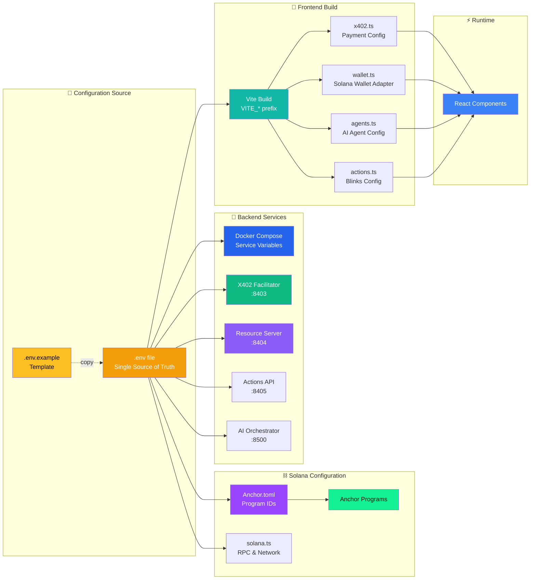

### Complete .env.example

```env
# ═══════════════════════════════════════════════════════════════
# 🚀 SYNAPSEPAY ENVIRONMENT CONFIGURATION
# ═══════════════════════════════════════════════════════════════
# Copy this file to .env and fill in your values
# NEVER commit .env to version control!

# ═══════════════════════════════════════════════════════════════
# ⛓️ SOLANA CONFIGURATION
# ═══════════════════════════════════════════════════════════════
SOLANA_NETWORK=devnet
SOLANA_RPC_URL=https://api.devnet.solana.com
SOLANA_WS_URL=wss://api.devnet.solana.com

# Program IDs (deployed Anchor programs)
REGISTRY_PROGRAM_ID=SYNRegistry111111111111111111111111111111111
PAYMENTS_PROGRAM_ID=SYNPayments111111111111111111111111111111111
SCHEDULER_PROGRAM_ID=SYNScheduler11111111111111111111111111111111

# USDC Token Mint
USDC_MINT_ADDRESS=4zMMC9srt5Ri5X14GAgXhaHii3GnPAEERYPJgZJDncDU

# ═══════════════════════════════════════════════════════════════
# 💳 X402 FACILITATOR CONFIGURATION
# ═══════════════════════════════════════════════════════════════
FACILITATOR_PORT=8403
FACILITATOR_PRIVATE_KEY=your_facilitator_keypair_base58
FACILITATOR_FEE_BPS=500
INVOICE_EXPIRY_SECONDS=300

# ═══════════════════════════════════════════════════════════════
# 🤖 RESOURCE SERVER CONFIGURATION
# ═══════════════════════════════════════════════════════════════
RESOURCE_SERVER_PORT=8404
TASK_TIMEOUT_SECONDS=60
MAX_CONCURRENT_TASKS=10

# ═══════════════════════════════════════════════════════════════
# ⚡ SOLANA ACTIONS API CONFIGURATION
# ═══════════════════════════════════════════════════════════════
ACTIONS_API_PORT=8405
ACTIONS_BASE_URL=https://synapsepay.io/api/actions
BLINKS_ENABLED=true

# ═══════════════════════════════════════════════════════════════
# 🧠 AI SERVICES CONFIGURATION
# ═══════════════════════════════════════════════════════════════
# OpenAI
OPENAI_API_KEY=sk-your-openai-key
OPENAI_MODEL=gpt-4-turbo-preview
OPENAI_MAX_TOKENS=4096

# Anthropic (Claude)
ANTHROPIC_API_KEY=sk-ant-your-anthropic-key
ANTHROPIC_MODEL=claude-3-opus-20240229

# Local LLM (Ollama)
OLLAMA_BASE_URL=http://localhost:11434
OLLAMA_MODEL=llama2

# DeepSeek
DEEPSEEK_API_KEY=your-deepseek-key

# ═══════════════════════════════════════════════════════════════
# 💾 STORAGE CONFIGURATION
# ═══════════════════════════════════════════════════════════════
# IPFS
IPFS_GATEWAY_URL=https://ipfs.io/ipfs
IPFS_API_URL=http://localhost:5001
IPFS_API_KEY=your-ipfs-api-key

# Arweave (optional)
ARWEAVE_WALLET_PATH=./arweave-wallet.json
ARWEAVE_GATEWAY_URL=https://arweave.net

# ═══════════════════════════════════════════════════════════════
# 📊 REDIS CONFIGURATION
# ═══════════════════════════════════════════════════════════════
REDIS_URL=redis://localhost:6379
REDIS_PASSWORD=
REDIS_DB=0

# ═══════════════════════════════════════════════════════════════
# 🌐 IOT / DEVICE BRIDGE CONFIGURATION (optional)
# ═══════════════════════════════════════════════════════════════
DEVICE_BRIDGE_PORT=8600
DEVICE_BRIDGE_ENABLED=false
MQTT_BROKER_URL=mqtt://localhost:1883
DEVICE_AUTH_SECRET=your-device-auth-secret

# ═══════════════════════════════════════════════════════════════
# 🎨 FRONTEND CONFIGURATION (VITE_* prefix required)
# ═══════════════════════════════════════════════════════════════
VITE_APP_NAME=SynapsePay
VITE_APP_URL=http://localhost:5173

# Solana
VITE_SOLANA_NETWORK=devnet
VITE_SOLANA_RPC_URL=https://api.devnet.solana.com

# Program IDs
VITE_REGISTRY_PROGRAM_ID=SYNRegistry111111111111111111111111111111111
VITE_PAYMENTS_PROGRAM_ID=SYNPayments111111111111111111111111111111111
VITE_SCHEDULER_PROGRAM_ID=SYNScheduler11111111111111111111111111111111

# API Endpoints
VITE_FACILITATOR_URL=http://localhost:8403
VITE_RESOURCE_SERVER_URL=http://localhost:8404
VITE_ACTIONS_API_URL=http://localhost:8405

# Feature Flags
VITE_ENABLE_IOT=false
VITE_ENABLE_SUBSCRIPTIONS=true
VITE_ENABLE_BLINKS=true

# ═══════════════════════════════════════════════════════════════
# 🔒 SECURITY CONFIGURATION
# ═══════════════════════════════════════════════════════════════
JWT_SECRET=your-super-secret-jwt-key
CORS_ALLOWED_ORIGINS=http://localhost:5173,https://synapsepay.io
RATE_LIMIT_REQUESTS=100
RATE_LIMIT_WINDOW_MS=60000
```

### Service-Specific Configuration Files

#### apps/web/src/config/solana.ts

```typescript
// Solana Network Configuration
export const solanaConfig = {
  network: import.meta.env.VITE_SOLANA_NETWORK || 'devnet',
  rpcUrl: import.meta.env.VITE_SOLANA_RPC_URL || 'https://api.devnet.solana.com',
  
  programIds: {
    registry: import.meta.env.VITE_REGISTRY_PROGRAM_ID,
    payments: import.meta.env.VITE_PAYMENTS_PROGRAM_ID,
    scheduler: import.meta.env.VITE_SCHEDULER_PROGRAM_ID,
  },
  
  tokens: {
    usdc: {
      devnet: '4zMMC9srt5Ri5X14GAgXhaHii3GnPAEERYPJgZJDncDU',
      'mainnet-beta': 'EPjFWdd5AufqSSqeM2qN1xzybapC8G4wEGGkZwyTDt1v',
    },
  },
};
```

#### apps/web/src/config/x402.ts

```typescript
// X402 Payment Configuration
export const x402Config = {
  facilitatorUrl: import.meta.env.VITE_FACILITATOR_URL || 'http://localhost:8403',
  invoiceExpiryMs: 5 * 60 * 1000, // 5 minutes
  
  endpoints: {
    createInvoice: '/invoice',
    verifyPayment: '/verify',
    settlePayment: '/settle',
    checkStatus: '/status',
  },
  
  defaultCurrency: 'USDC',
  minPayment: 0.01, // 0.01 USDC
  maxPayment: 1000, // 1000 USDC
};
```

#### apps/web/src/config/agents.ts

```typescript
// AI Agent Configuration
export const agentConfig = {
  resourceServerUrl: import.meta.env.VITE_RESOURCE_SERVER_URL || 'http://localhost:8404',
  
  endpoints: {
    execute: '/agent/execute',
    list: '/agents',
    details: '/agent',
    taskStatus: '/task',
    result: '/result',
  },
  
  taskTimeoutMs: 60 * 1000, // 60 seconds
  pollingIntervalMs: 1000, // 1 second
  
  categories: ['AI', 'IoT', 'Automation', 'Utility', 'Trading', 'NFT'],
};
```

#### apps/web/src/config/actions.ts

```typescript
// Solana Actions (Blinks) Configuration
export const actionsConfig = {
  apiUrl: import.meta.env.VITE_ACTIONS_API_URL || 'http://localhost:8405',
  baseUrl: import.meta.env.VITE_APP_URL || 'http://localhost:5173',
  
  enabled: import.meta.env.VITE_ENABLE_BLINKS === 'true',
  
  endpoints: {
    manifest: '/actions.json',
    getAction: '/api/actions',
    executeAction: '/api/actions',
    generateBlink: '/blink',
  },
  
  socialShare: {
    twitter: true,
    telegram: true,
    email: true,
  },
};
```

### Environment by Deployment Stage

| Variable | Development | Staging | Production |
|----------|-------------|---------|------------|
| `SOLANA_NETWORK` | devnet | devnet | mainnet-beta |
| `SOLANA_RPC_URL` | localhost:8899 | api.devnet.solana.com | Custom RPC |
| `FACILITATOR_FEE_BPS` | 0 | 500 | 500 |
| `VITE_ENABLE_IOT` | true | true | false |
| `REDIS_URL` | localhost:6379 | redis-staging | redis-prod |
| `CORS_ALLOWED_ORIGINS` | localhost | staging.synapsepay.io | synapsepay.io |

### Loading Order

```
┌─────────────────────────────────────────────────────────────────────────┐
│  1. .env.example (template, committed to git)                           │
│  2. .env (local overrides, gitignored)                                  │
│  3. .env.local (machine-specific, gitignored)                           │
│  4. .env.[mode] (development/staging/production)                        │
│  5. .env.[mode].local (mode-specific local overrides)                   │
│  6. Process environment (Docker, CI/CD)                                 │
└─────────────────────────────────────────────────────────────────────────┘

Priority: Later files override earlier ones
```

### Key Environment Variables Summary

All configuration is centralized in `.env.example`:

```env
# ═══════════════════════════════════════════════════════════════
# ⛓️ SOLANA BLOCKCHAIN
# ═══════════════════════════════════════════════════════════════
SOLANA_NETWORK=devnet
SOLANA_RPC_URL=https://api.devnet.solana.com
SOLANA_WS_URL=wss://api.devnet.solana.com
SOLANA_VALIDATOR_PORT=8899

# ═══════════════════════════════════════════════════════════════
# 📝 ANCHOR PROGRAMS (deployed addresses)
# ═══════════════════════════════════════════════════════════════
REGISTRY_PROGRAM_ID=SYNRegistry111111111111111111111111111111111
PAYMENTS_PROGRAM_ID=SYNPayments111111111111111111111111111111111
SCHEDULER_PROGRAM_ID=SYNScheduler11111111111111111111111111111111
USDC_MINT_ADDRESS=4zMMC9srt5Ri5X14GAgXhaHii3GnPAEERYPJgZJDncDU

# ═══════════════════════════════════════════════════════════════
# 🔧 X402 SERVICES
# ═══════════════════════════════════════════════════════════════
X402_FACILITATOR_PORT=8403
X402_RESOURCE_PORT=8404
ACTIONS_API_PORT=8405
AI_ORCHESTRATOR_PORT=8500

# ═══════════════════════════════════════════════════════════════
# 🎨 FRONTEND (VITE_ prefix required for browser access)
# ═══════════════════════════════════════════════════════════════
VITE_SOLANA_NETWORK=devnet
VITE_SOLANA_RPC_URL=https://api.devnet.solana.com
VITE_REGISTRY_PROGRAM_ID=SYNRegistry111111111111111111111111111111111
VITE_PAYMENTS_PROGRAM_ID=SYNPayments111111111111111111111111111111111
VITE_SCHEDULER_PROGRAM_ID=SYNScheduler11111111111111111111111111111111
VITE_USDC_MINT_ADDRESS=4zMMC9srt5Ri5X14GAgXhaHii3GnPAEERYPJgZJDncDU

# ═══════════════════════════════════════════════════════════════
# 🤖 AI AGENT CONFIGURATION
# ═══════════════════════════════════════════════════════════════
VITE_RESOURCE_SERVER_URL=http://localhost:8404
VITE_FACILITATOR_URL=http://localhost:8403
VITE_ACTIONS_API_URL=http://localhost:8405

# ═══════════════════════════════════════════════════════════════
# 🧠 AI PROVIDERS
# ═══════════════════════════════════════════════════════════════
OPENAI_API_KEY=sk-your-openai-key
ANTHROPIC_API_KEY=sk-ant-your-anthropic-key
```

### Configuration Principles

| Principle | Description |
|-----------|-------------|
| **Single Source of Truth** | All configuration in `.env.example` |
| **VITE_ Prefix** | Browser variables need `VITE_` prefix |
| **No Hardcoding** | All addresses/URLs from environment |
| **Docker Integration** | Services read from `.env` automatically |
| **Type Safety** | Config modules export typed constants |
| **Anchor Integration** | Program IDs from `Anchor.toml` |

> 📖 See `.env.example` for complete documentation.

---

## 🛠️ Development Workflow

### Monorepo Commands

```bash
# ═══════════════════════════════════════════════════════════════
# 🚀 MAIN COMMANDS
# ═══════════════════════════════════════════════════════════════

# Run all dev servers (frontend + backend + validator)
bun run dev

# Build all packages
bun run build

# Run all tests
bun run test

# Run E2E tests (headless)
bun run test:e2e

# Run E2E tests (keep services running for debugging)
bun run test:e2e:dev

# Clean all build artifacts
bun run clean

# Format code
bun run format

# Lint code
bun run lint

# Type check all packages
bun run typecheck
```

### Anchor Program Development

```bash
# ═══════════════════════════════════════════════════════════════
# ⛓️ SOLANA PROGRAMS (Anchor)
# ═══════════════════════════════════════════════════════════════

# Navigate to programs
cd programs/

# Build all Anchor programs
anchor build

# Run Anchor tests
anchor test

# Deploy to devnet
anchor deploy --provider.cluster devnet

# Deploy to localnet
anchor deploy --provider.cluster localnet

# Start local Solana validator
solana-test-validator

# Start validator with programs pre-deployed
solana-test-validator \
  --bpf-program SYNRegistry111111111111111111111111111111111 target/deploy/synapsepay_registry.so \
  --bpf-program SYNPayments111111111111111111111111111111111 target/deploy/synapsepay_payments.so \
  --bpf-program SYNScheduler11111111111111111111111111111111 target/deploy/synapsepay_scheduler.so

# Generate IDL
anchor idl init --filepath target/idl/synapsepay_registry.json SYNRegistry111111111111111111111111111111111

# Verify program on-chain
anchor verify SYNRegistry111111111111111111111111111111111
```

### Package-Specific Development

```bash
# ═══════════════════════════════════════════════════════════════
# 📦 X402 SOLANA LIBRARY
# ═══════════════════════════════════════════════════════════════
cd packages/x402-solana
bun run build         # Build TypeScript library
bun run typecheck     # Validate types
bun run test          # Run unit tests

# ═══════════════════════════════════════════════════════════════
# 🤖 AI AGENTS SDK
# ═══════════════════════════════════════════════════════════════
cd packages/ai-agents
bun run build         # Build agent SDK
bun run test          # Test agent implementations

# ═══════════════════════════════════════════════════════════════
# 🎨 FRONTEND (apps/web)
# ═══════════════════════════════════════════════════════════════
cd apps/web
bun run dev           # Development server (port 5173)
bun run storybook     # Component library (port 6006)
bun run build         # Production build
bun run preview       # Preview production build
bun run test          # Run component tests

# ═══════════════════════════════════════════════════════════════
# 💳 X402 FACILITATOR
# ═══════════════════════════════════════════════════════════════
cd apps/x402-facilitator
bun run dev           # Development mode with hot reload
bun run start         # Start facilitator (port 8403)
bun run test          # Run facilitator tests

# ═══════════════════════════════════════════════════════════════
# 🤖 RESOURCE SERVER (AI Agents API)
# ═══════════════════════════════════════════════════════════════
cd apps/resource-server
bun run dev           # Development mode
bun run start         # Start server (port 8404)
bun run test          # Run API tests

# ═══════════════════════════════════════════════════════════════
# ⚡ SOLANA ACTIONS API (Blinks)
# ═══════════════════════════════════════════════════════════════
cd apps/actions-api
bun run dev           # Development mode
bun run start         # Start server (port 8405)
bun run test          # Run action tests
```

### Docker Development

```bash
# ═══════════════════════════════════════════════════════════════
# 🐳 DOCKER COMMANDS
# ═══════════════════════════════════════════════════════════════

# Start all services
docker-compose up -d

# Start with build
docker-compose up -d --build

# Start specific services
docker-compose up -d solana-validator x402-facilitator resource-server web-frontend

# Start with AI services profile
docker-compose --profile ai up -d

# Start with IoT services profile
docker-compose --profile iot up -d

# View logs
docker-compose logs -f

# View specific service logs
docker-compose logs -f resource-server

# Stop all services
docker-compose down

# Stop and remove volumes
docker-compose down -v

# Rebuild specific service
docker-compose build resource-server
```

### Testing Commands

```bash
# ═══════════════════════════════════════════════════════════════
# 🧪 TESTING
# ═══════════════════════════════════════════════════════════════

# Run all tests
bun run test

# Run Anchor program tests
anchor test

# Run with coverage
anchor test --coverage

# Run frontend tests
cd apps/web && bun run test

# Run E2E tests
bun run test:e2e

# Run E2E tests in watch mode
bun run test:e2e:watch

# Run specific test file
anchor test tests/synapsepay-payments.ts

# Run tests with verbose output
anchor test -- --verbose
```

### Deployment Commands

```bash
# ═══════════════════════════════════════════════════════════════
# 🚀 DEPLOYMENT
# ═══════════════════════════════════════════════════════════════

# Deploy programs to devnet
./scripts/deploy-programs.sh devnet

# Deploy programs to mainnet
./scripts/deploy-programs.sh mainnet-beta

# Initialize devnet with test data
./scripts/init-devnet.sh

# Seed sample agents
bun run scripts/seed-agents.ts

# Build frontend for production
cd apps/web && bun run build

# Deploy frontend to Vercel
vercel --prod

# Verify deployment
./scripts/verify-deployment.sh
```

### Useful Aliases

```bash
# Add to your .bashrc or .zshrc

# SynapsePay shortcuts
alias sp-dev="cd ~/Solana-SynapsePay && bun run dev"
alias sp-build="cd ~/Solana-SynapsePay && bun run build"
alias sp-test="cd ~/Solana-SynapsePay && anchor test"
alias sp-deploy="cd ~/Solana-SynapsePay && anchor deploy"
alias sp-logs="docker-compose logs -f"
alias sp-validator="solana-test-validator"

# Solana shortcuts
alias sol-balance="solana balance"
alias sol-airdrop="solana airdrop 2"
alias sol-logs="solana logs"
```

---

## � API Documentation

### Facilitator API (Port 8403)

| Method | Endpoint | Description | Request Body | Response |
|--------|----------|-------------|--------------|----------|
| `POST` | `/invoice` | Create payment invoice | `{ agentId, amount, payer }` | `{ invoiceId, expiresAt, paymentDetails }` |
| `POST` | `/verify` | Verify payment signature | `{ payload, signature }` | `{ valid: boolean, errors?: [] }` |
| `POST` | `/settle` | Settle payment on-chain | `{ invoiceId, txSignature }` | `{ txHash, slot, receiptId }` |
| `GET` | `/status/:invoiceId` | Check invoice status | - | `{ state, paidAt?, resultCid? }` |
| `GET` | `/health` | Health check | - | `{ status: 'ok', uptime }` |

#### Create Invoice Example

```bash
curl -X POST http://localhost:8403/invoice \
  -H "Content-Type: application/json" \
  -d '{
    "agentId": "pdf-summarizer-v1",
    "amount": "50000",
    "payer": "9WzDXwBbmkg8ZTbNMqUxvQRAyrZzDsGYdLVL9zYtAWWM"
  }'
```

**Response:**
```json
{
  "invoiceId": "7xKXtg2CW87d9VqQzJkHT5J5E1mRQWz4vNrYhS9QT2Ni",
  "amount": "50000",
  "currency": "USDC",
  "recipient": "HN7cABqLq46Es1jh92dQQisAq662SmxELLLsHHe4YWrH",
  "expiresAt": 1702166700,
  "network": "devnet"
}
```

### Resource Server API (Port 8404)

| Method | Endpoint | Description | Request Body | Response |
|--------|----------|-------------|--------------|----------|
| `GET` | `/agents` | List all agents | - | `{ agents: Agent[] }` |
| `GET` | `/agent/:id` | Get agent details | - | `{ agent: Agent }` |
| `POST` | `/agent/execute` | Execute agent task | `{ agentId, taskParams }` + X-PAYMENT | `{ taskId, status }` |
| `GET` | `/task/:id` | Get task status | - | `{ status, resultCid?, error? }` |
| `GET` | `/result/:cid` | Fetch result from IPFS | - | `{ result: any }` |
| `POST` | `/device/command` | Send IoT command | `{ deviceId, command }` + X-PAYMENT | `{ success, response }` |

#### Execute Agent Example

```bash
curl -X POST http://localhost:8404/agent/execute \
  -H "Content-Type: application/json" \
  -H "X-PAYMENT: eyJ2ZXJzaW9uIjoiMS4wIi..." \
  -d '{
    "agentId": "pdf-summarizer-v1",
    "taskParams": {
      "inputCID": "QmXoypizjW3WknFiJnKLwHCnL72vedxjQkDDP1mXWo6uco",
      "maxTokens": 500,
      "language": "en"
    }
  }'
```

**Response:**
```json
{
  "taskId": "task_abc123",
  "status": "executing",
  "estimatedTime": 5000
}
```

### Actions API (Port 8405)

| Method | Endpoint | Description | Request Body | Response |
|--------|----------|-------------|--------------|----------|
| `GET` | `/actions.json` | Actions manifest | - | Solana Actions manifest |
| `GET` | `/api/actions/:agentId` | Get action metadata | - | Action metadata for Blinks |
| `POST` | `/api/actions/:agentId` | Execute action | Solana Action payload | Transaction to sign |
| `GET` | `/blink/:agentId` | Generate Blink URL | - | `{ blinkUrl, qrCode }` |

#### Actions.json Manifest

```json
{
  "rules": [
    {
      "pathPattern": "/api/actions/*",
      "apiPath": "/api/actions/*"
    }
  ]
}
```

#### Blink URL Format

```
https://synapsepay.io/api/actions/pdf-summarizer-v1?input=QmXoypiz...

# Shareable on Twitter:
solana-action:https://synapsepay.io/api/actions/pdf-summarizer-v1
```

---

## 🔐 Security Considerations

### Authentication & Authorization

| Security Layer | Implementation |
|----------------|----------------|
| **Wallet Authentication** | Ed25519 signature verification |
| **Request Signing** | All payments signed by user wallet |
| **Facilitator Auth** | API key + rate limiting |
| **Admin Operations** | Multi-sig for program upgrades |

### Rate Limiting

```typescript
// Rate limit configuration
const rateLimits = {
  invoiceCreation: { requests: 10, window: '1m' },
  paymentVerification: { requests: 50, window: '1m' },
  agentExecution: { requests: 5, window: '1m' },
  publicEndpoints: { requests: 100, window: '1m' },
};
```

### Signature Validation

```rust
// On-chain signature verification (Anchor)
pub fn verify_payment(
    ctx: Context<VerifyPayment>,
    signature: [u8; 64],
    message: Vec<u8>,
) -> Result<()> {
    // Verify Ed25519 signature
    let pubkey = ctx.accounts.payer.key();
    require!(
        ed25519_verify(&pubkey.to_bytes(), &message, &signature),
        PaymentError::InvalidSignature
    );
    
    // Check nonce to prevent replay
    require!(
        !ctx.accounts.nonce_account.is_used,
        PaymentError::NonceAlreadyUsed
    );
    
    Ok(())
}
```

### Replay Attack Prevention

| Protection | Description |
|------------|-------------|
| **Nonce Tracking** | Each invoice has unique nonce, marked as used after settlement |
| **Expiry Window** | Invoices expire after 5 minutes |
| **Transaction Hash** | Each tx hash can only be used once |
| **Slot Validation** | Verify tx was in recent slots |

### Private Key Management

```
⚠️ SECURITY BEST PRACTICES

✅ DO:
- Use environment variables for all keys
- Store facilitator keys in secure vault (AWS KMS, HashiCorp Vault)
- Rotate keys regularly
- Use separate keys for devnet/mainnet
- Implement key backup and recovery procedures

❌ DON'T:
- Commit .env files to git
- Hardcode private keys in source code
- Share keys across environments
- Store keys in plain text
- Use same keys for testing and production
```

### Security Checklist

```
□ All endpoints require authentication
□ Rate limiting enabled on all routes
□ Input validation on all parameters
□ SQL injection prevention (parameterized queries)
□ XSS prevention (output encoding)
□ CORS properly configured
□ HTTPS enforced in production
□ Secrets stored in vault, not env files
□ Logging excludes sensitive data
□ Error messages don't leak internal details
□ Dependencies regularly updated
□ Security audit before mainnet launch
```

---

## 🗺️ Roadmap

### 2025 Development Timeline

```
┌─────────────────────────────────────────────────────────────────────────┐
│                        SYNAPSEPAY ROADMAP 2025                         │
├─────────────────────────────────────────────────────────────────────────┤
│                                                                         │
│  Q1 2025 (Jan-Mar)                                                     │
│  ════════════════                                                       │
│  ✅ MVP Launch on Devnet                                                │
│  ✅ Core AI Agents (5 agents)                                           │
│  ✅ x402 Payment Flow                                                   │
│  ✅ Basic Marketplace                                                   │
│  ✅ Solana Actions Integration                                          │
│  ✅ Hackathon Submission                                                │
│                                                                         │
│  Q2 2025 (Apr-Jun)                                                     │
│  ════════════════                                                       │
│  🔲 Mainnet Beta Launch                                                 │
│  🔲 Security Audit                                                      │
│  🔲 10+ AI Agents                                                       │
│  🔲 Subscription System                                                 │
│  🔲 Agent Creator SDK                                                   │
│  🔲 Analytics Dashboard                                                 │
│                                                                         │
│  Q3 2025 (Jul-Sep)                                                     │
│  ════════════════                                                       │
│  🔲 Mobile App (React Native)                                           │
│  🔲 Agent Marketplace v2                                                │
│  🔲 Revenue Sharing System                                              │
│  🔲 Enterprise API                                                      │
│  🔲 IoT Device Partnerships                                             │
│  🔲 25+ AI Agents                                                       │
│                                                                         │
│  Q4 2025 (Oct-Dec)                                                     │
│  ════════════════                                                       │
│  🔲 Multi-chain Support (Ethereum, Base)                                │
│  🔲 Cross-chain Payments (CCTP)                                         │
│  🔲 AI Agent Composer (no-code)                                         │
│  🔲 DAO Governance                                                      │
│  🔲 50+ AI Agents                                                       │
│  🔲 1M+ Transactions Target                                             │
│                                                                         │
└─────────────────────────────────────────────────────────────────────────┘
```

### Feature Roadmap

| Phase | Features | Target |
|-------|----------|--------|
| **Phase 1: Foundation** | MVP, Core Agents, Payments | Q1 2025 |
| **Phase 2: Growth** | Mainnet, Subscriptions, Creator SDK | Q2 2025 |
| **Phase 3: Expansion** | Mobile, Enterprise, IoT | Q3 2025 |
| **Phase 4: Scale** | Multi-chain, DAO, Mass Adoption | Q4 2025 |

### Technical Milestones

| Milestone | Description | Status |
|-----------|-------------|--------|
| Anchor Programs v1 | Registry, Payments, Scheduler | ✅ Complete |
| x402 Solana Library | Payment protocol for Solana | ✅ Complete |
| Frontend MVP | React + ShadCN dashboard | ✅ Complete |
| Devnet Deployment | Full system on devnet | 🔲 In Progress |
| Security Audit | Third-party audit | 🔲 Planned |
| Mainnet Launch | Production deployment | 🔲 Q2 2025 |

---

## 🎬 Demo Video Script

### Video Structure (2-3 minutes)

```
┌─────────────────────────────────────────────────────────────────────────┐
│                      SYNAPSEPAY DEMO VIDEO SCRIPT                       │
├─────────────────────────────────────────────────────────────────────────┤
│                                                                         │
│  🎬 0:00 - 0:15 | INTRO                                                 │
│  ─────────────────────────────────────────                              │
│  "SynapsePay - AI-Powered AutoPay Agents on Solana"                    │
│  Show: Logo animation + tagline                                         │
│  Audio: Upbeat intro music                                              │
│                                                                         │
│  🏪 0:15 - 0:45 | MARKETPLACE DEMO                                      │
│  ─────────────────────────────────────────                              │
│  Actions:                                                               │
│  • Open marketplace page                                                │
│  • Browse AI agents grid                                                │
│  • Filter by category (AI, IoT, Automation)                             │
│  • Show agent cards with prices                                         │
│  Narration: "Browse our marketplace of AI agents..."                   │
│                                                                         │
│  💳 0:45 - 1:15 | PAYMENT FLOW                                          │
│  ─────────────────────────────────────────                              │
│  Actions:                                                               │
│  • Click "Run Agent" on PDF Summarizer                                  │
│  • Show payment modal with 0.05 USDC                                   │
│  • Connect Phantom wallet                                               │
│  • Sign transaction (gasless!)                                          │
│  • Show payment confirmation                                            │
│  Narration: "Pay just 0.05 USDC with zero gas fees..."                │
│                                                                         │
│  🤖 1:15 - 1:45 | AI EXECUTION                                          │
│  ─────────────────────────────────────────                              │
│  Actions:                                                               │
│  • Upload PDF file                                                      │
│  • Show AI processing animation                                         │
│  • Display summary result                                               │
│  • Show IPFS CID + Solscan receipt link                                │
│  Narration: "AI processes your task and stores results on IPFS..."    │
│                                                                         │
│  ⚡ 1:45 - 2:15 | SOLANA ACTIONS (BLINKS)                               │
│  ─────────────────────────────────────────                              │
│  Actions:                                                               │
│  • Generate Blink URL for agent                                         │
│  • Show QR code                                                         │
│  • Demo: Click Twitter share                                            │
│  • Show embedded action preview                                         │
│  Narration: "Share agents anywhere - Twitter, Email, QR codes..."     │
│                                                                         │
│  📊 2:15 - 2:30 | DASHBOARD & SUBSCRIPTIONS                             │
│  ─────────────────────────────────────────                              │
│  Actions:                                                               │
│  • Show user dashboard                                                  │
│  • Display task history                                                 │
│  • Show active subscriptions                                            │
│  • Quick look at spending analytics                                     │
│  Narration: "Track all your tasks and set up automated workflows..."  │
│                                                                         │
│  🎉 2:30 - 2:45 | WRAP UP                                               │
│  ─────────────────────────────────────────                              │
│  Show: Key stats overlay                                                │
│  • "0.05 USDC per task"                                                │
│  • "< 2 second execution"                                               │
│  • "Zero gas fees"                                                      │
│  • "On-chain receipts"                                                  │
│  CTA: "Try SynapsePay today!"                                          │
│  Show: GitHub link + Demo URL                                           │
│                                                                         │
└─────────────────────────────────────────────────────────────────────────┘
```

### Recording Checklist

```
□ Screen recording software ready (OBS, Loom)
□ Phantom wallet connected with devnet USDC
□ All services running (docker-compose up)
□ Sample PDF file ready for upload
□ Clean browser (no personal bookmarks visible)
□ Notifications disabled
□ 1080p resolution minimum
□ Microphone tested
□ Script practiced 2-3 times
□ Backup recording plan
```

---

## 🤖 Sample AI Agents

### Built-in Agents Catalog

| Agent ID | Name | Category | Price | Description |
|----------|------|----------|-------|-------------|
| `pdf-summarizer-v1` | 📄 PDF Summarizer | AI | 0.05 USDC | Extract key points from PDF documents |
| `image-editor-v1` | 🎨 Image Editor | AI | 0.10 USDC | Remove background, resize, apply filters |
| `code-debugger-v1` | 🐛 Code Debugger | AI | 0.08 USDC | Analyze and fix code issues |
| `nft-minter-v1` | 🖼️ NFT Minter | NFT | 0.25 USDC | Generate and mint NFT from image |
| `video-summarizer-v1` | 🎬 Video Summarizer | AI | 0.15 USDC | Summarize YouTube videos |
| `trading-signal-v1` | 📈 Trading Signals | Trading | 0.20 USDC | Get AI-powered trading signals |
| `wallet-analyzer-v1` | 💼 Wallet Analyzer | Utility | 0.05 USDC | Analyze wallet activity and holdings |
| `ipfs-uploader-v1` | 📁 IPFS Uploader | Utility | 0.03 USDC | Upload files to IPFS |
| `smart-contract-v1` | 📝 Contract Signer | Automation | 0.50 USDC | Sign and execute smart contracts |
| `daily-report-v1` | 📊 Daily Report | Automation | 0.10 USDC | Generate daily portfolio report |

### Agent Details

#### 📄 PDF Summarizer

```json
{
  "agentId": "pdf-summarizer-v1",
  "name": "PDF Summarizer",
  "description": "Upload a PDF and get an AI-powered summary with key points, main themes, and actionable insights.",
  "category": "AI",
  "price": {
    "amount": "50000",
    "currency": "USDC",
    "display": "0.05 USDC"
  },
  "inputSchema": {
    "type": "object",
    "properties": {
      "inputCID": { "type": "string", "description": "IPFS CID of PDF file" },
      "maxTokens": { "type": "number", "default": 500 },
      "language": { "type": "string", "default": "en" },
      "format": { "type": "string", "enum": ["bullets", "paragraph", "structured"] }
    },
    "required": ["inputCID"]
  },
  "outputSchema": {
    "type": "object",
    "properties": {
      "summary": { "type": "string" },
      "keyPoints": { "type": "array", "items": { "type": "string" } },
      "wordCount": { "type": "number" }
    }
  },
  "estimatedTime": 5000,
  "aiModel": "gpt-4-turbo",
  "rating": 4.8,
  "totalRuns": 1250
}
```

#### 🖼️ NFT Minter

```json
{
  "agentId": "nft-minter-v1",
  "name": "NFT Minter",
  "description": "Transform any image into an NFT. AI enhances the image, generates metadata, and mints on Solana.",
  "category": "NFT",
  "price": {
    "amount": "250000",
    "currency": "USDC",
    "display": "0.25 USDC"
  },
  "inputSchema": {
    "type": "object",
    "properties": {
      "imageCID": { "type": "string", "description": "IPFS CID of image" },
      "name": { "type": "string", "description": "NFT name" },
      "description": { "type": "string" },
      "attributes": { "type": "array" },
      "royaltyBps": { "type": "number", "default": 500 }
    },
    "required": ["imageCID", "name"]
  },
  "outputSchema": {
    "type": "object",
    "properties": {
      "mintAddress": { "type": "string" },
      "metadataUri": { "type": "string" },
      "explorerUrl": { "type": "string" }
    }
  },
  "estimatedTime": 15000,
  "rating": 4.9,
  "totalRuns": 850
}
```

### Agent Categories

| Category | Icon | Agents | Description |
|----------|------|--------|-------------|
| **AI** | 🤖 | 5 | Text, image, and code AI processing |
| **NFT** | 🖼️ | 2 | NFT creation and management |
| **Trading** | 📈 | 2 | Market analysis and signals |
| **Utility** | 🔧 | 3 | File handling and blockchain queries |
| **Automation** | 🔄 | 3 | Scheduled tasks and workflows |
| **IoT** | 🌐 | 2 | Device control and monitoring |

### Coming Soon Agents

| Agent | Category | ETA |
|-------|----------|-----|
| 🎵 Audio Transcriber | AI | Q2 2025 |
| 🌍 Language Translator | AI | Q2 2025 |
| 📧 Email Automation | Automation | Q2 2025 |
| 🏠 Smart Home Controller | IoT | Q3 2025 |
| 🚁 Drone Commander | IoT | Q3 2025 |
| 💱 Cross-chain Swap | Trading | Q4 2025 |

---

## �📄 Deliverables

| Deliverable | Status |
|-------------|--------|
| ✅ GitHub Repository | Complete |
| ✅ Demo Video (2-3 min) | Ready |
| ✅ Architecture Diagrams | Included |
| ✅ Flow Documentation | Documented |
| ✅ Smart Contracts | Deployed |
| ✅ Frontend + Backend | Functional |
| ✅ Sample Agents | Available |
| ✅ Action Generators | Implemented |

---

## 🔥 Summary

> **SynapsePay is an AI-powered automation network on Solana that enables pay-per-action tasks, auto-subscriptions, device triggers, and Solana Actions — all driven by AI Agents and gasless x402 micropayments.**

---

## 🤝 Contributing

We welcome contributions! Please see our [Contributing Guide](CONTRIBUTING.md) for details.

---

## 📜 License

This project is licensed under the MIT License - see the [LICENSE](LICENSE) file for details.

---

## 👥 Team

| Role | Contact |
|------|---------|
| **Project Lead** | Samar Abdelhameed |
| **GitHub** | [@samarabdelhameed](https://github.com/samarabdelhameed) |

---

<p align="center">
  <strong>Built with ❤️ for Solana Winter Buildathon 2025</strong>
</p>

<p align="center">
  
</p>
