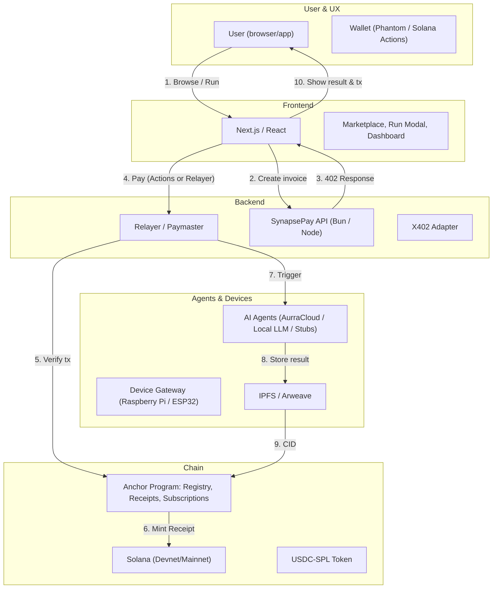

# SynapsePay — Run AI & Devices on Solana (x402 + Pay-Per-Action)

**Tagline:** _Power autonomous agents and real-world devices with instant micropayments — Solana speed, x402 simplicity._

SynapsePay is a production-minded demo platform for pay-per-action agents on **Solana**.  
Users pay micro-amounts (USDC-SPL) via the **x402 HTTP payment flow**, then instantly trigger AI tasks, IoT/device actions, or on-chain workflows. SynapsePay combines:

- **x402 micropayments** (HTTP 402 invoice flow)  
- **Solana (Anchor)** on-chain receipts & fee settlement  
- **Solana Actions** + relayer (gasless UX) for frictionless consumers  
- **AI Agents Marketplace**, **Automation/Subscriptions**, and **Device Gateway** support

Built for the **Solana Winter Build Challenge 2025** — demonstrates a realistic integration of x402 + Solana that judges can run, test, and extend.

---

## 🎯 Why SynapsePay wins

- **Directly targets the "Best Use of x402 with Solana" challenge.**  
- Combines a consumer-facing UX (fast, single-click flows) with deep technical merit (on-chain receipts, Anchor program design).  
- Unique mix: **Agent economy + micropayments + real-world device control + subscriptions** — nothing else in the field bundles all these cleanly.  
- Demo is **hands-on** and repeatable: the judges can pay, trigger, and verify results on Solscan in minutes.

---

## Key Features (MVP + Near-term stretch)

### Core MVP (required for submission)
- **Marketplace**: list and browse agents (AI + device + utility agents).  
- **Pay-Per-Action flow**: x402 invoice → Solana settlement (relayer or Solana Actions) → agent execution.  
- **On-chain Receipts**: Anchor program stores immutable receipts (txHash + resultCID).  
- **Result Storage**: outputs uploaded to IPFS/Arweave; CID recorded on-chain.  
- **Relayer (Paymaster)**: optional gasless UX for non-crypto users.

### Differentiators (stretch / hackathon polish)
- **AI Agents**: image edits, PDF summaries, code fixes, trading queries, NFT generation.  
- **Subscriptions / Automation**: schedule recurring agent runs (cron via relayer, on-chain pointer).  
- **Device / IoT Gateway**: signed command delivery to hardware (Raspberry Pi / ESP32).  
- **Marketplace Economics**: platform fees, owner payouts, on-chain withdraws.  
- **Proof-of-Execution**: verifiable receipts + signed callbacks from agents.

---

## Architecture (overview)

**Flow Overview:**
1. User browses marketplace and selects an agent to run
2. Frontend requests invoice from API
3. API returns HTTP 402 with payment details
4. User pays via Solana Actions or Relayer (gasless)
5. Relayer verifies transaction on-chain
6. Anchor program mints receipt on Solana
7. Agent/device executes the requested action
8. Result stored on IPFS/Arweave
9. CID recorded in Anchor program
10. User sees result and transaction proof

---

## x402 Payment Flow (high level)

1. **User requests** access to an agent (e.g., "remove background").
2. **Server responds 402** with an `X-PAYMENT` invoice header (amount, currency, payee, invoiceId, expiry).
3. **User pays** via Solana Actions or via SynapsePay relayer (gasless). Payment contains the invoice proof (txHash).
4. **Backend verifies** payment on Solana (amount & recipient) and marks invoice as consumed (nonce).
5. **Agent runs**, produces result (CID), and backend writes a **Receipt** to the Anchor program (payer, agentId, amount, cid, timestamp).
6. **User sees** result + on-chain receipt (link to tx on Solscan & CID on IPFS).

---

## On-chain data model (Anchor)

* **AgentRegistry** — `agent_id`, owner pubkey, price (in USDC-SPL), endpoint metadataCID, fee_bps
* **Receipt** — `receipt_id`, payer pubkey, agent_id, amount, result_cid, tx_hash, timestamp
* **Subscription** — `sub_id`, payer, agent_id, cadence_seconds, next_run_slot, active

*Primary Anchor instructions (MVP):*

* `register_agent(metadata)` — owner registers agent.
* `buy_and_run(agent_id, invoice_id, payer)` — validates invoice consumed & mints Receipt.
* `create_subscription(agent_id, cadence)` — store subscription pointer; relayer handles triggers.
* `claim_fees()` — payout aggregated owner/platform fees.

---

## Demo Walkthrough (2–4 minutes video script)

1. **Intro (10s):** "SynapsePay — pay per action for AI & devices on Solana."
2. **Marketplace (20s):** show 3 agents (ImageEdit, PDFSummary, RobotSim).
3. **Run flow (40s):** click "Run ImageEdit" → invoice appears → click Pay (Solana Actions or relayer) → instant confirmation.
4. **Execution (30s):** show agent running → result appears (image) + link to IPFS.
5. **On-chain proof (20s):** open Solscan showing receipt tx & Anchor program log.
6. **Subscription (20s):** show scheduling a weekly report run (automated).
7. **Wrap-up (10s):** highlight x402 + Solana synergy + extension paths.

---

## Quick Start (dev)

> This project targets Devnet for the hackathon. All secrets must remain out of repo.

1. `git clone <repo>`
2. `cp .env.example .env` and edit (SOLANA_RPC, RELAYER_KEY, STORAGE_KEY)
3. `bun install` (or `npm install`)
4. Start local services: `docker-compose up -d` *(if using containers)* or run `solana-test-validator` + Anchor programs deployed to Devnet.
5. `bun run dev` to start frontend & backend locally.
6. Open `http://localhost:5173` and follow the demo steps.

---

## Testing & Acceptance Criteria (for judges)

**TC-1: Guest Run (Relayer / Gasless)**

* Steps: open marketplace (not connected) → Run ImageEdit → click Pay → see result and Solscan receipt.
* Expect: result CID + txHash + receipt record in Anchor.

**TC-2: Wallet Run (Phantom / Solana Actions)**

* Steps: connect Phantom → Run PDFSummary → sign via Actions → result.
* Expect: clear user signature flow & receipt.

**TC-3: Replay & Underpay Protection**

* Replay test: re-submit same txHash for new invoice → rejected.
* Underpay test: send tx with lower amount → rejected.

**TC-4: Subscription Trigger**

* Create weekly subscription → relayer triggers job → receipts for scheduled runs exist.

---

## Tech Stack (targeted for Solana Hackathon)

* **Chain:** Solana (Devnet / Testnet)
* **On-chain:** Anchor (Rust) — Registry & Receipts
* **Frontend:** Next.js + React + Tailwind CSS
* **Backend / Relayer:** Bun or Node.js (TypeScript)
* **Payment Protocol:** x402 (HTTP invoice flow)
* **Wallet UX:** Phantom + Solana Actions (for single-click flows)
* **AI Agents:** external APIs (OpenAI, local LLM stubs, or AurraCloud/Daydreams)
* **Storage:** IPFS / Arweave (Web3.Storage)
* **Dev tooling:** Vercel (frontend), Fly/Railway for backend, Docker for local orchestration

---

## Security & Operational Notes (must-read)

* **Never** commit private keys or `.env`. Use secrets manager for relayer key.
* **Validate on-chain**: always check `recipient` & `amount` match invoice before executing agent.
* Use `invoice_id` + nonce to prevent replay attacks. Mark invoices consumed on verification.
* Rate-limit expensive agent jobs and set job caps to avoid drains.
* Sign callbacks from agents to verify result authenticity (Ed25519).
* For device control: use signed commands with short TTL and per-device keys.

---

## Roadmap & Next Steps (post-hackathon)

* Expand Agent Marketplace: allow third-party publishing & revenue share.
* Add reputational metadata for agents and usage analytics.
* Integrate zk proofs for private receipts (ZK rollups).
* Multi-chain settlement (USDC settlement via CCTP) for global reach.
* Formal security audit of Anchor program & relayer.

---

## Deliverables (What we submit for the Solana Winter Build Challenge)

* ✅ GitHub repo with code + README (this file)
* ✅ Deployed Anchor program on Devnet + frontend on Vercel (Live demo link)
* ✅ Demo video (2–4 minutes) walking through all acceptance tests
* ✅ Short technical appendix: "How x402 is used & why Solana" (1 page)
* ✅ Postman / curl examples to run flows programmatically

---

## Credits & Acknowledgements

* **SynapsePay** — built for Solana Winter Build Challenge 2025
* x402 protocol team — for the HTTP micropayment standard
* Solana & Anchor ecosystems — for fast settlement & developer tools
* OpenAI / AurraCloud / Daydreams — AI agent backends (examples)
* Community & early testers — for invaluable feedback

---

## License

`MIT` — see `LICENSE` for details.

---

## Contact

If you want to test the live demo or run a private walkthrough for judges, contact:

* **Project Lead:** Samar (GitHub: `@samar-dev`)
* **Email:** [samar@example.com](mailto:samar@example.com)
