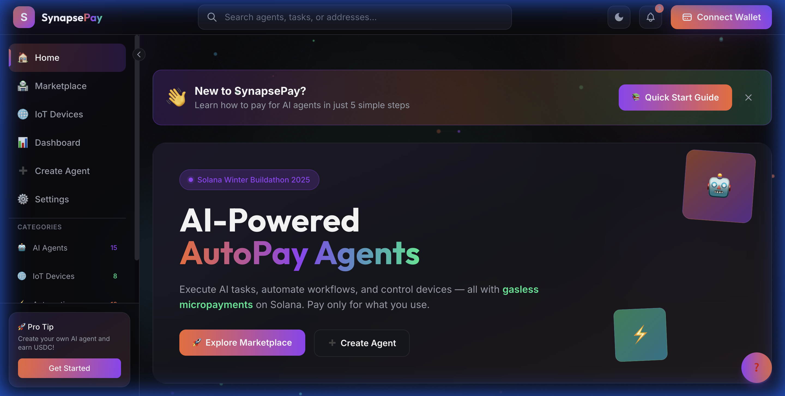
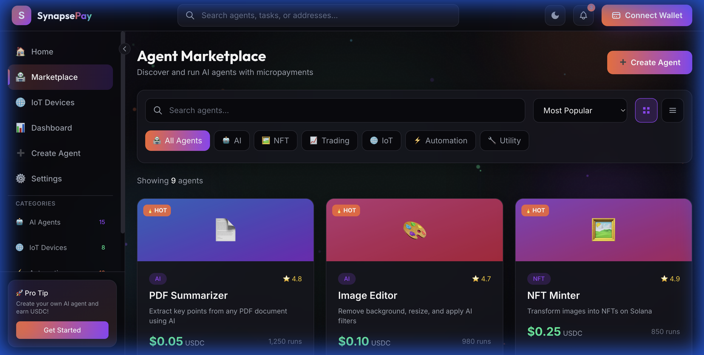
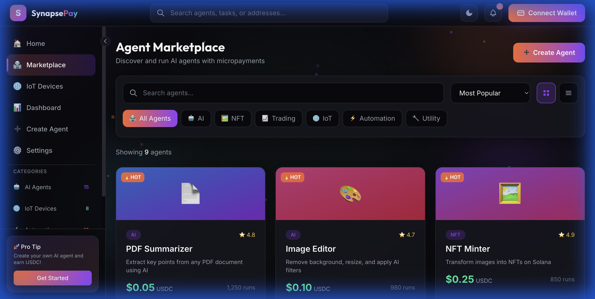
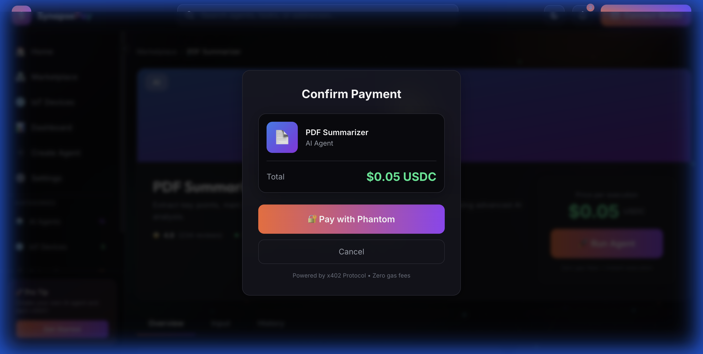
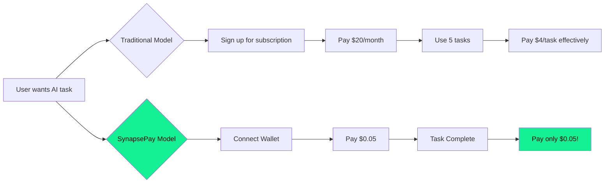
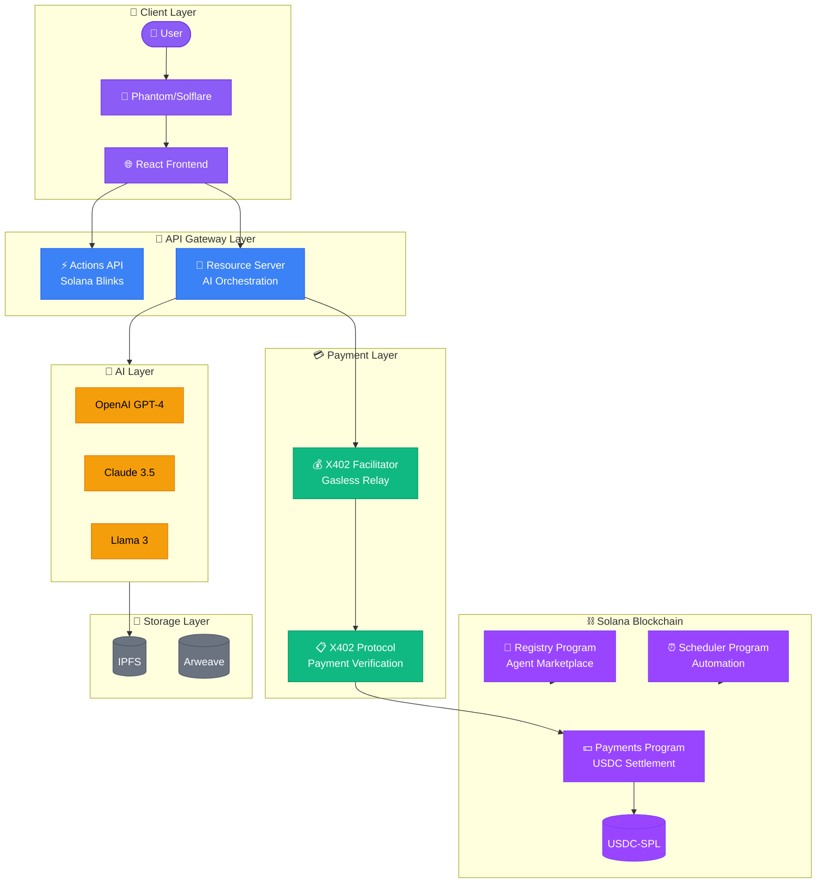
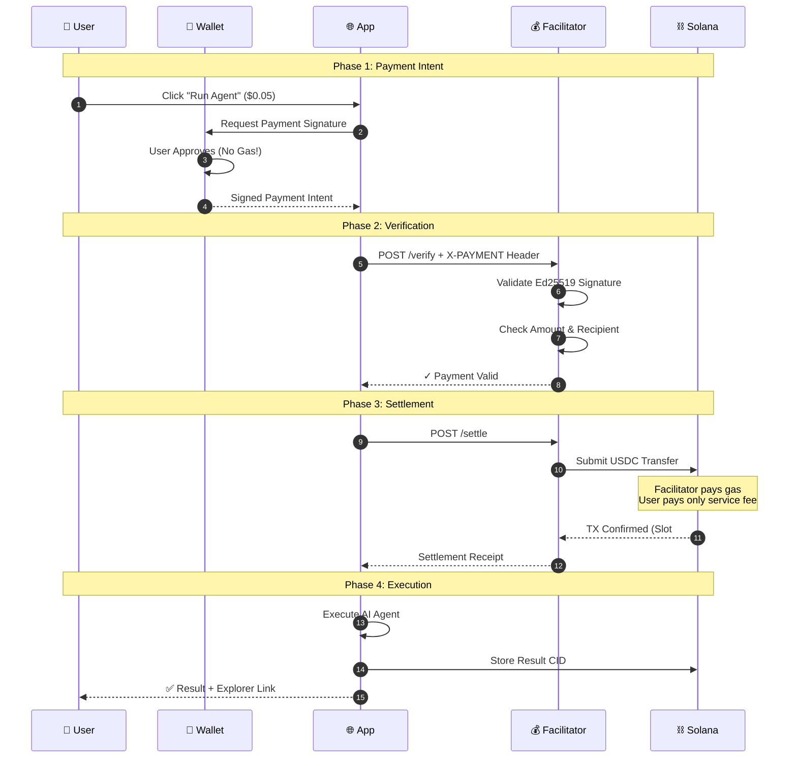
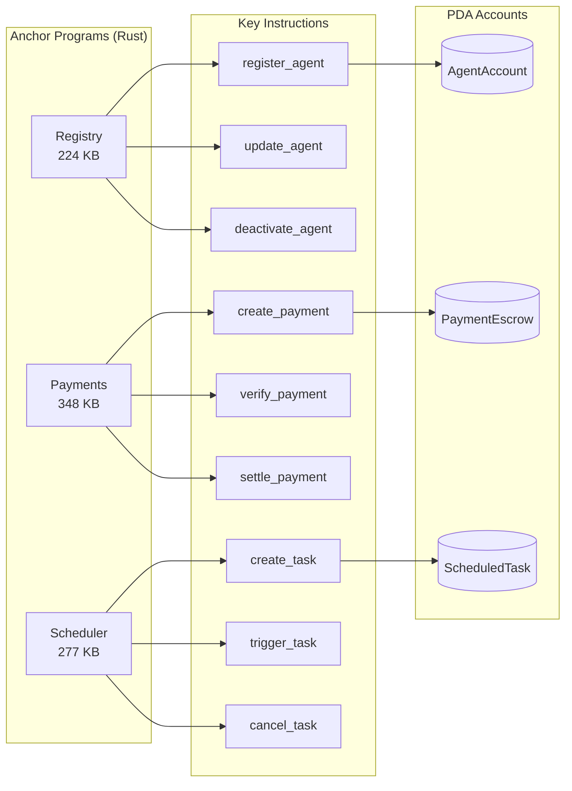

<div align="center">

# 🚀 SynapsePay

### **AI-Powered Autonomous Payment Agents on Solana**

*Revolutionizing micropayments with X402 Protocol integration for gasless, instant, pay-per-action AI agent execution*

[](https://solana.com/buildathon)
[](https://explorer.solana.com)
[](./AUDIT_FINAL_REPORT.md)
[](./LICENSE)

<br/>

[**🌐 Live Demo**](https://synapsepay.vercel.app) · [**🎬 Watch Demo Video**](https://youtu.be/stY5DphAuVw) · [**📖 Documentation**](./USER_GUIDE.md) · [**🔗 Explorer**](https://explorer.solana.com/address/5w8vTt1AUo67nE9bWA5e9Sh28HXtJJZaqiPj53n6wcby?cluster=devnet)

<br/>

<a href="https://synapsepay.vercel.app" target="_blank">
  
</a>

<a href="https://youtu.be/stY5DphAuVw" target="_blank">
  
</a>

</div>

---

## 📌 Table of Contents

- [Overview](#-overview)
- [Screenshots Gallery](#-screenshots-gallery)
- [The Problem We Solve](#-the-problem-we-solve)
- [Key Features](#-key-features)
- [Live Deployment](#-live-deployment)
- [System Architecture](#-system-architecture)
- [X402 Payment Protocol Integration](#-x402-payment-protocol-integration)
- [Smart Contracts](#-smart-contracts)
- [Tech Stack](#-tech-stack)
- [Quick Start](#-quick-start)
- [API Reference](#-api-reference)
- [Security & Audit](#-security--audit)
- [Hackathon Alignment](#-hackathon-alignment)
- [Future Roadmap](#-future-roadmap)

---

## 🎯 Overview

**SynapsePay** is a decentralized infrastructure platform that enables **micropayment-driven execution** of AI agents, automated workflows, and IoT device control on **Solana**. 

By leveraging the **X402 Payment Protocol**, we've created a **gasless, instant, pay-per-action** model that transforms how users interact with AI services—eliminating expensive subscriptions and enabling true on-demand payments as low as **$0.01**.

<div align="center">

```
┌─────────────────────────────────────────────────────────────────────────────┐
│                                                                             │
│    💰 PAY $0.05  →  🤖 AI EXECUTES  →  ✅ RESULT IN < 2 SECONDS            │
│                                                                             │
│    No subscriptions. No gas fees. No complexity.                            │
│                                                                             │
└─────────────────────────────────────────────────────────────────────────────┘
```

</div>

### Why SynapsePay?

| Traditional AI Services | SynapsePay |
|------------------------|------------|
| $20-100/month subscriptions | **$0.05 per task** |
| Pay for unused features | **Pay only what you use** |
| Gas fees on every transaction | **Gasless for users** |
| Days for settlement | **~400ms finality** |
| Minimum $5+ payments | **Micropayments from $0.01** |

---

## � Screenshots Gallery

<div align="center">

### 🏠 Homepage
*Modern, clean landing page with animated hero section*



---

### 🛒 Agent Marketplace
*Browse and discover AI agents with real-time pricing*



---

### 🤖 Agent Details
*Detailed agent information with usage stats and reviews*



---

### 💳 Payment Modal
*Seamless X402 gasless payment with wallet integration*



---

### ➕ Create Agent
*Multi-step wizard for creating and publishing new agents*


</div>

---

## �🔴 The Problem We Solve

### Current Pain Points in AI Services:

1. **Subscription Fatigue**: Users pay monthly fees for services they rarely use
2. **High Entry Barriers**: Credit card minimums prevent micropayments
3. **Centralized Control**: Single points of failure, censorship risk
4. **Complex Onboarding**: Long sign-up flows, KYC requirements
5. **Slow Settlements**: Traditional payment rails take days

### Our Solution:



---

## ⚡ Key Features

<table>
<tr>
<td width="50%">

### 🤖 AI Agent Marketplace
- Multi-model support (GPT-4, Claude, Llama)
- PDF Analysis, Code Debugging, NFT Minting
- Pay-per-execution ($0.05 - $0.50)
- Real-time result delivery

</td>
<td width="50%">

### 💳 X402 Gasless Payments
- Users sign, facilitator pays gas
- Instant USDC-SPL settlements
- ~400ms transaction finality
- Verifiable on-chain receipts

</td>
</tr>
<tr>
<td width="50%">

### 🔗 Solana Actions/Blinks
- Trigger AI from Twitter, Email, QR
- Embeddable payment buttons
- Universal action URLs
- Cross-platform compatibility

</td>
<td width="50%">

### 🌐 IoT Device Control
- Rent robots, drones, smart devices
- Real-time video streaming
- Session-based micropayments
- Physical-digital bridge

</td>
</tr>
<tr>
<td width="50%">

### ⏰ Automated Scheduling
- Recurring task automation
- Daily reports, weekly backups
- Subscription model support
- Smart contract triggers

</td>
<td width="50%">

### 📊 Analytics Dashboard
- Real-time usage stats
- Transaction history
- Agent performance metrics
- Spending analytics

</td>
</tr>
</table>

---

## 🚀 Live Deployment

<div align="center">

### ✅ Fully Deployed & Verified on Solana Devnet

</div>

| Resource | URL | Status |
|----------|-----|--------|
| **🌐 Live Application** | [synapsepay.vercel.app](https://synapsepay.vercel.app) | ✅ **LIVE** |
| **🎬 Demo Video** | [youtu.be/stY5DphAuVw](https://youtu.be/stY5DphAuVw) | ✅ **Available** |
| **📂 Source Code** | [github.com/samarabdelhameed/SynapsePay](https://github.com/samarabdelhameed/SynapsePay) | ✅ **Public** |

### Deployed Smart Contracts

| Contract | Program ID | Size | Explorer |
|----------|-----------|------|----------|
| **Registry** | `5w8vTt1AUo67nE9bWA5e9Sh28HXtJJZaqiPj53n6wcby` | 224 KB | [View →](https://explorer.solana.com/address/5w8vTt1AUo67nE9bWA5e9Sh28HXtJJZaqiPj53n6wcby?cluster=devnet) |
| **Payments** | `8yzR2Ze7t8NjH9b9wUUaUxkHLcrfogWqAzqbMSb1vZgP` | 348 KB | [View →](https://explorer.solana.com/address/8yzR2Ze7t8NjH9b9wUUaUxkHLcrfogWqAzqbMSb1vZgP?cluster=devnet) |
| **Scheduler** | `8NWxX7CDYhpfWAG5Dd6UJQ4EU1Ykrid8CoJ48Kp8MjsY` | 277 KB | [View →](https://explorer.solana.com/address/8NWxX7CDYhpfWAG5Dd6UJQ4EU1Ykrid8CoJ48Kp8MjsY?cluster=devnet) |

### Backend Services

| Service | Purpose | Port |
|---------|---------|------|
| **Frontend** | React Web Application | 5173 |
| **X402 Facilitator** | Payment verification & settlement | 4021 |
| **Resource Server** | AI Agent orchestration | 4020 |
| **Actions API** | Solana Blinks/Actions | 8405 |

---

## 🏗 System Architecture

### High-Level Architecture



### Component Interaction Flow

```
┌─────────────────────────────────────────────────────────────────────────────────┐
│                           SynapsePay Architecture                                │
├─────────────────────────────────────────────────────────────────────────────────┤
│                                                                                  │
│  ┌──────────────┐     ┌──────────────┐     ┌──────────────┐                     │
│  │   Frontend   │────▶│   Actions    │────▶│   Resource   │                     │
│  │  React/Vite  │     │     API      │     │    Server    │                     │
│  └──────────────┘     └──────────────┘     └──────┬───────┘                     │
│         │                                         │                              │
│         │ Wallet Signature                        │ AI Execution                 │
│         ▼                                         ▼                              │
│  ┌──────────────┐     ┌──────────────┐     ┌──────────────┐                     │
│  │   Phantom/   │     │     X402     │────▶│   OpenAI/    │                     │
│  │   Solflare   │────▶│  Facilitator │     │   Claude     │                     │
│  └──────────────┘     └──────┬───────┘     └──────────────┘                     │
│                              │                                                   │
│                              │ Settlement TX                                     │
│                              ▼                                                   │
│  ┌───────────────────────────────────────────────────────────────────────────┐  │
│  │                        Solana Blockchain (Devnet)                          │  │
│  │  ┌─────────────┐    ┌─────────────┐    ┌─────────────┐    ┌──────────┐   │  │
│  │  │  Registry   │    │  Payments   │    │  Scheduler  │    │   USDC   │   │  │
│  │  │   Program   │    │   Program   │    │   Program   │    │   SPL    │   │  │
│  │  └─────────────┘    └─────────────┘    └─────────────┘    └──────────┘   │  │
│  └───────────────────────────────────────────────────────────────────────────┘  │
│                                                                                  │
└─────────────────────────────────────────────────────────────────────────────────┘
```

---

## 💳 X402 Payment Protocol Integration

### What is X402?

**X402** is a web-native payment protocol that uses HTTP status code 402 (Payment Required) to enable seamless micropayments. SynapsePay is a **reference implementation** of X402 on Solana.

### Payment Flow Sequence



### Why X402 + Solana is Powerful

| Feature | Technical Implementation | User Benefit |
|---------|------------------------|--------------|
| **Gasless TX** | Facilitator relays & pays fees | Zero friction |
| **Micropayments** | USDC-SPL with 6 decimals | Pay $0.01+ |
| **Instant Finality** | Solana ~400ms slots | Real-time payments |
| **Verifiable** | On-chain receipts | Full transparency |
| **Ed25519 Signing** | Native Solana keys | No new tools |

### X402 Header Structure

```typescript
// X-PAYMENT Header Format
{
  "version": "1",
  "network": "solana-devnet",
  "payload": {
    "signature": "base58-ed25519-signature",
    "payer": "payer-wallet-pubkey",
    "recipient": "agent-owner-pubkey",
    "amount": "50000", // 0.05 USDC (6 decimals)
    "token": "USDC-SPL-mint-address",
    "agentId": "pdf-summarizer-v1",
    "expiry": 1702500000
  }
}
```

---

## 📜 Smart Contracts

### Contract Architecture



### Registry Program
**Purpose**: Agent registration, marketplace indexing, discovery

```rust
// Agent Registration Instruction
pub fn register_agent(
    ctx: Context<RegisterAgent>,
    agent_id: String,
    name: String,
    description: String,
    price: u64,          // In USDC base units (6 decimals)
    category: AgentCategory,
    metadata_uri: String,
) -> Result<()>
```

### Payments Program  
**Purpose**: X402 payment processing, escrow management, settlement

```rust
// Payment Settlement Instruction
pub fn settle_payment(
    ctx: Context<SettlePayment>,
    payment_id: String,
    signature: [u8; 64],
    amount: u64,
) -> Result<()>
```

### Scheduler Program
**Purpose**: Recurring task automation, subscription management

```rust
// Create Scheduled Task
pub fn create_scheduled_task(
    ctx: Context<CreateTask>,
    agent_id: String,
    interval: i64,       // Seconds between executions
    max_runs: Option<u32>,
) -> Result<()>
```

---

## 🛠 Tech Stack

<table>
<tr>
<td align="center" width="20%">

<br/><b>Solana</b>
<br/><sub>L1 Blockchain</sub>
</td>
<td align="center" width="20%">

<br/><b>Anchor</b>
<br/><sub>Smart Contracts</sub>
</td>
<td align="center" width="20%">

<br/><b>React 18</b>
<br/><sub>Frontend</sub>
</td>
<td align="center" width="20%">

<br/><b>Vite</b>
<br/><sub>Build Tool</sub>
</td>
<td align="center" width="20%">

<br/><b>TypeScript</b>
<br/><sub>Language</sub>
</td>
</tr>
</table>

### Full Stack Overview

| Layer | Technology | Purpose |
|-------|------------|---------|
| **Blockchain** | Solana (Rust/Anchor) | Smart contracts, USDC settlement |
| **Frontend** | React 18 + Vite + TailwindCSS | User interface, wallet connection |
| **Backend** | Node.js + Hono + TypeScript | API services, AI orchestration |
| **Payment** | X402 Protocol | Gasless micropayments |
| **Wallet** | @solana/wallet-adapter | Phantom, Solflare integration |
| **Storage** | IPFS + Arweave | Decentralized result storage |
| **AI** | OpenAI, Anthropic, Llama | Multi-model agent execution |

---

## 🚀 Quick Start

### Prerequisites

- Node.js 20+ or Bun 1.0+
- Phantom or Solflare wallet
- Solana CLI (optional, for contract dev)

### Installation

```bash
# Clone repository
git clone https://github.com/samarabdelhameed/SynapsePay.git
cd SynapsePay

# Install dependencies
bun install  # or npm install

# Configure environment
cp .env.example .env

# Start development server
bun run dev
```

### Access Points

| Service | URL |
|---------|-----|
| Frontend | http://localhost:5173 |
| X402 Facilitator | http://localhost:4021 |
| Resource Server | http://localhost:4020 |
| Actions API | http://localhost:8405 |

---

## 📡 API Reference

### X402 Facilitator Endpoints

```http
POST /invoice
Content-Type: application/json

{
  "agentId": "pdf-summarizer-v1",
  "payer": "<wallet-address>"
}

Response: {
  "invoiceId": "pay_xxx",
  "amount": "50000",
  "xPaymentHeader": "<base64>"
}
```

```http
POST /verify
Content-Type: application/json

{
  "payment": "<x-payment-header>"
}

Response: {
  "valid": true,
  "payer": "<address>",
  "amount": "50000"
}
```

```http
POST /settle
Content-Type: application/json

{
  "payment": "<x-payment-header>"
}

Response: {
  "txHash": "<solana-tx-signature>",
  "slot": 427927872
}
```

### Solana Actions (Blinks)

```http
GET /api/actions/pdf-summarizer-v1

Response: {
  "icon": "https://synapsepay.vercel.app/icon.png",
  "title": "PDF Summarizer",
  "description": "AI-powered PDF summary - 0.05 USDC",
  "label": "Pay & Run",
  "links": {
    "actions": [{ "href": "/api/actions/pdf-summarizer-v1", "label": "Run" }]
  }
}
```

---

## 🔒 Security & Audit

### Audit Results

| Category | Tests | Status |
|----------|-------|--------|
| Integration Tests | 21/21 | ✅ 100% Passed |
| System Tests | 28/29 | ✅ 96.5% Passed |
| Security Checks | All | ✅ Passed |
| Contract Verification | 3/3 | ✅ Verified |

### Security Features

- ✅ **Ed25519 Signature Verification** - All payments cryptographically signed
- ✅ **Amount Validation** - On-chain verification of payment amounts
- ✅ **Expiry Timestamps** - Payments expire to prevent replay attacks
- ✅ **PDA Authority** - Program-derived addresses for escrow security
- ✅ **Rate Limiting** - API-level protection against abuse

---

## 🏆 Hackathon Alignment

### Track: Best Consumer App on Solana

| Criteria | SynapsePay Implementation |
|----------|--------------------------|
| **Consumer Focus** | Simple UX, instant AI task execution |
| **Solana Native** | Actions, USDC-SPL, ~400ms finality |
| **Real Utility** | Pay-per-use AI, IoT control, automation |
| **Scalability** | 65k TPS blockchain, multi-model AI |

### Track: Best Use of X402 with Solana

| Criteria | SynapsePay Implementation |
|----------|--------------------------|
| **X402 Integration** | Full protocol implementation with facilitator |
| **Gasless Payments** | Users never pay Solana gas fees |
| **Micropayments** | $0.01 - $0.50 per action |
| **Verifiable Receipts** | On-chain settlement proofs |

---

## 🗺 Future Roadmap

```mermaid
gantt
    title SynapsePay Development Roadmap
    dateFormat YYYY-Q
    section Phase 1 (Current)
    Devnet Launch          :done, 2025-Q1, 2025-Q1
    AI Agent Marketplace   :done, 2025-Q1, 2025-Q1
    X402 Integration       :done, 2025-Q1, 2025-Q1
    
    section Phase 2
    Mainnet Deployment     :2025-Q2, 2025-Q2
    Mobile App (React Native) :2025-Q2, 2025-Q3
    Agent Creator SDK      :2025-Q2, 2025-Q3
    
    section Phase 3
    DAO Governance         :2025-Q3, 2025-Q4
    Cross-chain Expansion  :2025-Q4, 2026-Q1
    Enterprise API         :2025-Q4, 2026-Q1
```

---

## 🤝 Contributing

We welcome contributions! See our [Contributing Guide](./CONTRIBUTING.md) for details.

```bash
# Fork & clone
git clone https://github.com/YOUR_USERNAME/SynapsePay.git

# Create branch
git checkout -b feature/amazing-feature

# Make changes & test
bun run test
bun run lint

# Submit PR
git push origin feature/amazing-feature
```

---

## 📄 License

This project is licensed under the MIT License - see [LICENSE](./LICENSE) for details.

---

<div align="center">

### Built with ❤️ for Solana Winter Buildathon 2025

<br/>

[](https://solana.com)
[](https://anchor-lang.com)
[](https://react.dev)
[](https://typescriptlang.org)

<br/>

**[🌐 Live Demo](https://synapsepay.vercel.app)** · **[🎬 Demo Video](https://youtu.be/stY5DphAuVw)** · **[📂 GitHub](https://github.com/samarabdelhameed/SynapsePay)**

<br/>

*Transforming AI access with micropayments on Solana*

</div>