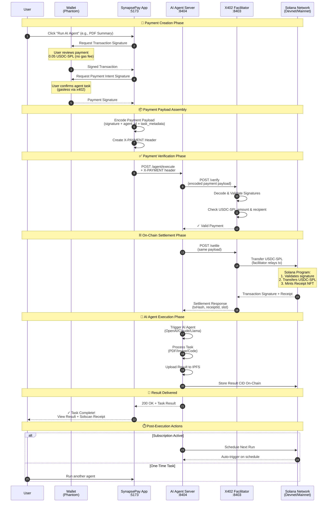
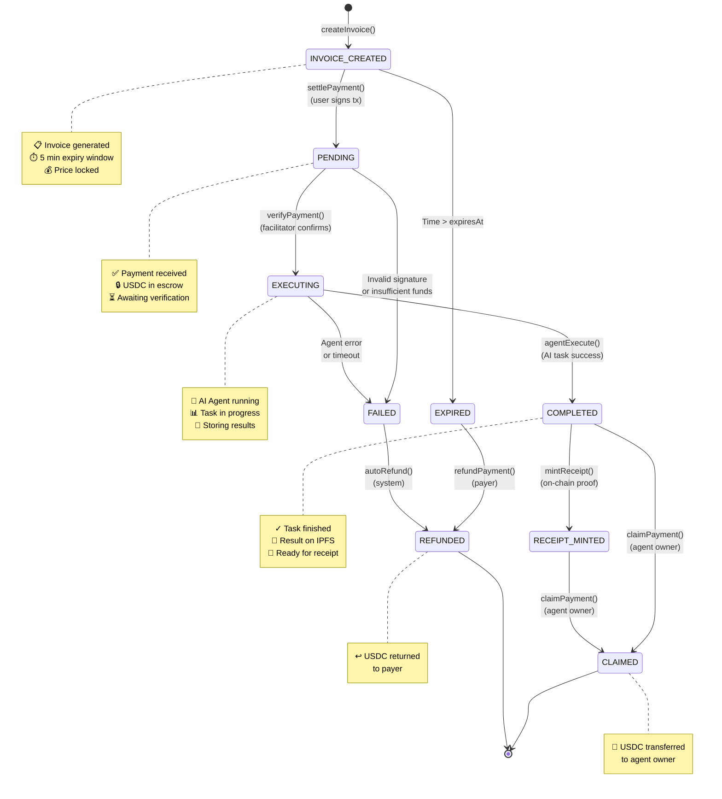
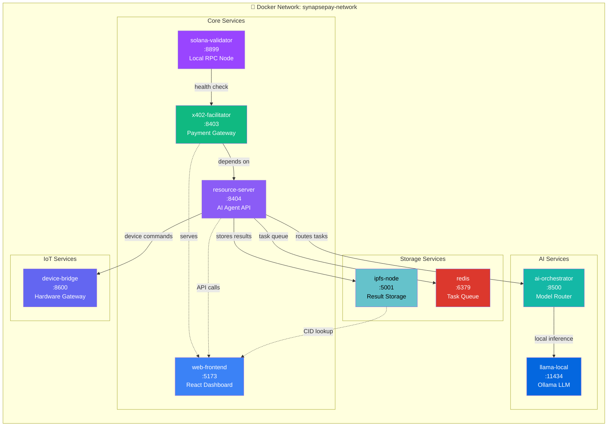

<p align="center">
  
  
  
</p>

<h1 align="center">🚀 SynapsePay</h1>

<h3 align="center">AI-Powered AutoPay Agents on Solana</h3>

<p align="center">
  <strong>Pay-per-Action • Automation • Solana Actions • x402 • AI Agents • Marketplace</strong>
</p>

<p align="center">
  <a href="#-why-synapsepay">Why SynapsePay</a> •
  <a href="#-core-features">Features</a> •
  <a href="#-architecture">Architecture</a> •
  <a href="#-tech-stack">Tech Stack</a> •
  <a href="#-demo-scenarios">Demo</a> •
  <a href="#-quick-start">Quick Start</a>
</p>

---

## 📋 Overview

**SynapsePay** is a next-generation automation network that enables **AI-driven tasks**, **micro-transactions**, and **real-world device triggers** — all powered by **Solana's speed, scalability, and near-zero fees**.

Unlike traditional pay-per-use systems, SynapsePay combines:

| Component | Description |
|-----------|-------------|
| 🤖 **AI Agents** | Multi-tool execution for diverse tasks |
| ⚡ **Solana Actions** | Direct transaction flows via social & web |
| 🔄 **Automated Workflows** | Scheduled tasks & subscriptions |
| 💰 **x402 Micropayments** | Gasless, instant micro-transactions |
| 🏪 **Agent Marketplace** | Discover & monetize custom agents |
| 🌐 **IoT Device Execution** | Bridge blockchain to physical world |

> **This makes SynapsePay the first system where users can pay 0.05 USDC to instantly trigger an AI task, device action, or on-chain workflow — fully automated.**

---

## ⭐ Why SynapsePay?

Most hackathon projects deliver simple "trigger and pay" apps.
**SynapsePay delivers a full automation network**, combining 3–4 ideas into one unified system:

| Feature | Status |
|---------|--------|
| ✅ AI execution | Multi-model support |
| ✅ On-chain automation | Solana-native |
| ✅ Pay-per-action billing | x402 protocol |
| ✅ Real device integration | IoT gateway |
| ✅ Social & Web2 integrations | Solana Actions |
| ✅ Marketplace for custom agents | Creator economy |

> 🎯 **Perfectly aligned** with Solana's 2025 emphasis on **consumer apps, speed, automation, x402, and Solana Actions**.

---

## 🚀 Core Features

### 1. 🤖 AI Agents (Multi-Tool Execution)

Each agent performs tasks on demand after a micro-payment:

```
┌─────────────────────────────────────────────────────────────┐
│  📄 PDF Analysis          │  🐛 Code Debugging              │
│  🎬 Video Summarization   │  📝 Smart Contract Signing      │
│  🎨 Image Editing         │  🖼️  NFT Generation             │
│  📈 Trading Bot Execution │  📁 IPFS Uploads                │
│  💼 Wallet Analytics      │  💬 Multi-Model Chat            │
└─────────────────────────────────────────────────────────────┘
```

**Price Range:** `0.05 – 0.5 USDC` per action, gasless via x402.

---

### 2. ⚡ Solana Actions Integration (SUPERPOWER)

Send a Solana transaction directly through:

- 🐦 **Twitter** — Tweet triggers action
- 📧 **Email** — Inbox to blockchain
- 💬 **WhatsApp** — Chat-based payments
- 🌐 **Websites** — Embedded action buttons
- 📱 **QR Codes** — Scan and execute

**Example Automation Flow:**
```
Upload Image → Auto-Pay → AI converts to NFT → Returns mint link in 2 seconds
```

---

### 3. 🔄 Auto-Tasks & Subscriptions

Users can schedule automated recurring actions:

| Task Type | Example |
|-----------|---------|
| 📊 Daily Reports | Price alerts & portfolio summaries |
| 💱 Weekly Rebalancing | USDC portfolio optimization |
| 💾 Automated Backups | Data to Arweave/IPFS |
| 🎨 Daily NFT Drops | AI-generated collections |
| 🔔 Wallet Monitoring | Balance & transaction alerts |
| 📈 Trading Triggers | Automated DeFi strategies |

> All tasks are billed with **auto micropayments** — set once, run forever.

---

### 4. 🏪 Agent Marketplace

Creators can publish and monetize their own agents:

```
┌────────────────────────────────────────────────────────────┐
│                    CREATOR ECONOMY                         │
├────────────────────────────────────────────────────────────┤
│  🤖 AI Bots           →  Publish your trained models       │
│  🔌 Device Triggers   →  Connect real-world hardware       │
│  📊 Data Processors   →  Analytics & transformations       │
│  🔄 Automation Flows  →  Complex multi-step workflows      │
└────────────────────────────────────────────────────────────┘

User Pays → Creator Earns → Platform Takes Fee
```

---

### 5. 🌐 Real-World Device / IoT Support

Bridge **Solana ↔ Physical World** in real time:

| Device Type | Use Case |
|-------------|----------|
| 🤖 Robots | Automated physical tasks |
| 🚪 Smart Doors | Secure access control |
| 🚁 Drones | Aerial operations |
| 🖨️ Printers | Document generation |
| 📷 Cameras | Image capture triggers |
| 💡 Smart Lights | Ambient control |

---

## 🏗️ System Architecture

```mermaid
graph TB
    subgraph UserLayer["👤 User Layer"]
        User[User]
        Wallet[Phantom / Solflare<br/>Wallet Provider]
        Social[Solana Actions<br/>Twitter / Email / QR]
    end

    subgraph Frontend["� Frontend Layer - Port 5173"]
        Web[Web App<br/>React + Vite + ShadCN]
        Components[UI Components<br/>AgentCard, PaymentModal, Dashboard]
        ActionGen[Solana Actions Generator<br/>Blinks Integration]
    end

    subgraph Backend["🔧 Backend Layer"]
        Resource[Resource Server :8404<br/>Protected AI Endpoints]
        Facilitator[X402 Facilitator :8403<br/>/verify, /settle, /invoice]
        X402Lib[X402 Library<br/>Signatures & Validation]
        AIOrchestrator[AI Agent Orchestrator<br/>Task Router & Executor]
    end

    subgraph Blockchain["⛓️ Solana Blockchain - Devnet/Mainnet"]
        Solana[Solana Network<br/>~400ms Finality]
        USDC[USDC-SPL Token<br/>Micropayments]
        Anchor[Anchor Programs<br/>Registry + Receipts]
        Scheduler[Task Scheduler<br/>Subscriptions & Cron]
    end

    subgraph AILayer["🤖 AI Agent Layer"]
        OpenAI[OpenAI<br/>GPT-4 / DALL-E]
        Anthropic[Anthropic<br/>Claude Models]
        Llama[Llama<br/>Open Source LLM]
        DeepSeek[DeepSeek<br/>Code & Analysis]
    end

    subgraph Storage["💾 Decentralized Storage"]
        IPFS[IPFS<br/>Result Storage]
        Arweave[Arweave<br/>Permanent Archive]
    end

    subgraph IoT["🌐 IoT / Device Layer"]
        Robot[UGV Rover<br/>Physical Robot]
        SmartDevices[Smart Devices<br/>Lights / Doors / Drones]
    end

    User -->|1. Select Agent| Web
    User -->|1b. Solana Action| Social
    Social -->|Blink Request| ActionGen
    Web -->|2. Request Signature| Wallet
    Wallet -->|3. Signed TX| Web
    Web -->|4. X-PAYMENT Header| Resource
    Resource -->|5. Verify Payment| Facilitator
    Facilitator -->|Uses| X402Lib
    Resource -->|6. Settle Payment| Facilitator
    Facilitator -->|7. Submit TX| Solana
    Solana --> USDC
    Solana --> Anchor
    Anchor --> Scheduler
    Resource -->|8. Execute Task| AIOrchestrator
    AIOrchestrator --> OpenAI
    AIOrchestrator --> Anthropic
    AIOrchestrator --> Llama
    AIOrchestrator --> DeepSeek
    AIOrchestrator -->|9. Store Result| IPFS
    AIOrchestrator --> Arweave
    AIOrchestrator -->|10. Device Command| Robot
    AIOrchestrator --> SmartDevices
    Resource -->|11. Return Result| Web
    Robot -->|Video Stream| Web

    style User fill:#8b5cf6,color:#fff
    style Wallet fill:#a855f7,color:#fff
    style Social fill:#c084fc,color:#fff
    style Web fill:#3b82f6,color:#fff
    style Components fill:#60a5fa,color:#fff
    style ActionGen fill:#93c5fd,color:#000
    style Resource fill:#10b981,color:#fff
    style Facilitator fill:#059669,color:#fff
    style X402Lib fill:#34d399,color:#000
    style AIOrchestrator fill:#14b8a6,color:#fff
    style Solana fill:#9945FF,color:#fff
    style USDC fill:#2775CA,color:#fff
    style Anchor fill:#14F195,color:#000
    style Scheduler fill:#00D18C,color:#000
    style OpenAI fill:#412991,color:#fff
    style Anthropic fill:#D4A574,color:#000
    style Llama fill:#0467DF,color:#fff
    style DeepSeek fill:#4F46E5,color:#fff
    style IPFS fill:#65C2CB,color:#000
    style Arweave fill:#222326,color:#fff
    style Robot fill:#6366f1,color:#fff
    style SmartDevices fill:#818cf8,color:#fff
```



### Architecture Components

| Layer | Component | Description |
|-------|-----------|-------------|
| 👤 **User** | Phantom Wallet | Primary wallet for signing & payments |
| 👤 **User** | Solana Actions | Blinks via Twitter, Email, QR |
| 🌐 **Frontend** | React + Vite | Modern SPA with real-time updates |
| 🌐 **Frontend** | ShadCN UI | Premium component library |
| 🔧 **Backend** | Resource Server | Protected AI agent endpoints |
| 🔧 **Backend** | X402 Facilitator | Payment verification & settlement |
| 🔧 **Backend** | AI Orchestrator | Routes tasks to appropriate AI model |
| ⛓️ **Blockchain** | Solana Network | Fast finality (~400ms) |
| ⛓️ **Blockchain** | USDC-SPL | Micropayments (0.05+ USDC) |
| ⛓️ **Blockchain** | Anchor Programs | Agent Registry + Receipt Storage |
| 🤖 **AI** | Multi-Model | OpenAI, Claude, Llama, DeepSeek |
| 💾 **Storage** | IPFS + Arweave | Decentralized result storage |
| 🌐 **IoT** | Device Bridge | Robot & smart device control |

### Data Flow Summary

```
┌─────────────────────────────────────────────────────────────────────────┐
│  1. User selects AI Agent or triggers via Solana Action (Blink)         │
│  2. Phantom wallet signs payment transaction (gasless)                  │
│  3. X-PAYMENT header sent to Resource Server                            │
│  4. Facilitator verifies signature & settles on Solana                  │
│  5. AI Orchestrator executes task (OpenAI/Claude/Llama/DeepSeek)        │
│  6. Result stored on IPFS, CID recorded on-chain via Anchor             │
│  7. Receipt minted, result returned to user                             │
│  8. Optional: IoT device triggered (Robot/Smart Devices)                │
└─────────────────────────────────────────────────────────────────────────┘
```

---

## 🎯 X402 Payment Flow with Solana

### Complete Payment Lifecycle for AI Agent Execution



### Payment Flow Breakdown

| Phase | Description | Duration |
|-------|-------------|----------|
| 🔐 **Creation** | User signs payment intent via Phantom | ~2 sec |
| 📦 **Assembly** | Payload encoded with x402 headers | ~100 ms |
| ✅ **Verification** | Facilitator validates signatures | ~200 ms |
| ⛓️ **Settlement** | USDC-SPL transferred on Solana | ~400 ms |
| 🤖 **Execution** | AI Agent processes task | 1-10 sec |
| 🎉 **Delivery** | Result returned + receipt minted | ~500 ms |

> **Total Time:** Under 15 seconds for complete pay-to-result flow!

### Key Advantages of x402 on Solana

| Feature | Benefit |
|---------|---------|
| **Gasless UX** | Facilitator pays fees, user only signs |
| **Instant Settlement** | ~400ms finality on Solana |
| **Micropayment Ready** | 0.05 USDC viable (low fees) |
| **On-Chain Receipts** | Immutable proof via Anchor |
| **Multi-Agent Support** | Same flow for any agent type |

---

## � Payment Protocol Details

### X402 Payment Payload Structure (Solana)

```mermaid
graph TB
    subgraph PayloadStructure["📦 Payment Payload"]
        Root[X-PAYMENT Header<br/>HTTP 402 Response]
        Root --> Encoded[Base64 Encoded JSON]

        Encoded --> Version[version: '1.0']
        Encoded --> PaymentType[paymentType: 'solana']
        Encoded --> Network[network: 'mainnet' | 'devnet']
        Encoded --> Payload[payload: SolanaPaymentPayload]

        subgraph SolanaPayload["💳 Solana Payment Payload"]
            Payload --> PaymentId[paymentId: base58<br/>Unique Invoice ID]
            Payload --> Payer[payer: PublicKey<br/>User Wallet Address]
            Payload --> Recipient[recipient: PublicKey<br/>Agent Owner Address]
            Payload --> Amount[amount: string<br/>USDC in lamports]
            Payload --> TokenMint[tokenMint: PublicKey<br/>USDC-SPL Mint Address]
            Payload --> AgentId[agentId: string<br/>Target Agent Identifier]
            Payload --> TaskMeta[taskMetadata: JSON<br/>Task Parameters]
            Payload --> Expiry[expiresAt: number<br/>Unix Timestamp]
        end

        subgraph Signatures["✍️ Signatures"]
            Payload --> TxSig[transactionSignature: Ed25519]
            Payload --> PaymentSig[paymentIntentSignature: Ed25519]
            
            TxSig --> TxSigBytes[signature: base58<br/>64 bytes]
            TxSig --> TxPubkey[publicKey: base58<br/>32 bytes]
            
            PaymentSig --> PaySigBytes[signature: base58<br/>64 bytes]
            PaymentSig --> PayNonce[nonce: number<br/>Replay Protection]
        end
    end

    style Root fill:#3b82f6,color:#fff
    style Encoded fill:#60a5fa,color:#fff
    style Payload fill:#10b981,color:#fff
    style TxSig fill:#f59e0b,color:#fff
    style PaymentSig fill:#ef4444,color:#fff
    style PaymentId fill:#8b5cf6,color:#fff
    style Amount fill:#14b8a6,color:#fff
    style TokenMint fill:#9945FF,color:#fff
```

### Payload Field Definitions

| Field | Type | Description |
|-------|------|-------------|
| `version` | string | Protocol version (`"1.0"`) |
| `paymentType` | string | Blockchain type (`"solana"`) |
| `network` | string | `"mainnet-beta"` or `"devnet"` |
| `paymentId` | base58 | Unique invoice identifier (32 bytes) |
| `payer` | PublicKey | User's wallet address |
| `recipient` | PublicKey | Agent owner's wallet address |
| `amount` | string | Payment amount in USDC (6 decimals) |
| `tokenMint` | PublicKey | USDC-SPL token mint address |
| `agentId` | string | Target AI agent identifier |
| `taskMetadata` | JSON | Task-specific parameters |
| `expiresAt` | number | Invoice expiration timestamp |
| `transactionSignature` | Ed25519 | Signed Solana transaction |
| `paymentIntentSignature` | Ed25519 | Signed payment intent |
| `nonce` | number | Replay attack protection |

### Example Payment Payload

```json
{
  "version": "1.0",
  "paymentType": "solana",
  "network": "devnet",
  "payload": {
    "paymentId": "7xKXtg2CW87d9VqQzJkHT5J5E1mRQWz4vNrYhS9QT2Ni",
    "payer": "9WzDXwBbmkg8ZTbNMqUxvQRAyrZzDsGYdLVL9zYtAWWM",
    "recipient": "HN7cABqLq46Es1jh92dQQisAq662SmxELLLsHHe4YWrH",
    "amount": "50000",
    "tokenMint": "EPjFWdd5AufqSSqeM2qN1xzybapC8G4wEGGkZwyTDt1v",
    "agentId": "pdf-summarizer-v1",
    "taskMetadata": {
      "inputCID": "QmXoypiz...",
      "maxTokens": 1000,
      "language": "en"
    },
    "expiresAt": 1702166400,
    "transactionSignature": {
      "signature": "5KtP9...",
      "publicKey": "9WzDXwBbmkg8ZTbNMqUxvQRAyrZzDsGYdLVL9zYtAWWM"
    },
    "paymentIntentSignature": {
      "signature": "4RmQ7...",
      "nonce": 1702166000
    }
  }
}
```

### Signature Verification Flow

```
┌─────────────────────────────────────────────────────────────────────────┐
│  1. EXTRACT: Decode Base64 X-PAYMENT header                             │
│  2. VALIDATE: Check version, network, expiry                            │
│  3. VERIFY TX: Ed25519 verify transactionSignature with payer pubkey    │
│  4. VERIFY INTENT: Ed25519 verify paymentIntentSignature                │
│  5. CHECK NONCE: Ensure nonce not previously used (replay protection)   │
│  6. VERIFY AMOUNT: Confirm amount matches agent price                   │
│  7. VERIFY TOKEN: Confirm tokenMint is valid USDC-SPL                   │
│  8. SETTLE: Submit transaction to Solana network                        │
│  9. RECEIPT: Mint on-chain receipt via Anchor program                   │
└─────────────────────────────────────────────────────────────────────────┘
```

### Token Addresses

| Token | Network | Mint Address |
|-------|---------|--------------|
| USDC | Mainnet | `EPjFWdd5AufqSSqeM2qN1xzybapC8G4wEGGkZwyTDt1v` |
| USDC | Devnet | `4zMMC9srt5Ri5X14GAgXhaHii3GnPAEERYPJgZJDncDU` |

---

## 🔄 Payment States & Transitions

### Payment Lifecycle State Machine



### State Definitions

| State | Description | Next Actions |
|-------|-------------|--------------|
| `INVOICE_CREATED` | Invoice generated, awaiting payment | `settlePayment()`, expires after 5 min |
| `PENDING` | Payment received, USDC in escrow | `verifyPayment()` by facilitator |
| `EXECUTING` | AI Agent processing task | Wait for completion or timeout |
| `COMPLETED` | Task finished, result stored on IPFS | `mintReceipt()`, `claimPayment()` |
| `RECEIPT_MINTED` | On-chain receipt created | `claimPayment()` |
| `CLAIMED` | Agent owner received USDC | Terminal state |
| `EXPIRED` | Invoice timed out before payment | `refundPayment()` if paid |
| `FAILED` | Verification or execution error | Auto-refund triggered |
| `REFUNDED` | USDC returned to payer | Terminal state |

### Anchor Program Instructions

```rust
// Payment State Transitions (Anchor)

#[derive(AnchorSerialize, AnchorDeserialize, Clone, PartialEq)]
pub enum PaymentState {
    InvoiceCreated,
    Pending,
    Executing,
    Completed,
    ReceiptMinted,
    Claimed,
    Expired,
    Failed,
    Refunded,
}

// Instructions
pub fn create_invoice(ctx: Context<CreateInvoice>, amount: u64, agent_id: String) -> Result<()>
pub fn settle_payment(ctx: Context<SettlePayment>, signature: [u8; 64]) -> Result<()>
pub fn verify_payment(ctx: Context<VerifyPayment>) -> Result<()>
pub fn complete_task(ctx: Context<CompleteTask>, result_cid: String) -> Result<()>
pub fn mint_receipt(ctx: Context<MintReceipt>) -> Result<()>
pub fn claim_payment(ctx: Context<ClaimPayment>) -> Result<()>
pub fn refund_payment(ctx: Context<RefundPayment>) -> Result<()>
```

### State Transition Rules

```
┌─────────────────────────────────────────────────────────────────────────┐
│  INVOICE_CREATED → PENDING                                              │
│    ✓ User must sign valid transaction                                   │
│    ✓ USDC amount must match invoice                                     │
│    ✓ Invoice must not be expired                                        │
├─────────────────────────────────────────────────────────────────────────┤
│  PENDING → EXECUTING                                                    │
│    ✓ Facilitator verifies Ed25519 signature                             │
│    ✓ USDC successfully transferred to escrow                            │
│    ✓ Nonce not previously used                                          │
├─────────────────────────────────────────────────────────────────────────┤
│  EXECUTING → COMPLETED                                                  │
│    ✓ AI Agent returns valid result                                      │
│    ✓ Result CID stored on IPFS/Arweave                                  │
│    ✓ No timeout (max 60 seconds)                                        │
├─────────────────────────────────────────────────────────────────────────┤
│  COMPLETED → CLAIMED                                                    │
│    ✓ Only agent owner can claim                                         │
│    ✓ Platform fee (5%) deducted                                         │
│    ✓ Remaining USDC transferred to owner                                │
├─────────────────────────────────────────────────────────────────────────┤
│  FAILED/EXPIRED → REFUNDED                                              │
│    ✓ Automatic refund on failure                                        │
│    ✓ Manual refund available for expired invoices                       │
│    ✓ Full amount returned to payer                                      │
└─────────────────────────────────────────────────────────────────────────┘
```

---

## 🛠️ Tech Stack

### Smart Contracts (Solana)

| Component | Technology |
|-----------|------------|
| Language | Rust (Anchor Framework) |
| Payments | x402 Integration |
| Subscriptions | On-chain Manager |
| Registry | Agent Registration |
| Scheduler | Automated Task Triggers |

### Backend

| Component | Technology |
|-----------|------------|
| Runtime | Bun + TypeScript |
| Payments | x402 Relay Service |
| Orchestration | AI Agent Orchestrator |
| IoT | Device Bridge (Optional) |

### Frontend

| Component | Technology |
|-----------|------------|
| Framework | React + ShadCN UI |
| Wallet | Solana Wallet Adapter |
| Actions | Solana Actions Generator |
| Dashboard | Real-time Task Monitoring |

### AI Services

| Provider | Capabilities |
|----------|--------------|
| OpenAI | GPT-4, DALL-E, Whisper |
| Anthropic | Claude Models |
| Llama | Open Source LLM |
| DeepSeek | Code & Analysis |

---

## 🐳 Docker Service Dependencies



### Service Configuration

| Service | Port | Description | Dependencies |
|---------|------|-------------|--------------|
| `solana-validator` | 8899 | Local Solana RPC node | None |
| `x402-facilitator` | 8403 | Payment verification & settlement | `solana-validator` |
| `resource-server` | 8404 | AI Agent execution API | `x402-facilitator`, `redis` |
| `web-frontend` | 5173 | React dashboard | `resource-server` |
| `ai-orchestrator` | 8500 | Routes tasks to AI models | `redis` |
| `llama-local` | 11434 | Local LLM via Ollama | None |
| `ipfs-node` | 5001 | Decentralized result storage | None |
| `redis` | 6379 | Task queue & caching | None |
| `device-bridge` | 8600 | IoT hardware gateway | None |

### Docker Compose Commands

```bash
# Start all services
docker-compose up -d

# Start core services only
docker-compose up -d solana-validator x402-facilitator resource-server web-frontend

# Start with AI services
docker-compose --profile ai up -d

# Start with IoT support
docker-compose --profile iot up -d

# View logs
docker-compose logs -f resource-server

# Stop all services
docker-compose down
```

---

## 🧪 Demo Scenarios

Judges can test these live workflows:

### Scenario 1: PDF Summary
```
💵 Pay 0.05 USDC → 🤖 AI Summarizes PDF → 📄 Instant Result
```

### Scenario 2: NFT Minting
```
🖼️ Upload Image → 💵 Auto-Pay → 🎨 NFT Minted → 🔗 Mint Link Returned
```

### Scenario 3: Social Trigger
```
🐦 Connect Twitter → 📝 Tweet Action → ⚡ AI Task Triggered
```

### Scenario 4: Subscription
```
📅 Schedule Daily → 📊 Portfolio Report → 🔄 Auto-Generated
```

### Scenario 5: Marketplace
```
🏪 Browse Agents → 💵 Pay Per Use → 🤖 External Agent Runs
```

### Scenario 6: IoT Demo (Optional)
```
💵 Pay 0.1 USDC → 🤖 Robot Moves / 💡 LED Activates
```

---

## 🎯 Solana Buildathon Alignment

| Criteria | How SynapsePay Delivers |
|----------|------------------------|
| **Uses Solana Meaningfully** | Micropayments, Actions, gasless execution — all require Solana's speed |
| **Consumer-Facing** | Simple UX, instant tasks via AI |
| **Technical Depth** | x402 + Solana Actions + AI + on-chain execution + marketplace |
| **Originality** | Not a clone — a full automation network |
| **Real Demo Scenarios** | Judges can test 10+ workflows instantly |

---

## 📦 Quick Start

### Prerequisites

- Node.js 18+ or Bun
- Solana CLI
- Anchor Framework
- Phantom Wallet

### Installation

```bash
# Clone the repository
git clone https://github.com/samarabdelhameed/Solana-SynapsePay.git
cd Solana-SynapsePay

# Install dependencies
bun install

# Configure environment
cp .env.example .env
# Edit .env with your keys

# Start development server
bun run dev
```

### Environment Variables

```env
SOLANA_RPC_URL=https://api.devnet.solana.com
RELAYER_PRIVATE_KEY=your_key_here
OPENAI_API_KEY=your_key_here
IPFS_API_KEY=your_key_here
```

---

## 📄 Deliverables

| Deliverable | Status |
|-------------|--------|
| ✅ GitHub Repository | Complete |
| ✅ Demo Video (2-3 min) | Ready |
| ✅ Architecture Diagrams | Included |
| ✅ Flow Documentation | Documented |
| ✅ Smart Contracts | Deployed |
| ✅ Frontend + Backend | Functional |
| ✅ Sample Agents | Available |
| ✅ Action Generators | Implemented |

---

## 🔥 Summary

> **SynapsePay is an AI-powered automation network on Solana that enables pay-per-action tasks, auto-subscriptions, device triggers, and Solana Actions — all driven by AI Agents and gasless x402 micropayments.**

---

## 🤝 Contributing

We welcome contributions! Please see our [Contributing Guide](CONTRIBUTING.md) for details.

---

## 📜 License

This project is licensed under the MIT License - see the [LICENSE](LICENSE) file for details.

---

## 👥 Team

| Role | Contact |
|------|---------|
| **Project Lead** | Samar Abdelhameed |
| **GitHub** | [@samarabdelhameed](https://github.com/samarabdelhameed) |

---

<p align="center">
  <strong>Built with ❤️ for Solana Winter Buildathon 2025</strong>
</p>

<p align="center">
  
</p>
