<p align="center">
  
  
  
</p>

<h1 align="center">🚀 SynapsePay</h1>

<h3 align="center">AI-Powered AutoPay Agents on Solana</h3>

<p align="center">
  <strong>Pay-per-Action • Automation • Solana Actions • x402 • AI Agents • Marketplace</strong>
</p>

<p align="center">
  <a href="#-why-synapsepay">Why SynapsePay</a> •
  <a href="#-core-features">Features</a> •
  <a href="#-architecture">Architecture</a> •
  <a href="#-tech-stack">Tech Stack</a> •
  <a href="#-demo-scenarios">Demo</a> •
  <a href="#-quick-start">Quick Start</a>
</p>

---

## 📋 Overview

**SynapsePay** is a next-generation automation network that enables **AI-driven tasks**, **micro-transactions**, and **real-world device triggers** — all powered by **Solana's speed, scalability, and near-zero fees**.

Unlike traditional pay-per-use systems, SynapsePay combines:

| Component | Description |
|-----------|-------------|
| 🤖 **AI Agents** | Multi-tool execution for diverse tasks |
| ⚡ **Solana Actions** | Direct transaction flows via social & web |
| 🔄 **Automated Workflows** | Scheduled tasks & subscriptions |
| 💰 **x402 Micropayments** | Gasless, instant micro-transactions |
| 🏪 **Agent Marketplace** | Discover & monetize custom agents |
| 🌐 **IoT Device Execution** | Bridge blockchain to physical world |

> **This makes SynapsePay the first system where users can pay 0.05 USDC to instantly trigger an AI task, device action, or on-chain workflow — fully automated.**

---

## ⭐ Why SynapsePay?

Most hackathon projects deliver simple "trigger and pay" apps.
**SynapsePay delivers a full automation network**, combining 3–4 ideas into one unified system:

| Feature | Status |
|---------|--------|
| ✅ AI execution | Multi-model support |
| ✅ On-chain automation | Solana-native |
| ✅ Pay-per-action billing | x402 protocol |
| ✅ Real device integration | IoT gateway |
| ✅ Social & Web2 integrations | Solana Actions |
| ✅ Marketplace for custom agents | Creator economy |

> 🎯 **Perfectly aligned** with Solana's 2025 emphasis on **consumer apps, speed, automation, x402, and Solana Actions**.

---

## 🚀 Core Features

### 1. 🤖 AI Agents (Multi-Tool Execution)

Each agent performs tasks on demand after a micro-payment:

```
┌─────────────────────────────────────────────────────────────┐
│  📄 PDF Analysis          │  🐛 Code Debugging              │
│  🎬 Video Summarization   │  📝 Smart Contract Signing      │
│  🎨 Image Editing         │  🖼️  NFT Generation             │
│  📈 Trading Bot Execution │  📁 IPFS Uploads                │
│  💼 Wallet Analytics      │  💬 Multi-Model Chat            │
└─────────────────────────────────────────────────────────────┘
```

**Price Range:** `0.05 – 0.5 USDC` per action, gasless via x402.

---

### 2. ⚡ Solana Actions Integration (SUPERPOWER)

Send a Solana transaction directly through:

- 🐦 **Twitter** — Tweet triggers action
- 📧 **Email** — Inbox to blockchain
- 💬 **WhatsApp** — Chat-based payments
- 🌐 **Websites** — Embedded action buttons
- 📱 **QR Codes** — Scan and execute

**Example Automation Flow:**
```
Upload Image → Auto-Pay → AI converts to NFT → Returns mint link in 2 seconds
```

---

### 3. 🔄 Auto-Tasks & Subscriptions

Users can schedule automated recurring actions:

| Task Type | Example |
|-----------|---------|
| 📊 Daily Reports | Price alerts & portfolio summaries |
| 💱 Weekly Rebalancing | USDC portfolio optimization |
| 💾 Automated Backups | Data to Arweave/IPFS |
| 🎨 Daily NFT Drops | AI-generated collections |
| 🔔 Wallet Monitoring | Balance & transaction alerts |
| 📈 Trading Triggers | Automated DeFi strategies |

> All tasks are billed with **auto micropayments** — set once, run forever.

---

### 4. 🏪 Agent Marketplace

Creators can publish and monetize their own agents:

```
┌────────────────────────────────────────────────────────────┐
│                    CREATOR ECONOMY                         │
├────────────────────────────────────────────────────────────┤
│  🤖 AI Bots           →  Publish your trained models       │
│  🔌 Device Triggers   →  Connect real-world hardware       │
│  📊 Data Processors   →  Analytics & transformations       │
│  🔄 Automation Flows  →  Complex multi-step workflows      │
└────────────────────────────────────────────────────────────┘

User Pays → Creator Earns → Platform Takes Fee
```

---

### 5. 🌐 Real-World Device / IoT Support

Bridge **Solana ↔ Physical World** in real time:

| Device Type | Use Case |
|-------------|----------|
| 🤖 Robots | Automated physical tasks |
| 🚪 Smart Doors | Secure access control |
| 🚁 Drones | Aerial operations |
| 🖨️ Printers | Document generation |
| 📷 Cameras | Image capture triggers |
| 💡 Smart Lights | Ambient control |

---

## 🏗️ System Architecture


### Architecture Components

| Layer | Component | Description |
|-------|-----------|-------------|
| 👤 **User** | Phantom Wallet | Primary wallet for signing & payments |
| 👤 **User** | Solana Actions | Blinks via Twitter, Email, QR |
| 🌐 **Frontend** | React + Vite | Modern SPA with real-time updates |
| 🌐 **Frontend** | ShadCN UI | Premium component library |
| 🔧 **Backend** | Resource Server | Protected AI agent endpoints |
| 🔧 **Backend** | X402 Facilitator | Payment verification & settlement |
| 🔧 **Backend** | AI Orchestrator | Routes tasks to appropriate AI model |
| ⛓️ **Blockchain** | Solana Network | Fast finality (~400ms) |
| ⛓️ **Blockchain** | USDC-SPL | Micropayments (0.05+ USDC) |
| ⛓️ **Blockchain** | Anchor Programs | Agent Registry + Receipt Storage |
| 🤖 **AI** | Multi-Model | OpenAI, Claude, Llama, DeepSeek |
| 💾 **Storage** | IPFS + Arweave | Decentralized result storage |
| 🌐 **IoT** | Device Bridge | Robot & smart device control |

### Data Flow Summary

```
┌─────────────────────────────────────────────────────────────────────────┐
│  1. User selects AI Agent or triggers via Solana Action (Blink)         │
│  2. Phantom wallet signs payment transaction (gasless)                  │
│  3. X-PAYMENT header sent to Resource Server                            │
│  4. Facilitator verifies signature & settles on Solana                  │
│  5. AI Orchestrator executes task (OpenAI/Claude/Llama/DeepSeek)        │
│  6. Result stored on IPFS, CID recorded on-chain via Anchor             │
│  7. Receipt minted, result returned to user                             │
│  8. Optional: IoT device triggered (Robot/Smart Devices)                │
└─────────────────────────────────────────────────────────────────────────┘
```

---

## 🎯 X402 Payment Flow with Solana

### Complete Payment Lifecycle for AI Agent Execution

```mermaid
sequenceDiagram
    autonumber
    participant User
    participant Wallet as Wallet<br/>(Phantom)
    participant Web as SynapsePay App<br/>:5173
    participant Resource as AI Agent Server<br/>:8404
    participant Facilitator as X402 Facilitator<br/>:8403
    participant Blockchain as Solana Network<br/>(Devnet/Mainnet)

    Note over User,Blockchain: 🔐 Payment Creation Phase
    User->>Web: Click "Run AI Agent" (e.g., PDF Summary)
    Web->>Wallet: Request Transaction Signature
    Note over Wallet: User reviews payment<br/>0.05 USDC-SPL (no gas fee)
    Wallet-->>Web: Signed Transaction

    Web->>Wallet: Request Payment Intent Signature
    Note over Wallet: User confirms agent task<br/>(gasless via x402)
    Wallet-->>Web: Payment Signature

    Note over User,Blockchain: 📦 Payment Payload Assembly
    Web->>Web: Encode Payment Payload<br/>(signature + agent_id + task_metadata)
    Web->>Web: Create X-PAYMENT Header

    Note over User,Blockchain: ✅ Payment Verification Phase
    Web->>Resource: POST /agent/execute<br/>+ X-PAYMENT header
    Resource->>Facilitator: POST /verify<br/>(encoded payment payload)
    Facilitator->>Facilitator: Decode & Validate Signatures
    Facilitator->>Facilitator: Check USDC-SPL amount & recipient
    Facilitator-->>Resource: ✓ Valid Payment

    Note over User,Blockchain: ⛓️ On-Chain Settlement Phase
    Resource->>Facilitator: POST /settle<br/>(same payload)
    Facilitator->>Blockchain: Transfer USDC-SPL<br/>(facilitator relays tx)
    Note over Blockchain: Solana Program:<br/>1. Validates signature<br/>2. Transfers USDC-SPL<br/>3. Mints Receipt NFT
    Blockchain-->>Facilitator: Transaction Signature + Receipt
    Facilitator-->>Resource: Settlement Response<br/>(txHash, receiptId, slot)

    Note over User,Blockchain: 🤖 AI Agent Execution Phase
    Resource->>Resource: Trigger AI Agent<br/>(OpenAI/Claude/Llama)
    Resource->>Resource: Process Task<br/>(PDF/Image/Code)
    Resource->>Resource: Upload Result to IPFS
    Resource->>Blockchain: Store Result CID On-Chain

    Note over User,Blockchain: 🎉 Result Delivered
    Resource-->>Web: 200 OK + Task Result
    Web-->>User: ✓ Task Complete!<br/>View Result + Solscan Receipt

    Note over User,Blockchain: ⏱️ Post-Execution Actions
    alt Subscription Active
        Resource->>Blockchain: Schedule Next Run
        Blockchain-->>Resource: Auto-trigger on schedule
    else One-Time Task
        User->>Web: Run another agent
    end
```



### Payment Flow Breakdown

| Phase | Description | Duration |
|-------|-------------|----------|
| 🔐 **Creation** | User signs payment intent via Phantom | ~2 sec |
| 📦 **Assembly** | Payload encoded with x402 headers | ~100 ms |
| ✅ **Verification** | Facilitator validates signatures | ~200 ms |
| ⛓️ **Settlement** | USDC-SPL transferred on Solana | ~400 ms |
| 🤖 **Execution** | AI Agent processes task | 1-10 sec |
| 🎉 **Delivery** | Result returned + receipt minted | ~500 ms |

> **Total Time:** Under 15 seconds for complete pay-to-result flow!

### Key Advantages of x402 on Solana

| Feature | Benefit |
|---------|---------|
| **Gasless UX** | Facilitator pays fees, user only signs |
| **Instant Settlement** | ~400ms finality on Solana |
| **Micropayment Ready** | 0.05 USDC viable (low fees) |
| **On-Chain Receipts** | Immutable proof via Anchor |
| **Multi-Agent Support** | Same flow for any agent type |

---

## 🛠️ Tech Stack

### Smart Contracts (Solana)

| Component | Technology |
|-----------|------------|
| Language | Rust (Anchor Framework) |
| Payments | x402 Integration |
| Subscriptions | On-chain Manager |
| Registry | Agent Registration |
| Scheduler | Automated Task Triggers |

### Backend

| Component | Technology |
|-----------|------------|
| Runtime | Bun + TypeScript |
| Payments | x402 Relay Service |
| Orchestration | AI Agent Orchestrator |
| IoT | Device Bridge (Optional) |

### Frontend

| Component | Technology |
|-----------|------------|
| Framework | React + ShadCN UI |
| Wallet | Solana Wallet Adapter |
| Actions | Solana Actions Generator |
| Dashboard | Real-time Task Monitoring |

### AI Services

| Provider | Capabilities |
|----------|--------------|
| OpenAI | GPT-4, DALL-E, Whisper |
| Anthropic | Claude Models |
| Llama | Open Source LLM |
| DeepSeek | Code & Analysis |

---

## 🧪 Demo Scenarios

Judges can test these live workflows:

### Scenario 1: PDF Summary
```
💵 Pay 0.05 USDC → 🤖 AI Summarizes PDF → 📄 Instant Result
```

### Scenario 2: NFT Minting
```
🖼️ Upload Image → 💵 Auto-Pay → 🎨 NFT Minted → 🔗 Mint Link Returned
```

### Scenario 3: Social Trigger
```
🐦 Connect Twitter → 📝 Tweet Action → ⚡ AI Task Triggered
```

### Scenario 4: Subscription
```
📅 Schedule Daily → 📊 Portfolio Report → 🔄 Auto-Generated
```

### Scenario 5: Marketplace
```
🏪 Browse Agents → 💵 Pay Per Use → 🤖 External Agent Runs
```

### Scenario 6: IoT Demo (Optional)
```
💵 Pay 0.1 USDC → 🤖 Robot Moves / 💡 LED Activates
```

---

## 🎯 Solana Buildathon Alignment

| Criteria | How SynapsePay Delivers |
|----------|------------------------|
| **Uses Solana Meaningfully** | Micropayments, Actions, gasless execution — all require Solana's speed |
| **Consumer-Facing** | Simple UX, instant tasks via AI |
| **Technical Depth** | x402 + Solana Actions + AI + on-chain execution + marketplace |
| **Originality** | Not a clone — a full automation network |
| **Real Demo Scenarios** | Judges can test 10+ workflows instantly |

---

## 📦 Quick Start

### Prerequisites

- Node.js 18+ or Bun
- Solana CLI
- Anchor Framework
- Phantom Wallet

### Installation

```bash
# Clone the repository
git clone https://github.com/samarabdelhameed/Solana-SynapsePay.git
cd Solana-SynapsePay

# Install dependencies
bun install

# Configure environment
cp .env.example .env
# Edit .env with your keys

# Start development server
bun run dev
```

### Environment Variables

```env
SOLANA_RPC_URL=https://api.devnet.solana.com
RELAYER_PRIVATE_KEY=your_key_here
OPENAI_API_KEY=your_key_here
IPFS_API_KEY=your_key_here
```

---

## 📄 Deliverables

| Deliverable | Status |
|-------------|--------|
| ✅ GitHub Repository | Complete |
| ✅ Demo Video (2-3 min) | Ready |
| ✅ Architecture Diagrams | Included |
| ✅ Flow Documentation | Documented |
| ✅ Smart Contracts | Deployed |
| ✅ Frontend + Backend | Functional |
| ✅ Sample Agents | Available |
| ✅ Action Generators | Implemented |

---

## 🔥 Summary

> **SynapsePay is an AI-powered automation network on Solana that enables pay-per-action tasks, auto-subscriptions, device triggers, and Solana Actions — all driven by AI Agents and gasless x402 micropayments.**

---

## 🤝 Contributing

We welcome contributions! Please see our [Contributing Guide](CONTRIBUTING.md) for details.

---

## 📜 License

This project is licensed under the MIT License - see the [LICENSE](LICENSE) file for details.

---

## 👥 Team

| Role | Contact |
|------|---------|
| **Project Lead** | Samar Abdelhameed |
| **GitHub** | [@samarabdelhameed](https://github.com/samarabdelhameed) |

---

<p align="center">
  <strong>Built with ❤️ for Solana Winter Buildathon 2025</strong>
</p>

<p align="center">
  
</p>
