<p align="center">
  
  
  
</p>

<h1 align="center">🚀 SynapsePay</h1>

<h3 align="center">AI-Powered AutoPay Agents on Solana</h3>

<p align="center">
  <strong>Pay-per-Action • Automation • Solana Actions • x402 • AI Agents • Marketplace</strong>
</p>

<p align="center">
  <a href="#-why-synapsepay">Why SynapsePay</a> •
  <a href="#-core-features">Features</a> •
  <a href="#-architecture">Architecture</a> •
  <a href="#-tech-stack">Tech Stack</a> •
  <a href="#-demo-scenarios">Demo</a> •
  <a href="#-quick-start">Quick Start</a>
</p>

---

## 📋 Overview

**SynapsePay** is a next-generation automation network that enables **AI-driven tasks**, **micro-transactions**, and **real-world device triggers** — all powered by **Solana's speed, scalability, and near-zero fees**.

Unlike traditional pay-per-use systems, SynapsePay combines:

| Component | Description |
|-----------|-------------|
| 🤖 **AI Agents** | Multi-tool execution for diverse tasks |
| ⚡ **Solana Actions** | Direct transaction flows via social & web |
| 🔄 **Automated Workflows** | Scheduled tasks & subscriptions |
| 💰 **x402 Micropayments** | Gasless, instant micro-transactions |
| 🏪 **Agent Marketplace** | Discover & monetize custom agents |
| 🌐 **IoT Device Execution** | Bridge blockchain to physical world |

> **This makes SynapsePay the first system where users can pay 0.05 USDC to instantly trigger an AI task, device action, or on-chain workflow — fully automated.**

---

## ⭐ Why SynapsePay?

Most hackathon projects deliver simple "trigger and pay" apps.
**SynapsePay delivers a full automation network**, combining 3–4 ideas into one unified system:

| Feature | Status |
|---------|--------|
| ✅ AI execution | Multi-model support |
| ✅ On-chain automation | Solana-native |
| ✅ Pay-per-action billing | x402 protocol |
| ✅ Real device integration | IoT gateway |
| ✅ Social & Web2 integrations | Solana Actions |
| ✅ Marketplace for custom agents | Creator economy |

> 🎯 **Perfectly aligned** with Solana's 2025 emphasis on **consumer apps, speed, automation, x402, and Solana Actions**.

---

## 🚀 Core Features

### 1. 🤖 AI Agents (Multi-Tool Execution)

Each agent performs tasks on demand after a micro-payment:

```
┌─────────────────────────────────────────────────────────────┐
│  📄 PDF Analysis          │  🐛 Code Debugging              │
│  🎬 Video Summarization   │  📝 Smart Contract Signing      │
│  🎨 Image Editing         │  🖼️  NFT Generation             │
│  📈 Trading Bot Execution │  📁 IPFS Uploads                │
│  💼 Wallet Analytics      │  💬 Multi-Model Chat            │
└─────────────────────────────────────────────────────────────┘
```

**Price Range:** `0.05 – 0.5 USDC` per action, gasless via x402.

---

### 2. ⚡ Solana Actions Integration (SUPERPOWER)

Send a Solana transaction directly through:

- 🐦 **Twitter** — Tweet triggers action
- 📧 **Email** — Inbox to blockchain
- 💬 **WhatsApp** — Chat-based payments
- 🌐 **Websites** — Embedded action buttons
- 📱 **QR Codes** — Scan and execute

**Example Automation Flow:**
```
Upload Image → Auto-Pay → AI converts to NFT → Returns mint link in 2 seconds
```

---

### 3. 🔄 Auto-Tasks & Subscriptions

Users can schedule automated recurring actions:

| Task Type | Example |
|-----------|---------|
| 📊 Daily Reports | Price alerts & portfolio summaries |
| 💱 Weekly Rebalancing | USDC portfolio optimization |
| 💾 Automated Backups | Data to Arweave/IPFS |
| 🎨 Daily NFT Drops | AI-generated collections |
| 🔔 Wallet Monitoring | Balance & transaction alerts |
| 📈 Trading Triggers | Automated DeFi strategies |

> All tasks are billed with **auto micropayments** — set once, run forever.

---

### 4. 🏪 Agent Marketplace

Creators can publish and monetize their own agents:

```
┌────────────────────────────────────────────────────────────┐
│                    CREATOR ECONOMY                         │
├────────────────────────────────────────────────────────────┤
│  🤖 AI Bots           →  Publish your trained models       │
│  🔌 Device Triggers   →  Connect real-world hardware       │
│  📊 Data Processors   →  Analytics & transformations       │
│  🔄 Automation Flows  →  Complex multi-step workflows      │
└────────────────────────────────────────────────────────────┘

User Pays → Creator Earns → Platform Takes Fee
```

---

### 5. 🌐 Real-World Device / IoT Support

Bridge **Solana ↔ Physical World** in real time:

| Device Type | Use Case |
|-------------|----------|
| 🤖 Robots | Automated physical tasks |
| 🚪 Smart Doors | Secure access control |
| 🚁 Drones | Aerial operations |
| 🖨️ Printers | Document generation |
| 📷 Cameras | Image capture triggers |
| 💡 Smart Lights | Ambient control |

---

## 🏗️ System Architecture


### Architecture Components

| Layer | Component | Description |
|-------|-----------|-------------|
| 👤 **User** | Phantom Wallet | Primary wallet for signing & payments |
| 👤 **User** | Solana Actions | Blinks via Twitter, Email, QR |
| 🌐 **Frontend** | React + Vite | Modern SPA with real-time updates |
| 🌐 **Frontend** | ShadCN UI | Premium component library |
| 🔧 **Backend** | Resource Server | Protected AI agent endpoints |
| 🔧 **Backend** | X402 Facilitator | Payment verification & settlement |
| 🔧 **Backend** | AI Orchestrator | Routes tasks to appropriate AI model |
| ⛓️ **Blockchain** | Solana Network | Fast finality (~400ms) |
| ⛓️ **Blockchain** | USDC-SPL | Micropayments (0.05+ USDC) |
| ⛓️ **Blockchain** | Anchor Programs | Agent Registry + Receipt Storage |
| 🤖 **AI** | Multi-Model | OpenAI, Claude, Llama, DeepSeek |
| 💾 **Storage** | IPFS + Arweave | Decentralized result storage |
| 🌐 **IoT** | Device Bridge | Robot & smart device control |

### Data Flow Summary

```
┌─────────────────────────────────────────────────────────────────────────┐
│  1. User selects AI Agent or triggers via Solana Action (Blink)         │
│  2. Phantom wallet signs payment transaction (gasless)                  │
│  3. X-PAYMENT header sent to Resource Server                            │
│  4. Facilitator verifies signature & settles on Solana                  │
│  5. AI Orchestrator executes task (OpenAI/Claude/Llama/DeepSeek)        │
│  6. Result stored on IPFS, CID recorded on-chain via Anchor             │
│  7. Receipt minted, result returned to user                             │
│  8. Optional: IoT device triggered (Robot/Smart Devices)                │
└─────────────────────────────────────────────────────────────────────────┘
```

---

## 🎯 X402 Payment Flow with Solana

### Complete Payment Lifecycle for AI Agent Execution

```mermaid
sequenceDiagram
    autonumber
    participant User
    participant Wallet as Wallet<br/>(Phantom)
    participant Web as SynapsePay App<br/>:5173
    participant Resource as AI Agent Server<br/>:8404
    participant Facilitator as X402 Facilitator<br/>:8403
    participant Blockchain as Solana Network<br/>(Devnet/Mainnet)

    Note over User,Blockchain: 🔐 Payment Creation Phase
    User->>Web: Click "Run AI Agent" (e.g., PDF Summary)
    Web->>Wallet: Request Transaction Signature
    Note over Wallet: User reviews payment<br/>0.05 USDC-SPL (no gas fee)
    Wallet-->>Web: Signed Transaction

    Web->>Wallet: Request Payment Intent Signature
    Note over Wallet: User confirms agent task<br/>(gasless via x402)
    Wallet-->>Web: Payment Signature

    Note over User,Blockchain: 📦 Payment Payload Assembly
    Web->>Web: Encode Payment Payload<br/>(signature + agent_id + task_metadata)
    Web->>Web: Create X-PAYMENT Header

    Note over User,Blockchain: ✅ Payment Verification Phase
    Web->>Resource: POST /agent/execute<br/>+ X-PAYMENT header
    Resource->>Facilitator: POST /verify<br/>(encoded payment payload)
    Facilitator->>Facilitator: Decode & Validate Signatures
    Facilitator->>Facilitator: Check USDC-SPL amount & recipient
    Facilitator-->>Resource: ✓ Valid Payment

    Note over User,Blockchain: ⛓️ On-Chain Settlement Phase
    Resource->>Facilitator: POST /settle<br/>(same payload)
    Facilitator->>Blockchain: Transfer USDC-SPL<br/>(facilitator relays tx)
    Note over Blockchain: Solana Program:<br/>1. Validates signature<br/>2. Transfers USDC-SPL<br/>3. Mints Receipt NFT
    Blockchain-->>Facilitator: Transaction Signature + Receipt
    Facilitator-->>Resource: Settlement Response<br/>(txHash, receiptId, slot)

    Note over User,Blockchain: 🤖 AI Agent Execution Phase
    Resource->>Resource: Trigger AI Agent<br/>(OpenAI/Claude/Llama)
    Resource->>Resource: Process Task<br/>(PDF/Image/Code)
    Resource->>Resource: Upload Result to IPFS
    Resource->>Blockchain: Store Result CID On-Chain

    Note over User,Blockchain: 🎉 Result Delivered
    Resource-->>Web: 200 OK + Task Result
    Web-->>User: ✓ Task Complete!<br/>View Result + Solscan Receipt

    Note over User,Blockchain: ⏱️ Post-Execution Actions
    alt Subscription Active
        Resource->>Blockchain: Schedule Next Run
        Blockchain-->>Resource: Auto-trigger on schedule
    else One-Time Task
        User->>Web: Run another agent
    end
```



### Payment Flow Breakdown

| Phase | Description | Duration |
|-------|-------------|----------|
| 🔐 **Creation** | User signs payment intent via Phantom | ~2 sec |
| 📦 **Assembly** | Payload encoded with x402 headers | ~100 ms |
| ✅ **Verification** | Facilitator validates signatures | ~200 ms |
| ⛓️ **Settlement** | USDC-SPL transferred on Solana | ~400 ms |
| 🤖 **Execution** | AI Agent processes task | 1-10 sec |
| 🎉 **Delivery** | Result returned + receipt minted | ~500 ms |

> **Total Time:** Under 15 seconds for complete pay-to-result flow!

### Key Advantages of x402 on Solana

| Feature | Benefit |
|---------|---------|
| **Gasless UX** | Facilitator pays fees, user only signs |
| **Instant Settlement** | ~400ms finality on Solana |
| **Micropayment Ready** | 0.05 USDC viable (low fees) |
| **On-Chain Receipts** | Immutable proof via Anchor |
| **Multi-Agent Support** | Same flow for any agent type |

---

## � Payment Protocol Details

### X402 Payment Payload Structure (Solana)

```mermaid
graph TB
    subgraph PayloadStructure["📦 Payment Payload"]
        Root[X-PAYMENT Header<br/>HTTP 402 Response]
        Root --> Encoded[Base64 Encoded JSON]

        Encoded --> Version[version: '1.0']
        Encoded --> PaymentType[paymentType: 'solana']
        Encoded --> Network[network: 'mainnet' | 'devnet']
        Encoded --> Payload[payload: SolanaPaymentPayload]

        subgraph SolanaPayload["💳 Solana Payment Payload"]
            Payload --> PaymentId[paymentId: base58<br/>Unique Invoice ID]
            Payload --> Payer[payer: PublicKey<br/>User Wallet Address]
            Payload --> Recipient[recipient: PublicKey<br/>Agent Owner Address]
            Payload --> Amount[amount: string<br/>USDC in lamports]
            Payload --> TokenMint[tokenMint: PublicKey<br/>USDC-SPL Mint Address]
            Payload --> AgentId[agentId: string<br/>Target Agent Identifier]
            Payload --> TaskMeta[taskMetadata: JSON<br/>Task Parameters]
            Payload --> Expiry[expiresAt: number<br/>Unix Timestamp]
        end

        subgraph Signatures["✍️ Signatures"]
            Payload --> TxSig[transactionSignature: Ed25519]
            Payload --> PaymentSig[paymentIntentSignature: Ed25519]
            
            TxSig --> TxSigBytes[signature: base58<br/>64 bytes]
            TxSig --> TxPubkey[publicKey: base58<br/>32 bytes]
            
            PaymentSig --> PaySigBytes[signature: base58<br/>64 bytes]
            PaymentSig --> PayNonce[nonce: number<br/>Replay Protection]
        end
    end

    style Root fill:#3b82f6,color:#fff
    style Encoded fill:#60a5fa,color:#fff
    style Payload fill:#10b981,color:#fff
    style TxSig fill:#f59e0b,color:#fff
    style PaymentSig fill:#ef4444,color:#fff
    style PaymentId fill:#8b5cf6,color:#fff
    style Amount fill:#14b8a6,color:#fff
    style TokenMint fill:#9945FF,color:#fff
```

### Payload Field Definitions

| Field | Type | Description |
|-------|------|-------------|
| `version` | string | Protocol version (`"1.0"`) |
| `paymentType` | string | Blockchain type (`"solana"`) |
| `network` | string | `"mainnet-beta"` or `"devnet"` |
| `paymentId` | base58 | Unique invoice identifier (32 bytes) |
| `payer` | PublicKey | User's wallet address |
| `recipient` | PublicKey | Agent owner's wallet address |
| `amount` | string | Payment amount in USDC (6 decimals) |
| `tokenMint` | PublicKey | USDC-SPL token mint address |
| `agentId` | string | Target AI agent identifier |
| `taskMetadata` | JSON | Task-specific parameters |
| `expiresAt` | number | Invoice expiration timestamp |
| `transactionSignature` | Ed25519 | Signed Solana transaction |
| `paymentIntentSignature` | Ed25519 | Signed payment intent |
| `nonce` | number | Replay attack protection |

### Example Payment Payload

```json
{
  "version": "1.0",
  "paymentType": "solana",
  "network": "devnet",
  "payload": {
    "paymentId": "7xKXtg2CW87d9VqQzJkHT5J5E1mRQWz4vNrYhS9QT2Ni",
    "payer": "9WzDXwBbmkg8ZTbNMqUxvQRAyrZzDsGYdLVL9zYtAWWM",
    "recipient": "HN7cABqLq46Es1jh92dQQisAq662SmxELLLsHHe4YWrH",
    "amount": "50000",
    "tokenMint": "EPjFWdd5AufqSSqeM2qN1xzybapC8G4wEGGkZwyTDt1v",
    "agentId": "pdf-summarizer-v1",
    "taskMetadata": {
      "inputCID": "QmXoypiz...",
      "maxTokens": 1000,
      "language": "en"
    },
    "expiresAt": 1702166400,
    "transactionSignature": {
      "signature": "5KtP9...",
      "publicKey": "9WzDXwBbmkg8ZTbNMqUxvQRAyrZzDsGYdLVL9zYtAWWM"
    },
    "paymentIntentSignature": {
      "signature": "4RmQ7...",
      "nonce": 1702166000
    }
  }
}
```

### Signature Verification Flow

```
┌─────────────────────────────────────────────────────────────────────────┐
│  1. EXTRACT: Decode Base64 X-PAYMENT header                             │
│  2. VALIDATE: Check version, network, expiry                            │
│  3. VERIFY TX: Ed25519 verify transactionSignature with payer pubkey    │
│  4. VERIFY INTENT: Ed25519 verify paymentIntentSignature                │
│  5. CHECK NONCE: Ensure nonce not previously used (replay protection)   │
│  6. VERIFY AMOUNT: Confirm amount matches agent price                   │
│  7. VERIFY TOKEN: Confirm tokenMint is valid USDC-SPL                   │
│  8. SETTLE: Submit transaction to Solana network                        │
│  9. RECEIPT: Mint on-chain receipt via Anchor program                   │
└─────────────────────────────────────────────────────────────────────────┘
```

### Token Addresses

| Token | Network | Mint Address |
|-------|---------|--------------|
| USDC | Mainnet | `EPjFWdd5AufqSSqeM2qN1xzybapC8G4wEGGkZwyTDt1v` |
| USDC | Devnet | `4zMMC9srt5Ri5X14GAgXhaHii3GnPAEERYPJgZJDncDU` |

---

## 🔄 Payment States & Transitions

### Payment Lifecycle State Machine

```mermaid
stateDiagram-v2
    [*] --> INVOICE_CREATED: createInvoice()

    INVOICE_CREATED --> PENDING: settlePayment()<br/>(user signs tx)
    INVOICE_CREATED --> EXPIRED: Time > expiresAt

    PENDING --> EXECUTING: verifyPayment()<br/>(facilitator confirms)
    PENDING --> FAILED: Invalid signature<br/>or insufficient funds

    EXECUTING --> COMPLETED: agentExecute()<br/>(AI task success)
    EXECUTING --> FAILED: Agent error<br/>or timeout

    COMPLETED --> CLAIMED: claimPayment()<br/>(agent owner)
    COMPLETED --> RECEIPT_MINTED: mintReceipt()<br/>(on-chain proof)

    RECEIPT_MINTED --> CLAIMED: claimPayment()<br/>(agent owner)

    EXPIRED --> REFUNDED: refundPayment()<br/>(payer)
    FAILED --> REFUNDED: autoRefund()<br/>(system)

    CLAIMED --> [*]
    REFUNDED --> [*]

    note right of INVOICE_CREATED
        📋 Invoice generated
        ⏱️ 5 min expiry window
        💰 Price locked
    end note

    note right of PENDING
        ✅ Payment received
        🔒 USDC in escrow
        ⏳ Awaiting verification
    end note

    note right of EXECUTING
        🤖 AI Agent running
        📊 Task in progress
        💾 Storing results
    end note

    note right of COMPLETED
        ✓ Task finished
        📁 Result on IPFS
        🎫 Ready for receipt
    end note

    note right of CLAIMED
        💸 USDC transferred
        to agent owner
    end note

    note right of REFUNDED
        ↩️ USDC returned
        to payer
    end note
```



### State Definitions

| State | Description | Next Actions |
|-------|-------------|--------------|
| `INVOICE_CREATED` | Invoice generated, awaiting payment | `settlePayment()`, expires after 5 min |
| `PENDING` | Payment received, USDC in escrow | `verifyPayment()` by facilitator |
| `EXECUTING` | AI Agent processing task | Wait for completion or timeout |
| `COMPLETED` | Task finished, result stored on IPFS | `mintReceipt()`, `claimPayment()` |
| `RECEIPT_MINTED` | On-chain receipt created | `claimPayment()` |
| `CLAIMED` | Agent owner received USDC | Terminal state |
| `EXPIRED` | Invoice timed out before payment | `refundPayment()` if paid |
| `FAILED` | Verification or execution error | Auto-refund triggered |
| `REFUNDED` | USDC returned to payer | Terminal state |

### Anchor Program Instructions

```rust
// Payment State Transitions (Anchor)

#[derive(AnchorSerialize, AnchorDeserialize, Clone, PartialEq)]
pub enum PaymentState {
    InvoiceCreated,
    Pending,
    Executing,
    Completed,
    ReceiptMinted,
    Claimed,
    Expired,
    Failed,
    Refunded,
}

// Instructions
pub fn create_invoice(ctx: Context<CreateInvoice>, amount: u64, agent_id: String) -> Result<()>
pub fn settle_payment(ctx: Context<SettlePayment>, signature: [u8; 64]) -> Result<()>
pub fn verify_payment(ctx: Context<VerifyPayment>) -> Result<()>
pub fn complete_task(ctx: Context<CompleteTask>, result_cid: String) -> Result<()>
pub fn mint_receipt(ctx: Context<MintReceipt>) -> Result<()>
pub fn claim_payment(ctx: Context<ClaimPayment>) -> Result<()>
pub fn refund_payment(ctx: Context<RefundPayment>) -> Result<()>
```

### State Transition Rules

```
┌─────────────────────────────────────────────────────────────────────────┐
│  INVOICE_CREATED → PENDING                                              │
│    ✓ User must sign valid transaction                                   │
│    ✓ USDC amount must match invoice                                     │
│    ✓ Invoice must not be expired                                        │
├─────────────────────────────────────────────────────────────────────────┤
│  PENDING → EXECUTING                                                    │
│    ✓ Facilitator verifies Ed25519 signature                             │
│    ✓ USDC successfully transferred to escrow                            │
│    ✓ Nonce not previously used                                          │
├─────────────────────────────────────────────────────────────────────────┤
│  EXECUTING → COMPLETED                                                  │
│    ✓ AI Agent returns valid result                                      │
│    ✓ Result CID stored on IPFS/Arweave                                  │
│    ✓ No timeout (max 60 seconds)                                        │
├─────────────────────────────────────────────────────────────────────────┤
│  COMPLETED → CLAIMED                                                    │
│    ✓ Only agent owner can claim                                         │
│    ✓ Platform fee (5%) deducted                                         │
│    ✓ Remaining USDC transferred to owner                                │
├─────────────────────────────────────────────────────────────────────────┤
│  FAILED/EXPIRED → REFUNDED                                              │
│    ✓ Automatic refund on failure                                        │
│    ✓ Manual refund available for expired invoices                       │
│    ✓ Full amount returned to payer                                      │
└─────────────────────────────────────────────────────────────────────────┘
```

---

## 🛠️ Tech Stack

### Smart Contracts (Solana)

| Component | Technology |
|-----------|------------|
| Language | Rust (Anchor Framework) |
| Payments | x402 Integration |
| Subscriptions | On-chain Manager |
| Registry | Agent Registration |
| Scheduler | Automated Task Triggers |

### Backend

| Component | Technology |
|-----------|------------|
| Runtime | Bun + TypeScript |
| Payments | x402 Relay Service |
| Orchestration | AI Agent Orchestrator |
| IoT | Device Bridge (Optional) |

### Frontend

| Component | Technology |
|-----------|------------|
| Framework | React + ShadCN UI |
| Wallet | Solana Wallet Adapter |
| Actions | Solana Actions Generator |
| Dashboard | Real-time Task Monitoring |

### AI Services

| Provider | Capabilities |
|----------|--------------|
| OpenAI | GPT-4, DALL-E, Whisper |
| Anthropic | Claude Models |
| Llama | Open Source LLM |
| DeepSeek | Code & Analysis |

---

## 🐳 Docker Service Dependencies


### Service Configuration

| Service | Port | Description | Dependencies |
|---------|------|-------------|--------------|
| `solana-validator` | 8899 | Local Solana RPC node | None |
| `x402-facilitator` | 8403 | Payment verification & settlement | `solana-validator` |
| `resource-server` | 8404 | AI Agent execution API | `x402-facilitator`, `redis` |
| `web-frontend` | 5173 | React dashboard | `resource-server` |
| `ai-orchestrator` | 8500 | Routes tasks to AI models | `redis` |
| `llama-local` | 11434 | Local LLM via Ollama | None |
| `ipfs-node` | 5001 | Decentralized result storage | None |
| `redis` | 6379 | Task queue & caching | None |
| `device-bridge` | 8600 | IoT hardware gateway | None |

### Docker Compose Commands

```bash
# Start all services
docker-compose up -d

# Start core services only
docker-compose up -d solana-validator x402-facilitator resource-server web-frontend

# Start with AI services
docker-compose --profile ai up -d

# Start with IoT support
docker-compose --profile iot up -d

# View logs
docker-compose logs -f resource-server

# Stop all services
docker-compose down
```

---

## 🧪 Demo Scenarios

Judges can test these live workflows:

### Scenario 1: PDF Summary
```
💵 Pay 0.05 USDC → 🤖 AI Summarizes PDF → 📄 Instant Result
```

### Scenario 2: NFT Minting
```
🖼️ Upload Image → 💵 Auto-Pay → 🎨 NFT Minted → 🔗 Mint Link Returned
```

### Scenario 3: Social Trigger
```
🐦 Connect Twitter → 📝 Tweet Action → ⚡ AI Task Triggered
```

### Scenario 4: Subscription
```
📅 Schedule Daily → 📊 Portfolio Report → 🔄 Auto-Generated
```

### Scenario 5: Marketplace
```
🏪 Browse Agents → 💵 Pay Per Use → 🤖 External Agent Runs
```

### Scenario 6: IoT Demo (Optional)
```
💵 Pay 0.1 USDC → 🤖 Robot Moves / 💡 LED Activates
```

---

## 🎯 Solana Buildathon Alignment

| Criteria | How SynapsePay Delivers |
|----------|------------------------|
| **Uses Solana Meaningfully** | Micropayments, Actions, gasless execution — all require Solana's speed |
| **Consumer-Facing** | Simple UX, instant tasks via AI |
| **Technical Depth** | x402 + Solana Actions + AI + on-chain execution + marketplace |
| **Originality** | Not a clone — a full automation network |
| **Real Demo Scenarios** | Judges can test 10+ workflows instantly |

---

## � Project Structure

### Monorepo Architecture


### Directory Tree

```
synapsepay/
├── 📄 docker-compose.yml          # Multi-container orchestration
├── 📄 Anchor.toml                 # Solana Anchor configuration
├── 📄 Cargo.toml                  # Rust workspace
├── 📄 turbo.json                  # Turborepo build config
├── 📄 package.json                # Root package manager
├── 📄 .env.example                # Environment template
│
├── 📁 apps/                       # Application services
│   ├── 📁 web/                    # Frontend dashboard
│   │   ├── 📁 src/
│   │   │   ├── 📁 components/     # UI components
│   │   │   │   ├── AgentCard.tsx
│   │   │   │   ├── PaymentModal.tsx
│   │   │   │   ├── TaskDashboard.tsx
│   │   │   │   └── WalletConnect.tsx
│   │   │   ├── 📁 pages/          # Route pages
│   │   │   │   ├── Marketplace.tsx
│   │   │   │   ├── Dashboard.tsx
│   │   │   │   └── AgentDetails.tsx
│   │   │   ├── 📁 hooks/          # Custom hooks
│   │   │   │   ├── usePayment.ts
│   │   │   │   ├── useAgent.ts
│   │   │   │   └── useSolanaActions.ts
│   │   │   └── 📁 config/         # App configuration
│   │   ├── 📄 vite.config.ts
│   │   └── 📄 package.json
│   │
│   ├── 📁 x402-facilitator/       # Payment gateway service
│   │   ├── 📁 src/
│   │   │   ├── 📁 routes/
│   │   │   │   ├── verify.ts      # Signature verification
│   │   │   │   ├── settle.ts      # On-chain settlement
│   │   │   │   └── invoice.ts     # Invoice generation
│   │   │   ├── 📁 services/
│   │   │   │   ├── solana.ts      # Solana RPC client
│   │   │   │   └── signature.ts   # Ed25519 verification
│   │   │   ├── 📁 middleware/
│   │   │   │   └── x402-parser.ts # X-PAYMENT header parser
│   │   │   └── server.ts          # HTTP server entry
│   │   └── 📄 package.json
│   │
│   ├── 📁 resource-server/        # AI Agent execution API
│   │   ├── 📁 src/
│   │   │   ├── 📁 agents/         # AI agent implementations
│   │   │   │   ├── pdf-summarizer.ts
│   │   │   │   ├── image-editor.ts
│   │   │   │   ├── nft-minter.ts
│   │   │   │   └── code-debugger.ts
│   │   │   ├── 📁 orchestrator/   # Task routing
│   │   │   │   └── agent-router.ts
│   │   │   ├── 📁 storage/        # IPFS/Arweave
│   │   │   │   └── ipfs-client.ts
│   │   │   └── server.ts
│   │   └── 📄 package.json
│   │
│   └── 📁 actions-api/            # Solana Actions/Blinks API
│       ├── 📁 src/
│       │   ├── actions.json       # Actions manifest
│       │   └── handlers/          # Action handlers
│       └── 📄 package.json
│
├── 📁 packages/                   # Shared libraries
│   ├── 📁 x402-solana/            # x402 protocol for Solana
│   │   ├── 📁 src/
│   │   │   ├── payload.ts         # Payload encoding/decoding
│   │   │   ├── signatures.ts      # Ed25519 signing
│   │   │   ├── middleware.ts      # Express/Hono middleware
│   │   │   └── types.ts           # TypeScript types
│   │   └── 📄 package.json
│   │
│   ├── 📁 ai-agents/              # Agent SDK
│   │   ├── 📁 src/
│   │   │   ├── base-agent.ts      # Abstract agent class
│   │   │   ├── openai-provider.ts
│   │   │   ├── claude-provider.ts
│   │   │   └── llama-provider.ts
│   │   └── 📄 package.json
│   │
│   ├── 📁 ui-kit/                 # Shared UI components
│   │   ├── 📁 src/
│   │   │   ├── Button.tsx
│   │   │   ├── Card.tsx
│   │   │   └── Modal.tsx
│   │   └── 📄 package.json
│   │
│   └── 📁 tsconfig/               # Shared TypeScript configs
│       ├── base.json
│       ├── react.json
│       └── node.json
│
├── 📁 programs/                   # Solana Anchor programs
│   ├── 📁 synapsepay-registry/    # Agent registry program
│   │   ├── 📁 src/
│   │   │   ├── lib.rs             # Program entry
│   │   │   ├── instructions/
│   │   │   │   ├── register_agent.rs
│   │   │   │   ├── update_agent.rs
│   │   │   │   └── deactivate_agent.rs
│   │   │   └── state/
│   │   │       └── agent.rs       # Agent account struct
│   │   └── Cargo.toml
│   │
│   ├── 📁 synapsepay-payments/    # Payments & receipts program
│   │   ├── 📁 src/
│   │   │   ├── lib.rs
│   │   │   ├── instructions/
│   │   │   │   ├── create_invoice.rs
│   │   │   │   ├── settle_payment.rs
│   │   │   │   ├── claim_payment.rs
│   │   │   │   ├── refund_payment.rs
│   │   │   │   └── mint_receipt.rs
│   │   │   └── state/
│   │   │       ├── invoice.rs
│   │   │       ├── payment.rs
│   │   │       └── receipt.rs
│   │   └── Cargo.toml
│   │
│   └── 📁 synapsepay-scheduler/   # Subscription scheduler
│       ├── 📁 src/
│       │   ├── lib.rs
│       │   ├── instructions/
│       │   │   ├── create_subscription.rs
│       │   │   ├── trigger_task.rs
│       │   │   └── cancel_subscription.rs
│       │   └── state/
│       │       └── subscription.rs
│       └── Cargo.toml
│
├── 📁 tests/                      # Integration tests
│   ├── synapsepay-registry.ts
│   ├── synapsepay-payments.ts
│   └── synapsepay-scheduler.ts
│
├── 📁 scripts/                    # Deployment & utility scripts
│   ├── deploy-programs.sh
│   ├── init-devnet.sh
│   └── seed-agents.ts
│
└── 📁 docs/                       # Documentation
    ├── architecture.md
    ├── api-reference.md
    └── deployment-guide.md
```

### Key Files Description

| File/Directory | Description |
|----------------|-------------|
| `docker-compose.yml` | Orchestrates all services (validator, facilitator, resource-server, web) |
| `Anchor.toml` | Solana Anchor framework configuration |
| `turbo.json` | Turborepo monorepo build pipeline |
| `apps/web/` | React + Vite frontend with ShadCN UI |
| `apps/x402-facilitator/` | Payment verification & settlement service |
| `apps/resource-server/` | AI Agent execution and task routing |
| `apps/actions-api/` | Solana Actions (Blinks) API endpoints |
| `packages/x402-solana/` | TypeScript library for x402 on Solana |
| `packages/ai-agents/` | SDK for building custom AI agents |
| `programs/synapsepay-registry/` | Anchor program for agent registration |
| `programs/synapsepay-payments/` | Anchor program for payments & receipts |
| `programs/synapsepay-scheduler/` | Anchor program for subscriptions |
| `tests/` | Anchor integration tests |
| `scripts/` | Deployment and initialization scripts |

---

## 🏗️ Turborepo Workspaces (Bun)

This is a **Turborepo monorepo** managed with **Bun workspaces**:

```
synapsepay/
├── .env.example              # Single source of truth for configuration
├── docker-compose.yml        # Multi-container orchestration
├── turbo.json                # Build pipeline configuration
├── Anchor.toml               # Solana Anchor configuration
├── Cargo.toml                # Rust workspace root
├── bun.lockb                 # Bun lockfile
├── package.json              # Root workspace configuration
│
├── apps/
│   ├── web/                  # React frontend (Vite + ShadCN + Storybook)
│   ├── x402-facilitator/     # Payment facilitator service
│   ├── resource-server/      # AI Agent execution API
│   └── actions-api/          # Solana Actions (Blinks) API
│
├── packages/
│   ├── x402-solana/          # X402 TypeScript library for Solana
│   ├── ai-agents/            # AI Agent SDK
│   ├── ui-kit/               # Shared UI components
│   └── tsconfig/             # Shared TypeScript configurations
│
└── programs/
    ├── synapsepay-registry/  # Agent Registry (Anchor/Rust)
    ├── synapsepay-payments/  # Payments & Receipts (Anchor/Rust)
    └── synapsepay-scheduler/ # Subscriptions (Anchor/Rust)
```

---

## 🖥️ Frontend Screens (apps/web)

### All Pages & Routes

| Route | Screen Name | Description |
|-------|-------------|-------------|
| `/` | **Home** | Landing page with hero, features, and CTA |
| `/marketplace` | **Agent Marketplace** | Browse, filter, and search AI agents |
| `/agent/:id` | **Agent Details** | Agent info, pricing, reviews, run button |
| `/dashboard` | **User Dashboard** | Task history, subscriptions, spending |
| `/dashboard/tasks` | **Task History** | List of all executed tasks with results |
| `/dashboard/subscriptions` | **Subscriptions** | Active auto-tasks and schedules |
| `/dashboard/wallet` | **Wallet Overview** | USDC balance, transaction history |
| `/create-agent` | **Create Agent** | Form to publish new agent to marketplace |
| `/my-agents` | **My Agents** | Manage agents you've published |
| `/settings` | **Settings** | Profile, notifications, API keys |

### Screen Components Detail

```
apps/web/src/
├── pages/
│   ├── Home.tsx                    # Landing page
│   ├── Marketplace.tsx             # Agent grid with filters
│   ├── AgentDetails.tsx            # Single agent view
│   ├── Dashboard/
│   │   ├── index.tsx               # Dashboard layout
│   │   ├── TaskHistory.tsx         # Past executions
│   │   ├── Subscriptions.tsx       # Active subscriptions
│   │   └── WalletOverview.tsx      # Balance & transactions
│   ├── CreateAgent.tsx             # Agent creation form
│   ├── MyAgents.tsx                # Agent management
│   └── Settings.tsx                # User preferences
│
├── components/
│   ├── layout/
│   │   ├── Navbar.tsx              # Navigation bar with wallet
│   │   ├── Sidebar.tsx             # Dashboard sidebar
│   │   ├── Footer.tsx              # Site footer
│   │   └── Layout.tsx              # Main layout wrapper
│   │
│   ├── marketplace/
│   │   ├── AgentCard.tsx           # Card showing agent info
│   │   ├── AgentGrid.tsx           # Grid of agent cards
│   │   ├── FilterPanel.tsx         # Category/price filters
│   │   ├── SearchBar.tsx           # Agent search
│   │   └── CategoryTabs.tsx        # AI, IoT, Automation tabs
│   │
│   ├── agent/
│   │   ├── AgentHeader.tsx         # Agent title, icon, rating
│   │   ├── AgentPricing.tsx        # Price display
│   │   ├── AgentDescription.tsx    # Full description
│   │   ├── AgentReviews.tsx        # User reviews
│   │   ├── RunAgentButton.tsx      # Trigger execution
│   │   └── TaskInputForm.tsx       # Task parameters form
│   │
│   ├── payment/
│   │   ├── PaymentModal.tsx        # x402 payment flow modal
│   │   ├── PaymentStatus.tsx       # Payment state indicator
│   │   ├── InvoiceDisplay.tsx      # Invoice details
│   │   ├── ReceiptCard.tsx         # On-chain receipt display
│   │   └── PriceTag.tsx            # USDC price display
│   │
│   ├── dashboard/
│   │   ├── TaskCard.tsx            # Single task display
│   │   ├── TaskResultViewer.tsx    # View task output
│   │   ├── SubscriptionCard.tsx    # Subscription item
│   │   ├── SpendingChart.tsx       # Usage analytics
│   │   └── BalanceCard.tsx         # Wallet balance
│   │
│   ├── wallet/
│   │   ├── WalletConnect.tsx       # Phantom/Solflare connect
│   │   ├── WalletButton.tsx        # Connect/disconnect button
│   │   ├── WalletDropdown.tsx      # Address & actions
│   │   └── TransactionList.tsx     # Recent transactions
│   │
│   ├── actions/
│   │   ├── BlinkGenerator.tsx      # Generate Solana Action URLs
│   │   ├── QRCodeDisplay.tsx       # QR code for actions
│   │   └── ShareButtons.tsx        # Twitter, email share
│   │
│   └── common/
│       ├── Button.tsx              # Styled button
│       ├── Card.tsx                # Card container
│       ├── Modal.tsx               # Modal dialog
│       ├── Input.tsx               # Form input
│       ├── Select.tsx              # Dropdown select
│       ├── Badge.tsx               # Status badge
│       ├── Loader.tsx              # Loading spinner
│       ├── Toast.tsx               # Notifications
│       └── EmptyState.tsx          # Empty list state
│
├── hooks/
│   ├── usePayment.ts               # x402 payment flow
│   ├── useAgent.ts                 # Agent data fetching
│   ├── useWallet.ts                # Wallet connection
│   ├── useTasks.ts                 # Task history
│   ├── useSubscriptions.ts         # Subscription management
│   ├── useSolanaActions.ts         # Blinks/Actions
│   └── useIPFS.ts                  # IPFS result fetching
│
├── stores/
│   ├── walletStore.ts              # Zustand wallet state
│   ├── agentStore.ts               # Agent cache
│   └── taskStore.ts                # Task state
│
└── config/
    ├── constants.ts                # App constants
    ├── endpoints.ts                # API endpoints
    └── solana.ts                   # Solana/RPC config
```

---

## ⛓️ Anchor Programs (Solana Smart Contracts)

### Program 1: synapsepay-registry

**Purpose:** Agent registration and marketplace management

```rust
// programs/synapsepay-registry/src/lib.rs

#[program]
pub mod synapsepay_registry {
    // Instructions
    pub fn register_agent(ctx, metadata_cid, price, category) -> Result<()>
    pub fn update_agent(ctx, new_metadata_cid, new_price) -> Result<()>
    pub fn deactivate_agent(ctx) -> Result<()>
    pub fn reactivate_agent(ctx) -> Result<()>
    pub fn transfer_ownership(ctx, new_owner) -> Result<()>
}

// Accounts
#[account]
pub struct Agent {
    pub owner: Pubkey,              // Agent owner wallet
    pub agent_id: String,           // Unique identifier
    pub metadata_cid: String,       // IPFS CID for metadata
    pub price: u64,                 // Price in USDC (6 decimals)
    pub category: AgentCategory,    // AI, IoT, Automation
    pub total_runs: u64,            // Execution count
    pub total_earned: u64,          // Total USDC earned
    pub rating: u16,                // Average rating (0-500)
    pub is_active: bool,            // Active status
    pub created_at: i64,            // Unix timestamp
    pub updated_at: i64,            // Last update
}

#[derive(AnchorSerialize, AnchorDeserialize)]
pub enum AgentCategory {
    AI,
    IoT,
    Automation,
    Utility,
    Trading,
    NFT,
}
```

### Program 2: synapsepay-payments

**Purpose:** Payment processing, escrow, and receipts

```rust
// programs/synapsepay-payments/src/lib.rs

#[program]
pub mod synapsepay_payments {
    // Instructions
    pub fn create_invoice(ctx, agent_id, amount, expires_at) -> Result<()>
    pub fn settle_payment(ctx, signature) -> Result<()>
    pub fn verify_payment(ctx) -> Result<()>
    pub fn complete_task(ctx, result_cid) -> Result<()>
    pub fn mint_receipt(ctx) -> Result<()>
    pub fn claim_payment(ctx) -> Result<()>
    pub fn refund_payment(ctx) -> Result<()>
    pub fn withdraw_fees(ctx) -> Result<()>
}

// Accounts
#[account]
pub struct Invoice {
    pub invoice_id: Pubkey,         // PDA derived ID
    pub payer: Pubkey,              // User wallet
    pub recipient: Pubkey,          // Agent owner
    pub agent_id: String,           // Target agent
    pub amount: u64,                // USDC amount
    pub state: PaymentState,        // Current state
    pub expires_at: i64,            // Expiration time
    pub created_at: i64,            // Creation time
    pub nonce: u64,                 // Replay protection
}

#[account]
pub struct Payment {
    pub payment_id: Pubkey,         // PDA derived ID
    pub invoice: Pubkey,            // Related invoice
    pub payer: Pubkey,              // User wallet
    pub recipient: Pubkey,          // Agent owner
    pub amount: u64,                // USDC amount
    pub platform_fee: u64,          // 5% platform fee
    pub state: PaymentState,        // Current state
    pub result_cid: Option<String>, // IPFS result CID
    pub tx_signature: [u8; 64],     // Solana tx signature
    pub settled_at: i64,            // Settlement time
}

#[account]
pub struct Receipt {
    pub receipt_id: Pubkey,         // PDA derived ID
    pub payment: Pubkey,            // Related payment
    pub payer: Pubkey,              // User wallet
    pub agent_id: String,           // Agent executed
    pub amount: u64,                // Amount paid
    pub result_cid: String,         // IPFS result
    pub minted_at: i64,             // Mint time
    pub slot: u64,                  // Solana slot
}

#[derive(AnchorSerialize, AnchorDeserialize, Clone, PartialEq)]
pub enum PaymentState {
    InvoiceCreated,
    Pending,
    Executing,
    Completed,
    ReceiptMinted,
    Claimed,
    Expired,
    Failed,
    Refunded,
}
```

### Program 3: synapsepay-scheduler

**Purpose:** Subscription and automated task scheduling

```rust
// programs/synapsepay-scheduler/src/lib.rs

#[program]
pub mod synapsepay_scheduler {
    // Instructions
    pub fn create_subscription(ctx, agent_id, cadence, max_runs) -> Result<()>
    pub fn update_subscription(ctx, new_cadence) -> Result<()>
    pub fn pause_subscription(ctx) -> Result<()>
    pub fn resume_subscription(ctx) -> Result<()>
    pub fn cancel_subscription(ctx) -> Result<()>
    pub fn trigger_scheduled_task(ctx) -> Result<()>
    pub fn fund_subscription(ctx, amount) -> Result<()>
}

// Accounts
#[account]
pub struct Subscription {
    pub subscription_id: Pubkey,    // PDA derived ID
    pub owner: Pubkey,              // Subscriber wallet
    pub agent_id: String,           // Target agent
    pub cadence: ScheduleCadence,   // Frequency
    pub next_run_at: i64,           // Next execution time
    pub last_run_at: Option<i64>,   // Last execution
    pub total_runs: u64,            // Completed runs
    pub max_runs: Option<u64>,      // Max runs limit
    pub balance: u64,               // Pre-funded USDC
    pub is_active: bool,            // Active status
    pub created_at: i64,            // Creation time
}

#[derive(AnchorSerialize, AnchorDeserialize)]
pub enum ScheduleCadence {
    Hourly,
    Daily,
    Weekly,
    Monthly,
    Custom { seconds: u64 },
}
```

---

## 🔌 API Routes (Backend Services)

### x402-facilitator (Port 8403)

| Method | Route | Description |
|--------|-------|-------------|
| `POST` | `/invoice` | Create new payment invoice |
| `POST` | `/verify` | Verify payment signature |
| `POST` | `/settle` | Settle payment on-chain |
| `GET` | `/status/:invoiceId` | Check invoice status |
| `GET` | `/health` | Service health check |

### resource-server (Port 8404)

| Method | Route | Description |
|--------|-------|-------------|
| `POST` | `/agent/execute` | Execute AI agent task |
| `GET` | `/agent/:id` | Get agent details |
| `GET` | `/agents` | List all agents |
| `GET` | `/task/:id` | Get task status/result |
| `GET` | `/result/:cid` | Fetch result from IPFS |
| `POST` | `/device/command` | Send IoT device command |
| `GET` | `/health` | Service health check |

### actions-api (Port 8405)

| Method | Route | Description |
|--------|-------|-------------|
| `GET` | `/actions.json` | Actions manifest |
| `GET` | `/api/actions/:agentId` | Get action metadata |
| `POST` | `/api/actions/:agentId` | Execute action |
| `GET` | `/blink/:agentId` | Generate Blink URL |

---

## 🧪 Test Suite

### Anchor Program Tests

```
tests/
├── synapsepay-registry.ts
│   ├── ✅ should register new agent
│   ├── ✅ should update agent metadata
│   ├── ✅ should deactivate agent
│   ├── ✅ should reject unauthorized update
│   └── ✅ should transfer ownership
│
├── synapsepay-payments.ts
│   ├── ✅ should create invoice
│   ├── ✅ should settle payment with valid signature
│   ├── ✅ should reject expired invoice
│   ├── ✅ should reject replay attack
│   ├── ✅ should complete task and store CID
│   ├── ✅ should mint receipt NFT
│   ├── ✅ should claim payment as owner
│   ├── ✅ should refund on failure
│   └── ✅ should deduct platform fee
│
└── synapsepay-scheduler.ts
    ├── ✅ should create subscription
    ├── ✅ should trigger scheduled task
    ├── ✅ should pause/resume subscription
    ├── ✅ should cancel subscription
    └── ✅ should enforce max runs limit

Total: 50+ tests
```

---

## 📦 Quick Start

### Prerequisites

- Node.js 18+ or Bun
- Solana CLI
- Anchor Framework
- Phantom Wallet

### Installation

```bash
# Clone the repository
git clone https://github.com/samarabdelhameed/Solana-SynapsePay.git
cd Solana-SynapsePay

# Install dependencies
bun install

# Configure environment
cp .env.example .env
# Edit .env with your keys

# Start development server
bun run dev
```

### Environment Variables

```env
SOLANA_RPC_URL=https://api.devnet.solana.com
RELAYER_PRIVATE_KEY=your_key_here
OPENAI_API_KEY=your_key_here
IPFS_API_KEY=your_key_here
```

---

## 📄 Deliverables

| Deliverable | Status |
|-------------|--------|
| ✅ GitHub Repository | Complete |
| ✅ Demo Video (2-3 min) | Ready |
| ✅ Architecture Diagrams | Included |
| ✅ Flow Documentation | Documented |
| ✅ Smart Contracts | Deployed |
| ✅ Frontend + Backend | Functional |
| ✅ Sample Agents | Available |
| ✅ Action Generators | Implemented |

---

## 🔥 Summary

> **SynapsePay is an AI-powered automation network on Solana that enables pay-per-action tasks, auto-subscriptions, device triggers, and Solana Actions — all driven by AI Agents and gasless x402 micropayments.**

---

## 🤝 Contributing

We welcome contributions! Please see our [Contributing Guide](CONTRIBUTING.md) for details.

---

## 📜 License

This project is licensed under the MIT License - see the [LICENSE](LICENSE) file for details.

---

## 👥 Team

| Role | Contact |
|------|---------|
| **Project Lead** | Samar Abdelhameed |
| **GitHub** | [@samarabdelhameed](https://github.com/samarabdelhameed) |

---

<p align="center">
  <strong>Built with ❤️ for Solana Winter Buildathon 2025</strong>
</p>

<p align="center">
  
</p>
